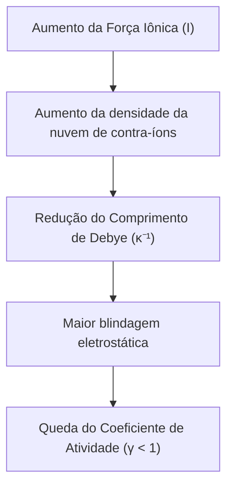
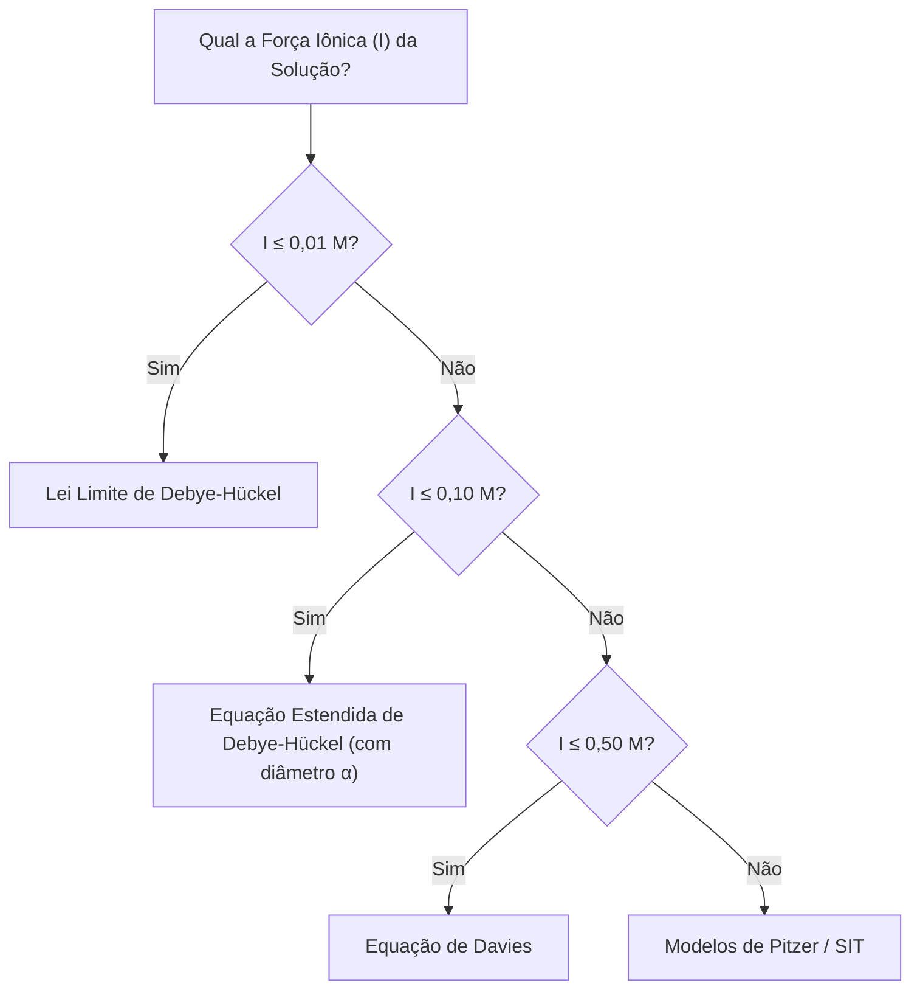

# 🎨 Didactic Visuals & Images Skill

Esta skill orienta a geração, diagramação e integração de recursos visuais (ilustrações científicas, esquemáticos de experimentos, diagramas conceituais e gráficos) para enriquecer materiais de estudo e apostilas.

---

## 🛠️ 1. Tipos de Recursos Visuais Disponíveis

| Tipo de Visual | Ferramenta Recomendada | Quando Utilizar |
| :--- | :--- | :--- |
| **Ilustração Científica / 3D / Realista** | `generate_image` | Células eletroquímicas, montagens de laboratório, estruturas moleculares, analogias físicas. |
| **Diagrama de Blocos e Fluxos Conceituais** | `mermaid` (GFM) | Cadeias de causa e efeito, árvores de decisão, etapas de um método analítico. |
| **Circuitos e Esquemáticos ASCII** | Blocos de código `text` | Circuitos equivalentes de Thévenin, pontes de Wheatstone, redes de resistores. |
| **Tabelas Comparativas** | Tabelas Markdown GFM | Resumo de propriedades, constantes, comparação de modelos teóricos. |

---

## 🖼️ 2. Diretrizes para Geração de Imagens (`generate_image`)

Ao solicitar ou gerar imagens didáticas com a ferramenta `generate_image`:

### 2.1 Estrutura de Prompt Eficaz para Imagens Científicas
* **Estilo Visual:** Prefira termos como *Clean educational scientific illustration, 3D render, minimalist, isometric, clean white background, high contrast, detailed, textbooks style*.
* **Composição:** Especifique os componentes em destaque (ex.: *"Zinc electrode in zinc sulfate solution, copper electrode in blue copper sulfate solution, connected by an inverted U-tube salt bridge and an external wire with an analog voltmeter showing 1.1V"*).
* **Aspect Ratio:**
  * `16:9` ou `3:2` para diagramas horizontais panorâmicos e montagens experimentais.
  * `1:1` ou `4:3` para íons, moléculas ou componentes isolados.

---

## 📊 3. Padrões Mermaid para Material Didático

Utilize blocos de código com linguagem `mermaid` para visualização estrutural no GitHub:

### Exemplo de Fluxo Causal:


### Exemplo de Decisão Algorítmica:


---

## 📎 4. Como Inserir Imagens no Markdown GFM

Para embutir imagens geradas nos arquivos de aula:

1. **Sintaxe de Imagem Padrão:**
   ```markdown
   
   ```
2. **Legenda Descritiva:** Sempre inclua uma legenda explicativa logo abaixo da figura para reforçar a assimilação dos elementos visuais.
