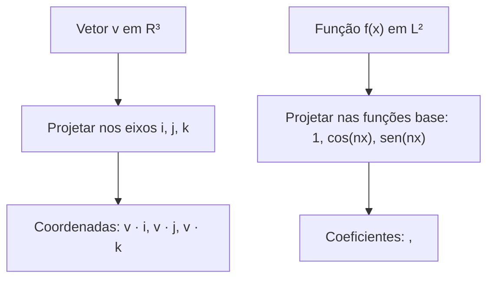

# 📘 Apostila Completa & Intuitiva: Séries de Fourier
> **Disciplina:** Cálculo Avançado / Análise de Fourier — USP  
> **Tema:** Fundamentos, Ortogonalidade, Coeficientes de Euler-Fourier e Teoremas de Convergência  
> **Público-alvo:** Estudantes que precisam de intuição geométrica profunda aliada ao rigor exigido nas provas da USP.

---

## 📑 Sumário
1. [A Grande Ideia Geométrica: Fourier como Projeção Vetorial](#1-a-grande-ideia-geométrica-fourier-como-projeção-vetorial)
2. [Simetrias e Decomposição Par/Ímpar](#2-simetrias-e-decomposição-parímpar)
3. [Ortogonalidade do Sistema Trigonométrico (Demonstração Completa)](#3-ortogonalidade-do-sistema-trigonométrico-demonstração-completa)
4. [Dedução dos Coeficientes de Euler-Fourier](#4-dedução-dos-coeficientes-de-euler-fourier)
5. [A Origem do Termo a₀/2 e do Fator 1/(2π)](#5-a-origem-do-termo-a₀2-e-do-fator-12π)
6. [Teorema Geral de Convergência Pontual (Dirichlet)](#6-teorema-geral-de-convergência-pontual-dirichlet)
7. [Exemplo Canônico Completo: f(x) = |x| e Séries Numéricas](#7-exemplo-canônico-completo-fx--x-e-séries-numéricas)
8. [Teorema da Melhor Aproximação em Álgebra Linear e Parseval](#8-teorema-da-melhor-aproximação-em-álgebra-linear-e-parseval)
9. [Quadro Comparativo de Convergências & Formulário de Prova](#9-quadro-comparativo-de-convergências--formulário-de-prova)

---

## 1. A Grande Ideia Geométrica: Fourier como Projeção Vetorial

A Série de Fourier nada mais é do que a generalização de **Álgebra Linear** para um espaço com infinitas dimensões (o espaço de funções $L^2[-\pi, \pi]$).

### O Dicionário de Tradução (Álgebra Linear $\to$ Cálculo)

| Álgebra Linear ($\mathbb{R}^3$) | Análise de Fourier ($L^2[-\pi, \pi]$) |
| :--- | :--- |
| Vetor $\vec{v} = (x, y, z)$ | Função contínua por partes $f(x)$ |
| Base ortonormal $\{\hat{i}, \hat{j}, \hat{k}\}$ | Base ortogonal $\{1, \cos(x), \sin(x), \cos(2x), \sin(2x), \dots\}$ |
| Produto Escalar: $\vec{u} \cdot \vec{w} = \sum u_i w_i$ | Produto Interno: $\langle u, v \rangle = \int_{-\pi}^\pi u(x)v(x)\,dx$ |
| Norma ao Quadrado: $\lVert\vec{u}\rVert^2 = \vec{u} \cdot \vec{u}$ | Norma ao Quadrado: $\lVert u \rVert^2 = \int_{-\pi}^\pi [u(x)]^2\,dx$ |
| Projeção: $c_i = \frac{\vec{v} \cdot \hat{e}_i}{\lVert\hat{e}_i\rVert^2}$ | Coeficiente: $a_n = \frac{\langle f, \cos(nx) \rangle}{\lVert\cos(nx)\rVert^2}$ |

---

## 2. Simetrias e Decomposição Par/Ímpar

### 2.1 Decomposição Canônica
Qualquer função $f(x)$ definida em intervalo simétrico $[-\pi, \pi]$ pode ser dividida de forma única em:

$$
f(x) = f_{\text{par}}(x) + f_{\text{impar}}(x)
$$

Onde:

$$
f_{\text{par}}(x) = \frac{f(x) + f(-x)}{2}, \quad f_{\text{impar}}(x) = \frac{f(x) - f(-x)}{2}
$$

### 2.2 Propriedades de Integração
* Se $g(x)$ é **ímpar**: $\int_{-\pi}^\pi g(x)\,dx = 0$
* Se $g(x)$ é **par**: $\int_{-\pi}^\pi g(x)\,dx = 2\int_0^\pi g(x)\,dx$

### 2.3 Álgebra das Paridades
* $\text{Impar} \times \text{Par} = \text{Impar} \implies \sin(nx)\cos(mx)$ é sempre uma função **ímpar**.
* $\text{Impar} \times \text{Impar} = \text{Par} \implies \sin(nx)\sin(mx)$ é sempre uma função **par**.
* $\text{Par} \times \text{Par} = \text{Par} \implies \cos(nx)\cos(mx)$ é sempre uma função **par**.

> [!TIP]
> **Intuição:** Os cossenos $\cos(nx)$ reconstroem exclusivamente a parte **par** de $f(x)$. Os senos $\sin(nx)$ reconstroem exclusivamente a parte **ímpar**.

---

## 3. Ortogonalidade do Sistema Trigonométrico (Demonstração Completa)

Dizemos que duas funções $u(x)$ e $v(x)$ são **ortogonais** no intervalo $[-\pi, \pi]$ quando:

$$
\langle u, v \rangle = \int_{-\pi}^\pi u(x)v(x)\,dx = 0
$$

Usamos o **Delta de Kronecker** ($\delta_{nm}$), definido como:

$$
\delta_{nm} = \begin{cases} 1, & \text{se } n = m \\ 0, & \text{se } n \neq m \end{cases}
$$

---

### Teorema das Relações de Ortogonalidade
Para quaisquer $n, m \in \mathbb{N} = \{1, 2, 3, \dots\}$:

1. $\int_{-\pi}^\pi \sin(nx)\cos(mx)\,dx = 0 \quad (\forall n, m)$
2. $\int_{-\pi}^\pi \sin(nx)\sin(mx)\,dx = \pi \delta_{nm}$
3. $\int_{-\pi}^\pi \cos(nx)\cos(mx)\,dx = \pi \delta_{nm}$
4. $\int_{-\pi}^\pi 1 \cdot \cos(nx)\,dx = 0, \quad \int_{-\pi}^\pi 1 \cdot \sin(nx)\,dx = 0$
5. $\int_{-\pi}^\pi 1 \cdot 1\,dx = 2\pi$

---

### Demonstrações Passo a Passo

#### Demonstração 1: $\int_{-\pi}^\pi \sin(nx)\cos(mx)\,dx = 0$
* Como $\sin(nx)$ é ímpar e $\cos(mx)$ é par, o produto $\sin(nx)\cos(mx)$ é uma função ímpar.
* A integral de qualquer função ímpar em um intervalo simétrico $[-\pi, \pi]$ é identicamente $0$.

#### Caso 1 ($n = m$): Usando o arco duplo $\sin^2(\theta) = \frac{1 - \cos(2\theta)}{2}$:

$$
\int_{-\pi}^\pi \sin^2(nx)\,dx = \int_{-\pi}^\pi \frac{1 - \cos(2nx)}{2}\,dx = \frac{1}{2}\int_{-\pi}^\pi 1\,dx - \frac{1}{2}\int_{-\pi}^\pi \cos(2nx)\,dx
$$

$$
= \frac{1}{2}(2\pi) - \frac{1}{2}\left[\frac{\sin(2nx)}{2n}\right]_{-\pi}^\pi = \pi - 0 = \pi
$$

#### Caso 2 ($n \neq m$): Usando as fórmulas de Prostaférese:

$$
\sin(nx)\sin(mx) = \frac{1}{2}\left[ \cos((n-m)x) - \cos((n+m)x) \right]
$$

Integrando de $-\pi$ a $\pi$:

$$
\int_{-\pi}^\pi \sin(nx)\sin(mx)\,dx = \frac{1}{2}\left[ \frac{\sin((n-m)x)}{n-m} - \frac{\sin((n+m)x)}{n+m} \right]_{-\pi}^\pi
$$

Como $n, m \in \mathbb{N}$ e $n \neq m$, os termos $(n-m)$ e $(n+m)$ são inteiros não nulos. Como $\sin(k\pi) = 0$ para todo $k \in \mathbb{Z}$, temos:

$$
\int_{-\pi}^\pi \sin(nx)\sin(mx)\,dx = 0
$$

---

## 4. Dedução dos Coeficientes de Euler-Fourier

Suponha que $f(x)$ possa ser representada pela soma trigonométrica:

$$
f(x) = \frac{a_0}{2} + \sum_{m=1}^\infty \left[ a_m \cos(mx) + b_m \sin(mx) \right]
$$

### 4.1 Isolando $a_n$
Multiplicamos ambos os lados por $\cos(nx)$ e integramos termo a termo de $-\pi$ a $\pi$:

$$
\int_{-\pi}^\pi f(x)\cos(nx)\,dx = \frac{a_0}{2}\int_{-\pi}^\pi \cos(nx)\,dx + \sum_{m=1}^\infty a_m \int_{-\pi}^\pi \cos(mx)\cos(nx)\,dx + \sum_{m=1}^\infty b_m \int_{-\pi}^\pi \sin(mx)\cos(nx)\,dx
$$

Pela propriedade de ortogonalidade:
* $\int_{-\pi}^\pi \cos(nx)\,dx = 0$
* $\int_{-\pi}^\pi \sin(mx)\cos(nx)\,dx = 0$
* $\int_{-\pi}^\pi \cos(mx)\cos(nx)\,dx = \pi \delta_{nm}$

Quando $m \neq n$, o termo zera. Sobra apenas $m = n$:

$$
\int_{-\pi}^\pi f(x)\cos(nx)\,dx = a_n \cdot \pi \implies a_n = \frac{1}{\pi}\int_{-\pi}^\pi f(x)\cos(nx)\,dx
$$

### 4.2 Isolando $b_n$
Multiplicamos ambos os lados por $\sin(nx)$ e integramos de $-\pi$ a $\pi$:

$$
\int_{-\pi}^\pi f(x)\sin(nx)\,dx = b_n \cdot \pi \implies b_n = \frac{1}{\pi}\int_{-\pi}^\pi f(x)\sin(nx)\,dx
$$

### 4.3 Isolando $a_0$
Integramos a equação original diretamente de $-\pi$ a $\pi$:

$$
\int_{-\pi}^\pi f(x)\,dx = \int_{-\pi}^\pi \frac{a_0}{2}\,dx + 0 = \frac{a_0}{2}(2\pi) = a_0 \pi \implies a_0 = \frac{1}{\pi}\int_{-\pi}^\pi f(x)\,dx
$$

---

## 5. A Origem do Termo a₀/2 e do Fator 1/(2π)

> [!NOTE]
> **Por que existe o termo $a_0/2$ na série?**  
> Para unificar a fórmula! Com $a_0/2$ na série, a fórmula geral $a_n = \frac{1}{\pi}\int_{-\pi}^\pi f(x)\cos(nx)\,dx$ funciona perfeitamente para $n=0$ (já que $\cos(0x) = 1$), sem precisar de uma fórmula separada com fator diferente.

### Por que o fator $1/(2\pi)$ aparece no valor médio?
A norma da base constante é $\lVert 1 \rVert^2 = \int_{-\pi}^\pi 1^2\,dx = 2\pi$, enquanto $\lVert\cos(nx)\rVert^2 = \pi$.

Logo, a componente média (nível DC) de uma função periódica é:

$$
\bar{f} = \frac{1}{2\pi}\int_{-\pi}^\pi f(x)\,dx = \frac{a_0}{2}
$$

---

## 6. Teorema Geral de Convergência Pontual (Dirichlet)

> [!IMPORTANT]
> **Definição da Série de Fourier:**  
> A série associada a $f(x)$ é dada por $S(x) = \frac{a_0}{2} + \sum_{n=1}^\infty [ a_n \cos(nx) + b_n \sin(nx) ]$.

### 6.1 Hipóteses do Teorema de Dirichlet
Uma função $f: \mathbb{R} \to \mathbb{R}$ satisfaz as **Condições de Dirichlet** em $[-\pi, \pi]$ se:

- $f(x)$ é periódica de período $2\pi$.
- $f(x)$ e sua derivada $f'(x)$ são **contínuas por partes** (possuem no máximo um número finito de descontinuidades de salto em qualquer intervalo finito).

Além disso, devem existir os limites laterais e as derivadas laterais finitas em todos os pontos:

$$
f'(x_0^+) = \lim_{h \to 0^+} \frac{f(x_0 + h) - f(x_0^+)}{h}, \quad f'(x_0^-) = \lim_{h \to 0^-} \frac{f(x_0 + h) - f(x_0^-)}{h}
$$

---

### 6.2 A Tese do Teorema de Dirichlet
Sob as hipóteses acima, a Série de Fourier $S(x)$ converge para todo $x \in \mathbb{R}$ para o valor:

$$
S(x) = \frac{f(x^+) + f(x^-)}{2}
$$

1. Se $f$ for contínua em $x$: $f(x^+) = f(x^-) = f(x) \implies S(x) = f(x)$.
2. Se $f$ tiver um salto em $x_0$: $S(x_0)$ converge exatamente para o **ponto médio do salto**.
3. Nas extremidades do período ($x = \pm \pi$): a série converge para $S(\pi) = S(-\pi) = \frac{f(\pi^-) + f(-\pi^+)}{2}$.

---

## 7. Exemplo Canônico Completo: $f(x) = |x|$ e Séries Numéricas

Consideremos a função $f(x) = |x|$ definida em $[-\pi, \pi]$ e estendida periodicamente para todo $\mathbb{R}$ com período $2\pi$.

### Passo 1: Análise de Paridade
* $f(-x) = |-x| = |x| = f(x) \implies f(x)$ é **PAR**.
* Consequentemente, $b_n = 0$ para todo $n \ge 1$.

### Passo 2: Cálculo de $a_0$ (Termo Médio)
Como $f(x)$ é par e $|x| = x$ em $[0, \pi]$:

$$
a_0 = \frac{2}{\pi}\int_0^\pi x\,dx = \frac{2}{\pi}\left[\frac{x^2}{2}\right]_0^\pi = \frac{2}{\pi}\frac{\pi^2}{2} = \pi \implies \frac{a_0}{2} = \frac{\pi}{2}
$$

### Passo 3: Cálculo de $a_n$ por Partes
Usando $u = x \implies du = dx$ e $dv = \cos(nx)dx \implies v = \frac{\sin(nx)}{n}$:

$$
a_n = \frac{2}{\pi}\int_0^\pi x\cos(nx)\,dx = \frac{2}{\pi}\left( \left[x\frac{\sin(nx)}{n}\right]_0^\pi - \int_0^\pi \frac{\sin(nx)}{n}\,dx \right)
$$

Como $\sin(n\pi) = 0$ e $\sin(0) = 0$, o primeiro termo se anula:

$$
a_n = \frac{2}{\pi}\left[ \frac{\cos(nx)}{n^2} \right]_0^\pi = \frac{2}{\pi n^2}\left(\cos(n\pi) - 1\right) = \frac{2}{\pi n^2}\left((-1)^n - 1\right)
$$

* Se $n$ for **par** ($n = 2k$): $(-1)^n = 1 \implies a_{2k} = 0$.
* Se $n$ for **ímpar** ($n = 2k-1$): $(-1)^n = -1 \implies a_{2k-1} = -\frac{4}{\pi(2k-1)^2}$.

### Passo 4: A Série de Fourier de $|x|$

$$
S(x) = \frac{\pi}{2} - \frac{4}{\pi}\sum_{k=1}^\infty \frac{\cos((2k-1)x)}{(2k-1)^2} = \frac{\pi}{2} - \frac{4}{\pi}\left( \frac{\cos(x)}{1^2} + \frac{\cos(3x)}{3^2} + \frac{\cos(5x)}{5^2} + \dots \right)
$$

### Passo 5: Aplicações em Prova da USP (Cálculo de Séries Numéricas)

Como $f(x) = |x|$ é contínua em todo $\mathbb{R}$, o Teorema de Dirichlet garante que $S(x) = f(x)$ para todo $x$.

* **Avaliando em $x = 0$:**
  Como $f(0) = 0$ e $\cos(0) = 1$:

$$
0 = \frac{\pi}{2} - \frac{4}{\pi}\sum_{k=1}^\infty \frac{1}{(2k-1)^2} \implies \sum_{k=1}^\infty \frac{1}{(2k-1)^2} = 1 + \frac{1}{3^2} + \frac{1}{5^2} + \frac{1}{7^2} + \dots = \frac{\pi^2}{8}
$$

* **Dedução da Série de Basel $\sum_{n=1}^\infty \frac{1}{n^2} = \frac{\pi^2}{6}$:**
  Separando a soma total em termos pares e ímpares:

$$
S = \sum_{n=1}^\infty \frac{1}{n^2} = \sum_{\text{pares}} \frac{1}{(2k)^2} + \sum_{\text{impares}} \frac{1}{(2k-1)^2} = \frac{1}{4}S + \frac{\pi^2}{8}
$$

$$
\frac{3}{4}S = \frac{\pi^2}{8} \implies S = \sum_{n=1}^\infty \frac{1}{n^2} = \frac{\pi^2}{6}
$$

---

## 8. Teorema da Melhor Aproximação em Álgebra Linear e Parseval

### 8.1 O Teorema da Projeção Ortogonal no Espaço $L^2$
Considere o subespaço $W_N = \text{span}\{1, \cos(x), \sin(x), \dots, \cos(Nx), \sin(Nx)\}$ formado por todos os polinômios trigonométricos de grau no máximo $N$:

$$
T_N(x) = \frac{\alpha_0}{2} + \sum_{n=1}^N \left[ \alpha_n \cos(nx) + \beta_n \sin(nx) \right]
$$

Desejamos encontrar quais coeficientes $(\alpha_0, \alpha_n, \beta_n)$ minimizam a distância quadrática média em relação a $f(x)$:

$$
E = \lVert f - T_N \rVert^2 = \int_{-\pi}^\pi [f(x) - T_N(x)]^2\,dx
$$

---

### 8.2 Demonstração: Por que os coeficientes de Fourier são ótimos?
Expandindo o quadrado do integrando:

$$
E = \int_{-\pi}^\pi [f(x)]^2\,dx - 2\int_{-\pi}^\pi f(x)T_N(x)\,dx + \int_{-\pi}^\pi [T_N(x)]^2\,dx
$$

Pelas relações de ortogonalidade:
1. $\int_{-\pi}^\pi [T_N(x)]^2\,dx = \pi\left[ \frac{\alpha_0^2}{2} + \sum_{n=1}^N (\alpha_n^2 + \beta_n^2) \right]$
2. $\int_{-\pi}^\pi f(x)T_N(x)\,dx = \pi\left[ \frac{\alpha_0 a_0}{2} + \sum_{n=1}^N (\alpha_n a_n + \beta_n b_n) \right]$

Substituindo e completando quadrados:

$$
E = \int_{-\pi}^\pi [f(x)]^2\,dx - \pi\left[ \frac{a_0^2}{2} + \sum_{n=1}^N (a_n^2 + b_n^2) \right] + \pi\left[ \frac{(\alpha_0 - a_0)^2}{2} + \sum_{n=1}^N \left[ (\alpha_n - a_n)^2 + (\beta_n - b_n)^2 \right] \right]
$$

Como todos os termos da última parcela são estritamente maiores ou iguais a zero, o erro $E$ atinge seu **mínimo absoluto** se e somente se:

$$
\alpha_0 = a_0, \quad \alpha_n = a_n, \quad \beta_n = b_n \quad (\forall n = 1, \dots, N)
$$

> [!IMPORTANT]
> **Teorema da Melhor Aproximação:** A soma parcial da Série de Fourier $S_N(x)$ é o elemento de $W_N$ mais próximo de $f(x)$ no sentido dos Mínimos Quadrados ($L^2$).

---

### 8.3 Desigualdade de Bessel e Identidade de Parseval

Como o erro mínimo $E_{\min} \ge 0$, temos a **Desigualdade de Bessel**:

$$
\pi \left[ \frac{a_0^2}{2} + \sum_{n=1}^N (a_n^2 + b_n^2) \right] \le \int_{-\pi}^\pi [f(x)]^2\,dx
$$

Fazendo $N \to \infty$, como a base trigonométrica é **completa** no espaço $L^2[-\pi, \pi]$, o erro $E \to 0$ e a desigualdade vira a **Identidade de Parseval**:

$$
\frac{a_0^2}{2} + \sum_{n=1}^\infty (a_n^2 + b_n^2) = \frac{1}{\pi}\int_{-\pi}^\pi [f(x)]^2\,dx
$$

> [!TIP]
> **Interpretação Física da Identidade de Parseval:**  
> É o **Teorema de Pitágoras em dimensão infinita**: $(\text{Norma do Vetor})^2 = \sum (\text{Componentes})^2$.  
> Em Engenharia Elétrica / Acústica, significa que a **energia total do sinal** no domínio do tempo é igual à **soma da energia de todos os seus harmônicos** no domínio da frequência.

---

### 8.4 Aplicação de Parseval em $f(x) = |x|$: Cálculo de $\sum \frac{1}{n^4}$
Para $f(x) = |x|$ em $[-\pi, \pi]$:
* $a_0 = \pi \implies \frac{a_0^2}{2} = \frac{\pi^2}{2}$
* $a_{2k-1} = -\frac{4}{\pi(2k-1)^2} \implies a_{2k-1}^2 = \frac{16}{\pi^2(2k-1)^4}$
* $b_n = 0$
* $\int_{-\pi}^\pi [f(x)]^2\,dx = \int_{-\pi}^\pi x^2\,dx = 2\left[\frac{x^3}{3}\right]_0^\pi = \frac{2\pi^3}{3}$

Aplicando na Identidade de Parseval:

$$
\frac{\pi^2}{2} + \sum_{k=1}^\infty \frac{16}{\pi^2(2k-1)^4} = \frac{1}{\pi}\left(\frac{2\pi^3}{3}\right) = \frac{2\pi^2}{3}
$$

$$
\frac{16}{\pi^2}\sum_{k=1}^\infty \frac{1}{(2k-1)^4} = \frac{2\pi^2}{3} - \frac{\pi^2}{2} = \frac{\pi^2}{6}
$$

$$
\sum_{k=1}^\infty \frac{1}{(2k-1)^4} = \frac{\pi^4}{96}
$$

E a soma completa de todos os inteiros:

$$
\sum_{n=1}^\infty \frac{1}{n^4} = 1 + \frac{1}{2^4} + \frac{1}{3^4} + \frac{1}{4^4} + \dots = \frac{\pi^4}{90}
$$

---

## 9. Quadro Comparativo de Convergências & Formulário de Prova

| Tipo de Convergência | O que significa? | Onde é aplicada? |
| :--- | :--- | :--- |
| **Pontual (Dirichlet)** | $S(x) \to \frac{f(x^+) + f(x^-)}{2}$ para cada $x$ individual | Descobrir o valor exato da série em um ponto ou calcular séries numéricas |
| **Média Quadrática ($L^2$)** | $\int_{-\pi}^\pi \lVert f(x) - S_N(x) \rVert^2\,dx \to 0$ | Conservação de energia, Identidade de Parseval, aproximações de sinais |
| **Uniforme** | $\sup \lVert f(x) - S_N(x) \rVert \to 0$ em todo o intervalo | Ocorre quando $f$ é contínua e periódica (sem nenhum salto) |

---

### Formulário Rápido para a Prova

$$
\begin{cases}
a_0 = \dfrac{1}{\pi}\displaystyle\int_{-\pi}^\pi f(x)\,dx \\
a_n = \dfrac{1}{\pi}\displaystyle\int_{-\pi}^\pi f(x)\cos(nx)\,dx \\
b_n = \dfrac{1}{\pi}\displaystyle\int_{-\pi}^\pi f(x)\sin(nx)\,dx
\end{cases}
$$

$$
S(x) = \frac{a_0}{2} + \sum_{n=1}^\infty \left[ a_n \cos(nx) + b_n \sin(nx) \right]
$$

$$
\text{Parseval: } \frac{a_0^2}{2} + \sum_{n=1}^\infty (a_n^2 + b_n^2) = \frac{1}{\pi}\int_{-\pi}^\pi [f(x)]^2\,dx
$$
