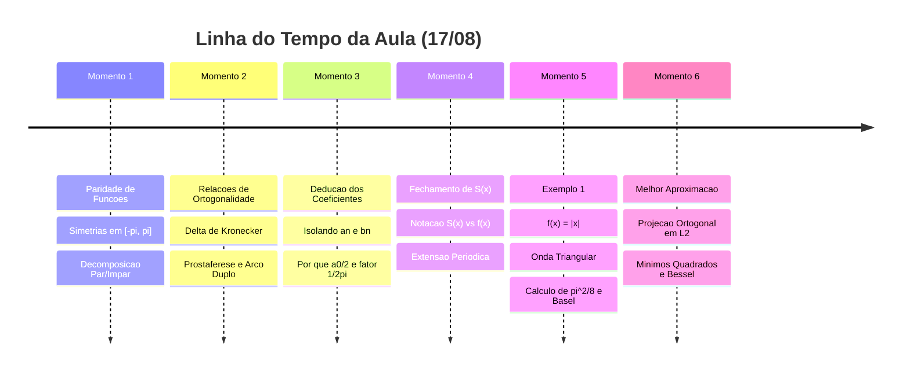

# 🔴 Live da Aula: Séries de Fourier (USP)
> **Data:** 17 de Agosto  
> **Status:** Acompanhamento em tempo real — Teorema da Melhor Aproximação em Álgebra Linear.  
> **Objetivo deste arquivo:** Decodificar fragmentos soltos, intenções imediatas e anotações cruas da aula conforme acontecem.

---

## ⏱️ Linha do Tempo & Momentos da Aula

---

## ⚡ Momento Atual: Teorema da Melhor Aproximação & Álgebra Linear

### 1. O Problema Geométrico que o Professor está Colocando na Lousa

Seja $W_N$ o subespaço vetorial de todos os polinômios trigonométricos de grau até $N$:

$$
T_N(x) = \frac{\alpha_0}{2} + \sum_{n=1}^N \left[ \alpha_n \cos(nx) + \beta_n \sin(nx) \right]
$$

Quais coeficientes $(\alpha_0, \dots, \alpha_N, \beta_1, \dots, \beta_N)$ tornam $T_N(x)$ o **mais próximo possível** da função $f(x)$, minimizando o erro quadrático:

$$
E = \|f - T_N\|^2 = \int_{-\pi}^\pi [f(x) - T_N(x)]^2\,dx
$$

---

### 2. A Resposta da Álgebra Linear (Projeção Ortogonal)

O vetor mais próximo em qualquer subespaço é a **Projeção Ortogonal**:

$$
T_N^*(x) = \text{proj}_{W_N}(f)
$$

O vetor erro $(f - T_N^*)$ é perpendicular a todo o subespaço $W_N$:

$$
\langle f - T_N^*, \cos(nx) \rangle = 0, \quad \langle f - T_N^*, \sin(nx) \rangle = 0
$$

---

### 3. A Dedução por Completamento de Quadrados

Ao expandir a integral do erro $E$:

$$
E = \int_{-\pi}^\pi [f(x)]^2\,dx - \pi\left[\frac{a_0^2}{2} + \sum_{n=1}^N (a_n^2 + b_n^2)\right] + \pi\left[ \frac{(\alpha_0 - a_0)^2}{2} + \sum_{n=1}^N [(\alpha_n - a_n)^2 + (\beta_n - b_n)^2] \right]
$$

Como todos os termos ao quadrado $(\alpha_n - a_n)^2 \ge 0$, o erro $E$ é **minimizado unicamente** quando:

$$
\alpha_n = a_n \quad \text{e} \quad \beta_n = b_n
$$

> [!IMPORTANT]
> **Intenção Central do Professor:** Provar que a soma parcial da Série de Fourier $S_N(x)$ é a **melhor aproximação em média quadrática** de $f(x)$ entre todas as combinações trigonométricas de grau $N$.

---

### 4. Consequência: Desigualdade de Bessel

Como o erro mínimo $E_{\min} \ge 0$:

$$
\pi\left[\frac{a_0^2}{2} + \sum_{n=1}^N (a_n^2 + b_n^2)\right] \le \int_{-\pi}^\pi [f(x)]^2\,dx
$$
