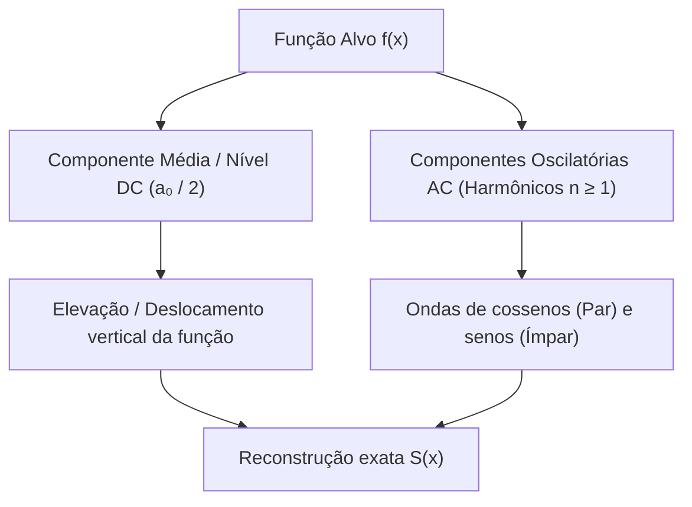
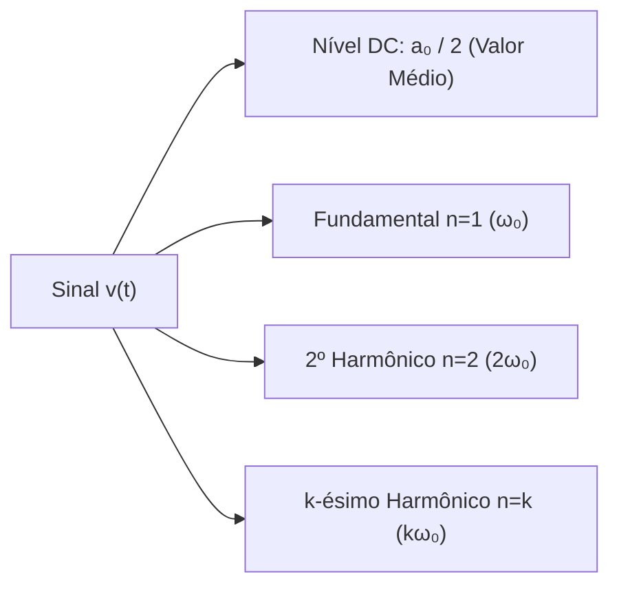
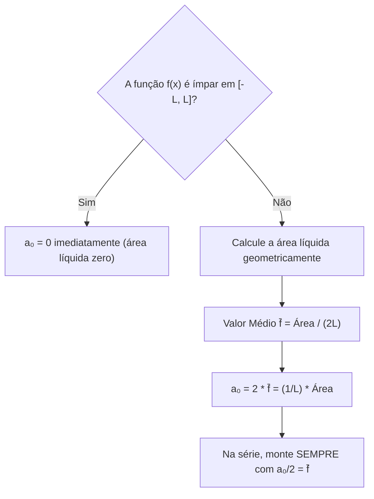

# 📘 Guia Didático Avançado: Valor Médio de uma Função e a Gênese do Termo $a_0$

> **Disciplina:** Cálculo Avançado / Análise de Fourier — USP  
> **Tema:** Valor Médio de Funções Contínuas por Partes, Projeção no Espaço $L^2[-L, L]$ e Origem Algébrica do Coeficiente $a_0$  
> **Público-alvo:** Estudantes de Engenharia, Física e Matemática que buscam o domínio conceitual completo, unindo intuição geométrica, física e o rigor formal exigido nas avaliações da USP.

---

## 📑 Sumário

1. [A Grande Pergunta: Por que a Série de Fourier Precisa de uma Constante?](#1-a-grande-pergunta-por-que-a-série-de-fourier-precisa-de-uma-constante)
2. [O Valor Médio de uma Função no Cálculo Integral](#2-o-valor-médio-de-uma-função-no-cálculo-integral)
3. [Por que Todas as Senoides Têm Média Nula?](#3-por-que-todas-as-senoides-têm-média-nula)
4. [Dedução Algébrica: A Projeção de f(x) na Base Constante](#4-dedução-algébrica-a-projeção-de-fx-na-base-constante)
5. [O Enigma Notacional: Por que Escrevemos a₀/2 e não Apenas a₀?](#5-o-enigma-notacional-por-que-escrevemos-fraca_02-e-não-apenas-a_0)
6. [Interpretação Física e Engenharia: O Nível DC e a Conservação de Parseval](#6-interpretação-física-e-engenharia-o-nível-dc-e-a-conservação-de-parseval)
7. [Exemplos Canônicos Resolvidos da USP](#7-exemplos-canônicos-resolvidos-da-usp)
8. [Checklist de Autocorreção e Armadilhas de Prova](#8-checklist-de-autocorreção-e-armadilhas-de-prova)

---

## 1. A Grande Pergunta: Por que a Série de Fourier Precisa de uma Constante?

Considere a expressão clássica da Série de Fourier de uma função periódica com período $2L$:

$$
S(x) = \frac{a_0}{2} + \sum_{n=1}^\infty \left[ a_n \cos\left(\frac{n\pi x}{L}\right) + b_n \sin\left(\frac{n\pi x}{L}\right) \right]
$$

Por que existe aquele termo solto $\frac{a_0}{2}$ no início da série, antes de todos os somatórios de senos e cossenos?



A resposta é direta e profunda:

* Todos os harmônicos senoidais e cossenoidais $\cos\left(\frac{n\pi x}{L}\right)$ e $\sin\left(\frac{n\pi x}{L}\right)$ (para $n \ge 1$) oscilam simetricamente em torno de zero.
* A soma de infinitas ondas puras possui, obrigatoriamente, média líquida igual a zero.
* Se a função $f(x)$ tiver qualquer elevação ou área líquida não nula acima ou abaixo do eixo horizontal, as senoides sozinhas jamais conseguirão alcançá-la.
* O termo constante $\frac{a_0}{2}$ é o **deslocador vertical exato** que posiciona a base da função em sua **média aritmética real**, permitindo que os harmônicos cuidem exclusivamente das oscilações.

---

## 2. O Valor Médio de uma Função no Cálculo Integral

### 2.1 Da Média Discreta à Média Contínua de Riemann

Na estatística elementar, a média aritmética de $N$ números discretos $\{y_1, y_2, \dots, y_N\}$ é dada por:

$$
\bar{y} = \frac{y_1 + y_2 + \cdots + y_N}{N} = \frac{1}{N}\sum_{i=1}^N y_i
$$

Para estender esse conceito para uma função contínua por partes $f(x)$ definida em um intervalo $[a, b]$:

Subdividimos o intervalo $[a, b]$ em $N$ subintervalos de largura uniforme $\Delta x = \frac{b - a}{N}$, o que implica $N = \frac{b - a}{\Delta x}$.

Avaliamos a média das amostras pontuais $f(x_i^*)$:

$$
\bar{y}_N = \frac{1}{N}\sum_{i=1}^N f(x_i^*) = \frac{1}{\frac{b - a}{\Delta x}}\sum_{i=1}^N f(x_i^*) = \frac{1}{b - a}\sum_{i=1}^N f(x_i^*)\Delta x
$$

Tomando o limite quando $N \to \infty$ ($\Delta x \to 0$), a soma de Riemann converge para a integral definida:

$$
\bar{f} = \lim_{N \to \infty} \left[ \frac{1}{b - a}\sum_{i=1}^N f(x_i^*)\Delta x \right] = \frac{1}{b - a} \int_a^b f(x)\,dx
$$

> [!IMPORTANT]
> **Definição Formal (Valor Médio Integral):**  
> O valor médio de uma função integrável $f(x)$ no intervalo $[a, b]$ é denotado por $\bar{f}$ e calculado por $\bar{f} = \frac{1}{b - a} \int_a^b f(x)\,dx$.

---

### 2.2 O Teorema do Valor Médio para Integrais (TVM Integral)

Se $f: [a, b] \to \mathbb{R}$ for contínua, então existe pelo menos um ponto $c \in [a, b]$ tal que:

$$
f(c) = \bar{f} = \frac{1}{b - a}\int_a^b f(x)\,dx
$$

Isto equivale a dizer que:

$$
\int_a^b f(x)\,dx = f(c)\cdot(b - a)
$$

---

### 2.3 Interpretação Geométrica do Retângulo Equivalente

Geometricamente, o valor médio $\bar{f}$ é a altura de um retângulo de base $(b - a)$ cuja área retangular é rigorosamente idêntica à área líquida sob a curva $y = f(x)$:

$$
\text{Area sob a curva} = \int_a^b f(x)\,dx = \bar{f} \cdot (b - a)
$$

```
y ^
  |       _ . - - . _                 Curva real y = f(x)
  |     /             \
--+----+---------------+---- f(x)
  |   /|               |\
f̄ |..|-+---------------+ |.........  Altura Média f̄
  |  | |               | |
  |  | |               | |           Área do Retângulo = Área sob a curva
--+--+-+---------------+---+-----> x
  0    a               b
       |<--- (b - a) ->|
```

Se o gráfico de $f(x)$ fosse nivelado como um fluido, preenchendo vales com cristas, a altura final de equilíbrio estático seria exatamente a reta horizontal $y = \bar{f}$.

---

## 3. Por que Todas as Senoides Têm Média Nula?

No intervalo simétrico fundamental $[-L, L]$, o comprimento total do intervalo é $b - a = L - (-L) = 2L$.

Calculando o valor médio de qualquer harmônico cossenoidal $\cos\left(\frac{n\pi x}{L}\right)$ para $n = 1, 2, 3, \dots$:

$$
\overline{\cos\left(\frac{n\pi x}{L}\right)} = \frac{1}{2L}\int_{-L}^L \cos\left(\frac{n\pi x}{L}\right)\,dx = \frac{1}{2L}\left[ \frac{L}{n\pi}\sin\left(\frac{n\pi x}{L}\right) \right]_{-L}^L
$$

$$
= \frac{1}{2n\pi}\left[ \sin(n\pi) - \sin(-n\pi) \right] = \frac{1}{2n\pi}[0 - 0] = 0
$$

Para as funções senoidais $\sin\left(\frac{n\pi x}{L}\right)$ (sendo funções ímpares integradas em intervalo simétrico):

$$
\overline{\sin\left(\frac{n\pi x}{L}\right)} = \frac{1}{2L}\int_{-L}^L \sin\left(\frac{n\pi x}{L}\right)\,dx = 0
$$

Portanto, integrando a série de Fourier $S(x)$ termo a termo em $[-L, L]$:

$$
\frac{1}{2L}\int_{-L}^L S(x)\,dx = \frac{1}{2L}\int_{-L}^L \frac{a_0}{2}\,dx + \sum_{n=1}^\infty \left[ a_n \cdot 0 + b_n \cdot 0 \right] = \frac{a_0}{2}
$$

> [!TIP]
> **Conclusão Fundamental:**  
> O valor médio de toda a Série de Fourier $S(x)$ no período fundamental $[-L, L]$ é única e exclusivamente fornecido pelo termo constante $\frac{a_0}{2}$.

---

## 4. Dedução Algébrica: A Projeção de $f(x)$ na Base Constante

A Análise de Fourier decompõe o espaço vetorial $L^2[-L, L]$ através do produto interno canônico:

$$
\langle u, v \rangle = \int_{-L}^L u(x)v(x)\,dx
$$

A base ortogonal contém a função base constante $\phi_0(x) \equiv 1$.

#### Cálculo do Produto Interno
O produto interno de $f(x)$ com a base constante $\phi_0 = 1$ é:

$$
\langle f, \phi_0 \rangle = \int_{-L}^L f(x) \cdot 1\,dx = \int_{-L}^L f(x)\,dx
$$

#### Cálculo da Norma ao Quadrado
A norma ao quadrado do vetor base constante $\phi_0 = 1$ é:

$$
\lVert \phi_0 \rVert^2 = \langle \phi_0, \phi_0 \rangle = \int_{-L}^L 1^2\,dx = [x]_{-L}^L = 2L
$$

Enquanto isso, para os harmônicos oscilatórios com $n \ge 1$:

$$
\lVert \cos(n\pi x / L) \rVert^2 = \int_{-L}^L \cos^2\left(\frac{n\pi x}{L}\right)\,dx = L
$$

$$
\lVert \sin(n\pi x / L) \rVert^2 = \int_{-L}^L \sin^2\left(\frac{n\pi x}{L}\right)\,dx = L
$$

#### O Coeficiente de Projeção
Pela projeção ortogonal clássica da Álgebra Linear, o coeficiente na direção de $\phi_0 = 1$ é:

$$
c_0 = \frac{\langle f, \phi_0 \rangle}{\lVert \phi_0 \rVert^2} = \frac{\int_{-L}^L f(x)\,dx}{2L} = \frac{1}{2L}\int_{-L}^L f(x)\,dx = \bar{f}
$$

O coeficiente da base constante é exatamente o valor médio de $f(x)$.

---

## 5. O Enigma Notacional: Por que Escrevemos $\frac{a_0}{2}$ e não Apenas $a_0$?

Se o termo constante é $c_0 = \bar{f} = \frac{1}{2L}\int_{-L}^L f(x)\,dx$, por que a convenção clássica adota a fração $\frac{a_0}{2}$?

### 5.1 A Unificação da Fórmula dos Cossenos

A fórmula de Euler-Fourier para os coeficientes dos cossenos com $n = 1, 2, 3, \dots$ é:

$$
a_n = \frac{1}{L} \int_{-L}^L f(x)\cos\left(\frac{n\pi x}{L}\right)\,dx
$$

Se aplicarmos essa fórmula para $n = 0$:

$$
a_0 = \frac{1}{L} \int_{-L}^L f(x)\cos(0)\,dx = \frac{1}{L} \int_{-L}^L f(x)\,dx
$$

Comparando com o valor médio $\bar{f}$:

$$
a_0 = \frac{1}{L}\int_{-L}^L f(x)\,dx = 2 \cdot \left[ \frac{1}{2L}\int_{-L}^L f(x)\,dx \right] = 2 \cdot \bar{f}
$$

Portanto:

$$
\bar{f} = \frac{a_0}{2}
$$

> [!NOTE]
> **A Elegância Algébrica de Euler:**  
> Escrevendo $\frac{a_0}{2}$ na série, a fórmula $a_n = \frac{1}{L}\int_{-L}^L f(x)\cos\left(\frac{n\pi x}{L}\right)\,dx$ torna-se válida para $n = 0, 1, 2, \dots$ sem necessidade de fórmulas condicionais separadas.

### 5.2 Quadro Comparativo de Notações

| Propriedade | Notação Tradicional USP (Euler) | Notação com $c_0$ Direto (Engenharia) |
| :--- | :--- | :--- |
| **Série** | $S(x) = \frac{a_0}{2} + \sum_{n=1}^\infty [a_n \cos + b_n \sin]$ | $S(x) = a_0 + \sum_{n=1}^\infty [a_n \cos + b_n \sin]$ |
| **Valor Médio $\bar{f}$** | $\bar{f} = \frac{a_0}{2}$ | $\bar{f} = a_0$ |
| **Fórmula de $a_0$** | $a_0 = \frac{1}{L}\int_{-L}^L f(x)\,dx$ | $a_0 = \frac{1}{2L}\int_{-L}^L f(x)\,dx$ |
| **Fórmula de $a_n$ ($n \ge 1$)** | $a_n = \frac{1}{L}\int_{-L}^L f(x)\cos(\frac{n\pi x}{L})\,dx$ | $a_n = \frac{1}{L}\int_{-L}^L f(x)\cos(\frac{n\pi x}{L})\,dx$ |
| **Unificação $n=0$** | **Sim** ($a_n$ com $n=0$ resulta em $a_0$) | **Não** (requer divisão explícita por $2L$) |

---

## 6. Interpretação Física e Engenharia: O Nível DC e a Conservação de Parseval

### 6.1 Sinais Elétricos: Nível DC vs Harmônicos AC

Em Engenharia Elétrica e Telecomunicações, qualquer sinal periódico de tensão $v(t)$ é decomposto em:

$$
v(t) = V_{\text{DC}} + \sum_{n=1}^\infty \left[ a_n \cos(n\omega_0 t) + b_n \sin(n\omega_0 t) \right]
$$

O termo $\frac{a_0}{2}$ corresponde exatamente à componente contínua $V_{\text{DC}}$, que representa o valor medido por um voltímetro em corrente contínua.



### 6.2 O Termo $a_0$ no Teorema de Parseval

O Teorema de Parseval estabelece a conservação da energia média no domínio do tempo e da frequência:

$$
E_{\text{total}} = \frac{1}{L}\int_{-L}^L [f(x)]^2\,dx = \frac{a_0^2}{2} + \sum_{n=1}^\infty (a_n^2 + b_n^2)
$$

A contribuição da componente média contínua $\bar{f} = \frac{a_0}{2}$ para a energia é:

$$
E_{\text{DC}} = \frac{1}{L}\int_{-L}^L \left(\frac{a_0}{2}\right)^2\,dx = \frac{1}{L} \cdot \frac{a_0^2}{4} \cdot (2L) = \frac{a_0^2}{2}
$$

---

## 7. Exemplos Canônicos Resolvidos da USP

### Exemplo 1: $f(x) = |x|$ em $[-\pi, \pi]$ (Apostila 17/08)

O gráfico de $f(x) = |x|$ forma dois triângulos simétricos em $[-\pi, \pi]$ com base $2\pi$ e altura máxima $\pi$.

#### Passo 1: Cálculo da Integral
A integral definida é:

$$
\int_{-\pi}^\pi |x|\,dx = 2 \int_0^\pi x\,dx = 2 \left[ \frac{x^2}{2} \right]_0^\pi = \pi^2
$$

#### Passo 2: Valor Médio
O valor médio geométrico é:

$$
\bar{f} = \frac{\pi^2}{2\pi} = \frac{\pi}{2}
$$

#### Passo 3: Coeficiente $a_0$
Pela fórmula unificada:

$$
a_0 = \frac{1}{\pi}\int_{-\pi}^\pi |x|\,dx = \frac{\pi^2}{\pi} = \pi \implies \frac{a_0}{2} = \frac{\pi}{2} = \bar{f}
$$

A série resultante abre com $\frac{\pi}{2}$:

$$
S(x) = \frac{\pi}{2} - \frac{4}{\pi}\sum_{k=1}^\infty \frac{\cos((2k-1)x)}{(2k-1)^2}
$$

---

### Exemplo 2: Onda Quadrada Simétrica vs Assimétrica

#### Caso A: Onda Quadrada Simétrica $f(x) = \text{sgn}(x)$ em $[-\pi, \pi]$

$$
f(x) = \begin{cases} -1, & -\pi < x < 0 \\ +1, & 0 < x < \pi \end{cases}
$$

A área positiva cancela a área negativa: $\int_{-\pi}^\pi f(x)\,dx = \pi - \pi = 0$.

Portanto: $\bar{f} = 0 \implies a_0 = 0 \implies \frac{a_0}{2} = 0$.

#### Caso B: Onda Quadrada Deslocada Unipolar

$$
g(x) = \begin{cases} 0, & -\pi < x < 0 \\ 1, & 0 < x < \pi \end{cases}
$$

A área líquida é $\int_{-\pi}^\pi g(x)\,dx = \int_0^\pi 1\,dx = \pi$.

O valor médio é:

$$
\bar{g} = \frac{\pi}{2\pi} = \frac{1}{2}
$$

O coeficiente $a_0$ vale:

$$
a_0 = \frac{1}{\pi}\int_0^\pi 1\,dx = 1 \implies \frac{a_0}{2} = \frac{1}{2}
$$

A série de $g(x)$ é:

$$
g(x) \sim \frac{1}{2} + \frac{2}{\pi}\sum_{k=1}^\infty \frac{\sin((2k-1)x)}{2k-1}
$$

---

### Exemplo 3: $f(x) = \pi - x$ em $[-\pi, \pi]$ (Apostila 20/08)

Considere a extensão periódica direta de $f(x) = \pi - x$ em $[-\pi, \pi]$:

#### Passo 1: Cálculo da Integral
Integrando em $[-\pi, \pi]$:

$$
\int_{-\pi}^\pi (\pi - x)\,dx = \int_{-\pi}^\pi \pi\,dx - \int_{-\pi}^\pi x\,dx = \pi \cdot (2\pi) - 0 = 2\pi^2
$$

#### Passo 2: Valor Médio
O valor médio é:

$$
\bar{f} = \frac{2\pi^2}{2\pi} = \pi
$$

#### Passo 3: Coeficiente $a_0$
O coeficiente é:

$$
a_0 = \frac{1}{\pi}(2\pi^2) = 2\pi \implies \frac{a_0}{2} = \pi
$$

A série periódica direta fica:

$$
S(x) = \pi + 2\sum_{n=1}^\infty \frac{(-1)^n}{n}\sin(nx)
$$

---

### Exemplo 4: Retificador de Onda Completa $f(x) = |\sin(x)|$ (Poli-USP)

Para a forma de onda $f(x) = |\sin(x)|$ em $[-\pi, \pi]$:

#### Passo 1: Valor Médio
O valor médio em $[0, \pi]$ é:

$$
\bar{f} = \frac{1}{\pi}\int_0^\pi \sin(x)\,dx = \frac{1}{\pi}[-\cos(x)]_0^\pi = \frac{2}{\pi} \approx 0{,}6366
$$

#### Passo 2: Coeficiente $a_0$
Calculando no período $[-\pi, \pi]$:

$$
a_0 = \frac{1}{\pi}\int_{-\pi}^\pi |\sin(x)|\,dx = \frac{2}{\pi}\int_0^\pi \sin(x)\,dx = \frac{4}{\pi}
$$

O termo constante na série é:

$$
\frac{a_0}{2} = \frac{2}{\pi} = \bar{f}
$$

---

### Exemplo 5: Pulso Causal em $[-2, 2]$ (Teorema de Dirichlet)

Considere o pulso retangular unitário em $[0, 1]$ com período $2L = 4$ ($L = 2$):

$$
f(x) = \begin{cases} 1, & 0 < x < 1 \\ 0, & \text{resto de } [-2, 2] \end{cases}
$$

#### Passo 1: Valor Médio no Período
A área é $1 \times 1 = 1$. O valor médio é:

$$
\bar{f} = \frac{1}{2L}\int_{-2}^2 f(x)\,dx = \frac{1}{4} \cdot 1 = \frac{1}{4} = 0{,}25
$$

#### Passo 2: Coeficiente $a_0$
Calculando $a_0$:

$$
a_0 = \frac{1}{L}\int_{-2}^2 f(x)\,dx = \frac{1}{2}(1) = \frac{1}{2}
$$

O termo que abre a série é:

$$
\frac{a_0}{2} = \frac{1}{4} = \bar{f}
$$

---

## 8. Checklist de Autocorreção e Armadilhas de Prova



### ⚠️ As 4 Maiores Armadilhas de Prova:

1. **Esquecer de dividir $a_0$ por 2 na montagem da série:**
   * *Erro comum:* Calcular $a_0 = \pi$ e escrever $S(x) = \pi + \sum \dots$ em vez de $S(x) = \frac{\pi}{2} + \sum \dots$.
   * *Regra de ouro:* O termo constante inicial DEVE ser numericamente igual à altura média do gráfico de $f(x)$.

2. **Confundir o semiperíodo $L$ com o período total $2L$:**
   * Intervalo $[-\pi, \pi] \implies 2L = 2\pi \implies L = \pi$.
   * Intervalo $[-2, 2] \implies 2L = 4 \implies L = 2$.
   * Intervalo $[0, 2\pi] \implies 2L = 2\pi \implies L = \pi$.

3. **Extensões de Meia Onda $[0, L]$:**
   * **Extensão Ímpar (Senos):** $a_0 = 0$ sempre, pois a função resultante em $[-L, L]$ é ímpar.
   * **Extensão Par (Cossenos):** $a_0 = \frac{2}{L}\int_0^L f(x)\,dx \implies \frac{a_0}{2} = \frac{1}{L}\int_0^L f(x)\,dx = \bar{f}_{[0, L]}$.

4. **Teste Rápido de Plausibilidade Visual:**
   * Se $f(x) \ge 0$ em todo o intervalo e não for identicamente nula, seu termo $\frac{a_0}{2}$ obrigatoriamente deve ser estritamente positivo.

---

*Material didático desenvolvido para as disciplinas de Cálculo Avançado e Análise de Fourier — USP.*  
*Simulador interativo disponível no Fourier Studio: [https://londresarthur.github.io/usp/](https://londresarthur.github.io/usp/)*
