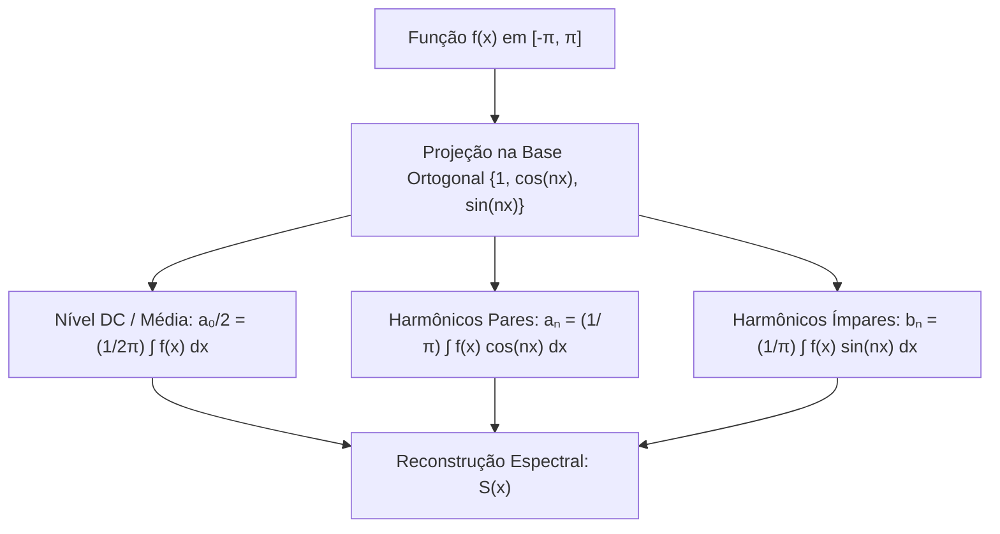
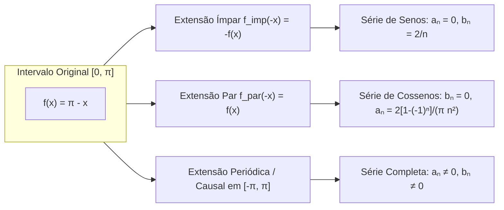
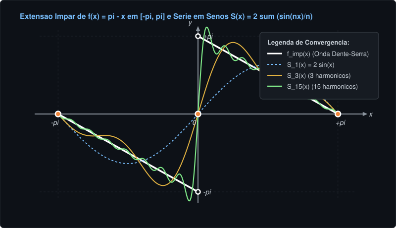
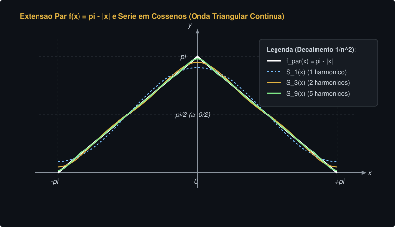
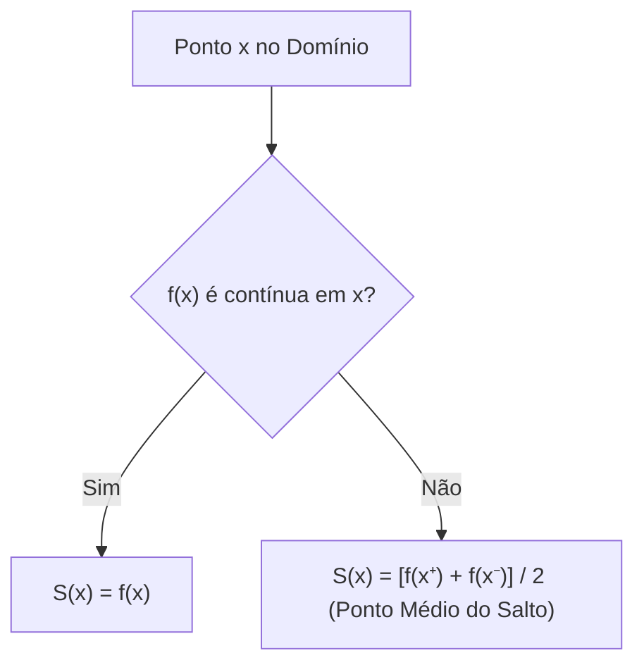
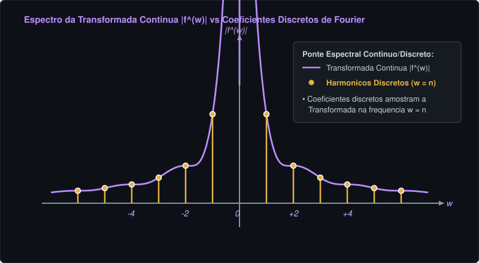

# 📘 Apostila Didática USP: Séries e Transformada de Fourier — $f(x) = \pi - x$
> **Disciplina:** Cálculo Avançado / Análise de Fourier — USP  
> **Data de Referência:** 20 de Agosto  
> **Tema:** Termo Geral da Série de Fourier em $[-\pi, \pi]$, Extensões de Meia Onda de $f(x) = \pi - x$, Rastreabilidade dos Coeficientes, Convergência de Dirichlet, Parseval e Transformada Contínua  
> **Objetivo:** Fornecer formalismo matemático rigoroso, intuição física, justificativa total de cada passagem algébrica e aplicações em cálculo de séries numéricas no padrão de exigência das provas da USP.

---

## 📑 Sumário
1. [Estrutura Geral da Série de Fourier em [-π, π]](#1-estrutura-geral-da-série-de-fourier-em---)
2. [A Função f(x) = π - x e o Conceito de Extensão de Meia Onda](#2-a-função-fx---x-e-o-conceito-de-extensão-de-meia-onda)
3. [Dedução Passo a Passo: Extensão Ímpar (Série de Senos)](#3-dedução-passo-a-passo-extensão-ímpar-série-de-senos)
4. [Dedução Passo a Passo: Extensão Par (Série de Cossenos)](#4-dedução-passo-a-passo-extensão-par-série-de-cossenos)
5. [Extensão Periódica Direta e Decomposição Canônica](#5-extensão-periódica-direta-e-decomposição-canônica)
6. [Teorema de Convergência de Dirichlet e Séries Numéricas Notáveis](#6-teorema-de-convergência-de-dirichlet-e-séries-numéricas-notáveis)
7. [Conservação de Energia e Identidade de Parseval](#7-conservação-de-energia-e-identidade-de-parseval)
8. [Da Série Discreta à Transformada de Fourier Contínua](#8-da-série-discreta-à-transformada-de-fourier-contínua)
9. [Quadro-Resumo de Coeficientes & Formulário de Prova](#9-quadro-resumo-de-coeficientes--formulário-de-prova)

---

## 1. Estrutura Geral da Série de Fourier em $[-\pi, \pi]$

A Série de Fourier decompõe uma função periódica $f(x)$ de período $T = 2\pi$ em uma soma infinita de harmônicos ortogonais (senos e cossenos).

### 1.1 Expressão Canônica da Série

$$
S(x) = \frac{a_0}{2} + \sum_{n=1}^\infty \left[ a_n \cos(nx) + b_n \sin(nx) \right]
$$

---

### 1.2 Fórmulas dos Coeficientes de Euler-Fourier

Para qualquer função $f(x)$ integrável no intervalo $[-\pi, \pi]$:

#### Termo Médio ($n = 0$):

$$
a_0 = \frac{1}{\pi} \int_{-\pi}^\pi f(x)\,dx \implies \frac{a_0}{2} = \frac{1}{2\pi}\int_{-\pi}^\pi f(x)\,dx
$$

#### Coeficientes dos Cossenos ($n \ge 1$):

$$
a_n = \frac{1}{\pi} \int_{-\pi}^\pi f(x)\cos(nx)\,dx
$$

#### Coeficientes dos Senos ($n \ge 1$):

$$
b_n = \frac{1}{\pi} \int_{-\pi}^\pi f(x)\sin(nx)\,dx
$$

> [!NOTE]
> **Por que o termo constante é escrito como $a_0/2$?**  
> Porque a norma da função constante $1$ no espaço $L^2[-\pi, \pi]$ é $\|1\|^2 = \int_{-\pi}^\pi 1^2\,dx = 2\pi$, enquanto $\|\cos(nx)\|^2 = \|\sin(nx)\|^2 = \pi$. Dividir $a_0$ por $2$ permite unificar a fórmula de $a_n$ para todo $n \ge 0$, já que $\cos(0\cdot x) = 1$.

---

## 2. A Função $f(x) = \pi - x$ e o Conceito de Extensão de Meia Onda

A função $f(x) = \pi - x$ é dada inicialmente apenas no intervalo de meia onda $[0, \pi]$.

### Tabela de Comparação das Extensões em $[-\pi, \pi]$

| Tipo de Extensão | Definição em $[-\pi, 0)$ | Paridade | Coeficientes Nulos | Tipo de Série Resultante |
| :--- | :--- | :--- | :--- | :--- |
| **Extensão Ímpar** | $f_{\text{imp}}(x) = -\pi - x$ | Ímpar | $a_0 = 0$, $a_n = 0$ | Série de Fourier em Senos |
| **Extensão Par** | $f_{\text{par}}(x) = \pi + x = \pi - \|x\|$ | Par | $b_n = 0$ | Série de Fourier em Cossenos |
| **Extensão Causal** | $f_{\text{causal}}(x) = 0$ | Nenhuma | Nenhum | Série Completa (Senos + Cossenos) |

---

## 3. Dedução Passo a Passo: Extensão Ímpar (Série de Senos)

Definimos a extensão ímpar periódica $f_{\text{imp}}(x)$ tal que $f_{\text{imp}}(-x) = -f_{\text{imp}}(x)$.

### 3.1 Propriedade de Paridade

Como a função estendida é ímpar, os termos $a_0 = 0$ e $a_n = 0$ para todo $n \ge 1$. O produto $(\text{impar}) \times (\text{impar})$ resulta em uma função par, duplicando a integral de meia onda:

$$
b_n = \frac{2}{\pi} \int_0^\pi (\pi - x)\sin(nx)\,dx
$$

---

### 3.2 Execução da Integração em Três Tempos

#### Ponto de Partida:
Separamos a expressão em duas integrais fundamentais:

$$
b_n = \frac{2}{\pi} \left[ \pi \int_0^\pi \sin(nx)\,dx - \int_0^\pi x\sin(nx)\,dx \right]
$$

#### Primeira Parcela (Integração Direta do Seno):
Calculamos a integral elementar do seno avaliada nos limites $0$ e $\pi$:

$$
\int_0^\pi \sin(nx)\,dx = \left[ -\frac{\cos(nx)}{n} \right]_0^\pi = -\frac{\cos(n\pi) - \cos(0)}{n} = \frac{1 - (-1)^n}{n}
$$

#### Segunda Parcela (Integração por Partes):
Adotamos $u = x \implies du = dx$ e $dv = \sin(nx)dx \implies v = -\frac{\cos(nx)}{n}$:

$$
\int_0^\pi x\sin(nx)\,dx = \left[ -\frac{x\cos(nx)}{n} \right]_0^\pi - \int_0^\pi \left(-\frac{\cos(nx)}{n}\right)\,dx
$$

$$
= -\frac{\pi\cos(n\pi) - 0}{n} + \frac{1}{n} \left[ \frac{\sin(nx)}{n} \right]_0^\pi = -\frac{\pi(-1)^n}{n} + 0 = -\frac{\pi(-1)^n}{n}
$$

#### Terceira Etapa: Substituição e Simplificação Algébrica:
Reunindo ambas as parcelas na expressão do coeficiente $b_n$:

$$
b_n = \frac{2}{\pi} \left[ \pi \left( \frac{1 - (-1)^n}{n} \right) - \left( -\frac{\pi(-1)^n}{n} \right) \right]
$$

$$
b_n = \frac{2}{\pi} \left[ \frac{\pi - \pi(-1)^n + \pi(-1)^n}{n} \right] = \frac{2}{\pi} \left( \frac{\pi}{n} \right) = \frac{2}{n}
$$

#### Resultado Obtido:

$$
b_n = \frac{2}{n} \quad (\forall n \ge 1)
$$

---

### 3.3 A Série de Senos de $\pi - x$

Substituindo os coeficientes obtidos na série de senos:

$$
S_{\text{sen}}(x) = \sum_{n=1}^\infty \frac{2}{n}\sin(nx) = 2\left( \frac{\sin(x)}{1} + \frac{\sin(2x)}{2} + \frac{\sin(3x)}{3} + \frac{\sin(4x)}{4} + \dots \right)
$$

> [!TIP]
> **Significado Físico / Engenharia:**  
> A amplitude do harmônico decai como $1/n$. Esse decaimento lento ($\mathcal{O}(1/n)$) é a assinatura direta de uma função que possui **descontinuidades de salto** nos extremos $x = 0$ e $x = \pm\pi$.

---

## 4. Dedução Passo a Passo: Extensão Par (Série de Cossenos)

Definimos a extensão par periódica $f_{\text{par}}(x) = \pi - |x|$ no intervalo $[-\pi, \pi]$.

### 4.1 Propriedade de Paridade

Como a função estendida é par, temos $b_n = 0$ para todo $n \ge 1$. O produto $(\text{par}) \times (\text{par})$ é par, dobrando o domínio de integração:

$$
a_0 = \frac{2}{\pi}\int_0^\pi (\pi - x)\,dx, \quad a_n = \frac{2}{\pi}\int_0^\pi (\pi - x)\cos(nx)\,dx
$$

---

### 4.2 Cálculo do Termo Médio ($a_0$)

#### Ponto de Partida e Integração Polinomial:

$$
a_0 = \frac{2}{\pi}\int_0^\pi (\pi - x)\,dx = \frac{2}{\pi} \left[ \pi x - \frac{x^2}{2} \right]_0^\pi = \frac{2}{\pi}\left( \pi^2 - \frac{\pi^2}{2} \right) = \frac{2}{\pi} \left(\frac{\pi^2}{2}\right) = \pi
$$

#### Valor DC da Série:

$$
\frac{a_0}{2} = \frac{\pi}{2}
$$

---

### 4.3 Cálculo dos Coeficientes $a_n$ ($n \ge 1$) por Partes

#### Ponto de Partida:
Adotamos $u = \pi - x \implies du = -dx$ e $dv = \cos(nx)dx \implies v = \frac{\sin(nx)}{n}$.

#### Execução da Integração por Partes:

$$
a_n = \frac{2}{\pi} \left( \left[ (\pi - x)\frac{\sin(nx)}{n} \right]_0^\pi - \int_0^\pi \left(\frac{\sin(nx)}{n}\right)(-dx) \right)
$$

Como $\sin(n\pi) = 0$ e $\sin(0) = 0$, a parcela de fronteira se anula identicamente:

$$
a_n = \frac{2}{\pi n} \int_0^\pi \sin(nx)\,dx = \frac{2}{\pi n} \left[ -\frac{\cos(nx)}{n} \right]_0^\pi = \frac{2}{\pi n^2} \left( 1 - \cos(n\pi) \right)
$$

$$
a_n = \frac{2(1 - (-1)^n)}{\pi n^2}
$$

#### Análise dos Casos Par e Ímpar:
Para $n$ **par** ($n = 2k$): $(-1)^{2k} = 1 \implies a_{2k} = 0$.

Para $n$ **ímpar** ($n = 2k-1$): $(-1)^{2k-1} = -1 \implies a_{2k-1} = \frac{4}{\pi(2k-1)^2}$.

---

### 4.4 A Série de Cossenos de $\pi - x$

Substituindo os índices ímpares $n = 2k-1$:

$$
S_{\text{cos}}(x) = \frac{\pi}{2} + \frac{4}{\pi}\sum_{k=1}^\infty \frac{\cos((2k-1)x)}{(2k-1)^2} = \frac{\pi}{2} + \frac{4}{\pi}\left( \frac{\cos(x)}{1^2} + \frac{\cos(3x)}{3^2} + \frac{\cos(5x)}{5^2} + \dots \right)
$$

> [!NOTE]
> **Decaimento Rápido:**  
> Os coeficientes decaem como $\mathcal{O}(1/n^2)$. A extensão par $f_{\text{par}}(x) = \pi - |x|$ é **contínua em toda a reta** (onda triangular contínua), garantindo convergência uniforme sem oscilações de Gibbs.

---

## 5. Extensão Periódica Direta e Decomposição Canônica

Considerando agora o sinal causal em $[-\pi, \pi]$ com anulação no semi-eixo negativo:

$$
g(x) = \begin{cases} \pi - x, & 0 \le x \le \pi \\ 0, & -\pi \le x < 0 \end{cases}
$$

### 5.1 Coeficientes Diretos de Euler-Fourier em $[-\pi, \pi]$

#### Cálculo de $a_0$:

$$
a_0 = \frac{1}{\pi}\int_{-\pi}^\pi g(x)\,dx = \frac{1}{\pi}\int_0^\pi (\pi - x)\,dx = \frac{\pi}{2} \implies \frac{a_0}{2} = \frac{\pi}{4}
$$

#### Cálculo de $a_n$ e $b_n$:

$$
a_n = \frac{1}{\pi}\int_0^\pi (\pi - x)\cos(nx)\,dx = \frac{1 - (-1)^n}{\pi n^2} = \begin{cases} 0, & n \text{ par} \\ \dfrac{2}{\pi n^2}, & n \text{ impar} \end{cases}
$$

$$
b_n = \frac{1}{\pi}\int_0^\pi (\pi - x)\sin(nx)\,dx = \frac{1}{n}
$$

---

### 5.2 A Série Geral de $g(x)$

$$
S_g(x) = \frac{\pi}{4} + \frac{2}{\pi}\sum_{k=1}^\infty \frac{\cos((2k-1)x)}{(2k-1)^2} + \sum_{n=1}^\infty \frac{\sin(nx)}{n}
$$

> [!IMPORTANT]
> **Teorema da Linearidade e Decomposição Par/Ímpar:**  
> Note que $g(x) = \frac{1}{2}f_{\text{par}}(x) + \frac{1}{2}f_{\text{imp}}(x)$. A série $S_g(x)$ é rigorosamente igual a $\frac{1}{2}S_{\text{cos}}(x) + \frac{1}{2}S_{\text{sen}}(x)$, demonstrando a consistência algébrica total do sistema.

---

## 6. Teorema de Convergência de Dirichlet e Séries Numéricas Notáveis

O **Teorema de Dirichlet** estabelece que, para uma função contínua por partes com derivadas laterais finitas:

$$
S(x) = \frac{f(x^+) + f(x^-)}{2}
$$

---

### 6.1 Aplicação 1: Fórmula de Leibniz para $\pi$ (via Série de Senos)

Avaliamos a Série de Senos em $x = \frac{\pi}{2}$ (ponto de continuidade):

Como $f(\pi/2) = \pi - \frac{\pi}{2} = \frac{\pi}{2}$ e $\sin\left(n\frac{\pi}{2}\right) = (-1)^{k-1}$ para $n = 2k-1$:

#### Igualdade de Dirichlet:

$$
\frac{\pi}{2} = 2 \left( \frac{\sin(\pi/2)}{1} + \frac{\sin(3\pi/2)}{3} + \frac{\sin(5\pi/2)}{5} - \dots \right) = 2 \sum_{k=1}^\infty \frac{(-1)^{k-1}}{2k-1}
$$

#### Resultado Obtido (Série de Leibniz):

$$
\sum_{k=1}^\infty \frac{(-1)^{k-1}}{2k-1} = 1 - \frac{1}{3} + \frac{1}{5} - \frac{1}{7} + \frac{1}{9} - \dots = \frac{\pi}{4}
$$

---

### 6.2 Aplicação 2: Soma dos Inversos dos Quadrados Ímpares (via Série de Cossenos)

Avaliamos a Série de Cossenos em $x = 0$ (ponto de continuidade):

Como $f(0) = \pi - 0 = \pi$ e $\cos(0) = 1$:

#### Igualdade de Dirichlet:

$$
\pi = \frac{\pi}{2} + \frac{4}{\pi}\sum_{k=1}^\infty \frac{1}{(2k-1)^2}
$$

#### Isolando o Somatório:

$$
\pi - \frac{\pi}{2} = \frac{4}{\pi}\sum_{k=1}^\infty \frac{1}{(2k-1)^2} \implies \frac{\pi}{2} = \frac{4}{\pi}\sum_{k=1}^\infty \frac{1}{(2k-1)^2}
$$

#### Resultado Obtido:

$$
\sum_{k=1}^\infty \frac{1}{(2k-1)^2} = 1 + \frac{1}{3^2} + \frac{1}{5^2} + \frac{1}{7^2} + \dots = \frac{\pi^2}{8}
$$

---

### 6.3 Aplicação 3: O Problema de Basel ($\sum_{n=1}^\infty \frac{1}{n^2}$)

Podemos deduzir o valor da série de todos os inversos dos quadrados ($S = \sum_{n=1}^\infty \frac{1}{n^2}$) separando os índices em pares e ímpares:

$$
S = \sum_{n=1}^\infty \frac{1}{n^2} = \sum_{k=1}^\infty \frac{1}{(2k)^2} + \sum_{k=1}^\infty \frac{1}{(2k-1)^2} = \frac{1}{4}\sum_{k=1}^\infty \frac{1}{k^2} + \frac{\pi^2}{8}
$$

$$
S = \frac{1}{4}S + \frac{\pi^2}{8} \implies \frac{3}{4}S = \frac{\pi^2}{8} \implies S = \frac{\pi^2}{8} \cdot \frac{4}{3} = \frac{\pi^2}{6}
$$

$$
\sum_{n=1}^\infty \frac{1}{n^2} = 1 + \frac{1}{2^2} + \frac{1}{3^2} + \frac{1}{4^2} + \dots = \frac{\pi^2}{6}
$$

---

## 7. Conservação de Energia e Identidade de Parseval

A **Identidade de Parseval** é a extensão do Teorema de Pitágoras para o espaço funcional de Hilbert $L^2[-\pi, \pi]$:

$$
\frac{a_0^2}{2} + \sum_{n=1}^\infty (a_n^2 + b_n^2) = \frac{1}{\pi}\int_{-\pi}^\pi [f(x)]^2\,dx
$$

---

### 7.1 Parseval Aplicado à Extensão Ímpar de $\pi - x$

Para a extensão ímpar $f_{\text{imp}}(x)$, temos $a_0 = 0$, $a_n = 0$ e $b_n = \frac{2}{n}$.

#### Energia no Domínio do Tempo:

$$
\frac{1}{\pi}\int_{-\pi}^\pi [f_{\text{imp}}(x)]^2\,dx = \frac{2}{\pi}\int_0^\pi (\pi - x)^2\,dx = \frac{2}{\pi} \left[ -\frac{(\pi - x)^3}{3} \right]_0^\pi = \frac{2}{\pi} \left( 0 - \left(-\frac{\pi^3}{3}\right) \right) = \frac{2\pi^2}{3}
$$

#### Energia no Domínio da Frequência:

$$
\sum_{n=1}^\infty b_n^2 = \sum_{n=1}^\infty \left(\frac{2}{n}\right)^2 = 4\sum_{n=1}^\infty \frac{1}{n^2}
$$

#### Igualdade de Parseval:

$$
4\sum_{n=1}^\infty \frac{1}{n^2} = \frac{2\pi^2}{3} \implies \sum_{n=1}^\infty \frac{1}{n^2} = \frac{\pi^2}{6}
$$

> [!TIP]
> Parseval fornece um segundo caminho totalmente independente para calcular o valor exato da **Série de Basel** ($\pi^2/6$).

---

## 8. Da Série Discreta à Transformada de Fourier Contínua

Quando o sinal deixa de ser periódico e passa a ser um pulso isolado no tempo contínuo $x \in \mathbb{R}$, o período $T \to \infty$ e a Série de Fourier discreta converge para a **Transformada de Fourier Contínua**.

Considere o pulso não periódico:

$$
f(x) = \begin{cases} \pi - x, & 0 \le x \le \pi \\ 0, & \text{caso contrario} \end{cases}
$$

---

### 8.1 Definição da Transformada de Fourier

$$
\hat{f}(\omega) = \mathcal{F}\{f(x)\}(\omega) = \int_{-\infty}^\infty f(x) e^{-i\omega x}\,dx = \int_0^\pi (\pi - x) e^{-i\omega x}\,dx
$$

---

### 8.2 Demonstração Passo a Passo da Transformada

#### Ponto de Partida (Integração por Partes Complexa):
Adotamos $u = \pi - x \implies du = -dx$ e $dv = e^{-i\omega x}dx \implies v = \frac{e^{-i\omega x}}{-i\omega}$.

#### Execução da Integração:

$$
\hat{f}(\omega) = \left[ (\pi - x)\frac{e^{-i\omega x}}{-i\omega} \right]_0^\pi - \int_0^\pi \left(\frac{e^{-i\omega x}}{-i\omega}\right)(-dx)
$$

#### Primeira Parcela (Termo de Fronteira):
Em $x = \pi$, temos $(\pi - \pi) = 0$. Em $x = 0$, temos $- (\pi - 0)\frac{e^0}{-i\omega} = \frac{\pi}{i\omega} = -\frac{i\pi}{\omega}$.

#### Segunda Parcela (Integral Restante):

$$
-\frac{1}{i\omega}\int_0^\pi e^{-i\omega x}\,dx = -\frac{1}{i\omega}\left[ \frac{e^{-i\omega x}}{-i\omega} \right]_0^\pi = \frac{1}{\omega^2}\left( e^{-i\omega\pi} - 1 \right)
$$

#### Terceira Etapa: Agrupamento dos Termos:

$$
\hat{f}(\omega) = -\frac{i\pi}{\omega} + \frac{e^{-i\omega\pi} - 1}{\omega^2} = \frac{-i\pi\omega + e^{-i\omega\pi} - 1}{\omega^2}
$$

---

### 8.3 Conexão entre a Transformada Contínua e a Série Discreta

Utilizando a fórmula de Euler $e^{-i\omega\pi} = \cos(\omega\pi) - i\sin(\omega\pi)$:

$$
\hat{f}(\omega) = \frac{\cos(\omega\pi) - 1}{\omega^2} - i\left[ \frac{\pi\omega + \sin(\omega\pi)}{\omega^2} \right]
$$

Para frequências inteiras discretas $\omega = n \in \mathbb{N}$:
* Parte Real: $\text{Re}\{\hat{f}(n)\} = \frac{\cos(n\pi) - 1}{n^2} = -\frac{\pi}{2} a_n$
* Parte Imaginária: $\text{Im}\{\hat{f}(n)\} = -\frac{\pi n + 0}{n^2} = -\frac{\pi}{n} = -\frac{\pi}{2} b_n$

> [!IMPORTANT]
> **Ponte Espectral:**  
> Os coeficientes discretos de Fourier da extensão causal periódica $g(x)$ são amostras diretas da Transformada de Fourier Contínua $\hat{f}(\omega)$ nos múltiplos da frequência fundamental ($\omega = n$).

---

## 9. Quadro-Resumo de Coeficientes & Formulário de Prova

### Formulário Geral para Intervalo $[-\pi, \pi]$:

$$
S(x) = \frac{a_0}{2} + \sum_{n=1}^\infty \left[ a_n \cos(nx) + b_n \sin(nx) \right]
$$

$$
a_0 = \frac{1}{\pi}\int_{-\pi}^\pi f(x)\,dx, \quad a_n = \frac{1}{\pi}\int_{-\pi}^\pi f(x)\cos(nx)\,dx, \quad b_n = \frac{1}{\pi}\int_{-\pi}^\pi f(x)\sin(nx)\,dx
$$

---

### Tabela Resumo para $f(x) = \pi - x$ em $[0, \pi]$:

| Modelo de Série | $a_0 / 2$ | Coeficiente $a_n$ | Coeficiente $b_n$ | Série Resultante $S(x)$ |
| :--- | :--- | :--- | :--- | :--- |
| **Série em Senos (Extensão Ímpar)** | $0$ | $0$ | $\dfrac{2}{n}$ | $\displaystyle\sum_{n=1}^\infty \frac{2}{n}\sin(nx)$ |
| **Série em Cossenos (Extensão Par)** | $\dfrac{\pi}{2}$ | $\begin{cases} 0, & n \text{ par} \\ \dfrac{4}{\pi n^2}, & n \text{ impar} \end{cases}$ | $0$ | $\dfrac{\pi}{2} + \dfrac{4}{\pi}\displaystyle\sum_{k=1}^\infty \frac{\cos((2k-1)x)}{(2k-1)^2}$ |
| **Série Completa (Extensão Causal)** | $\dfrac{\pi}{4}$ | $\begin{cases} 0, & n \text{ par} \\ \dfrac{2}{\pi n^2}, & n \text{ impar} \end{cases}$ | $\dfrac{1}{n}$ | $\dfrac{\pi}{4} + \dfrac{2}{\pi}\displaystyle\sum_{k=1}^\infty \frac{\cos((2k-1)x)}{(2k-1)^2} + \displaystyle\sum_{n=1}^\infty \frac{\sin(nx)}{n}$ |
| **Transformada Contínua $\hat{f}(\omega)$** | — | — | — | $\hat{f}(\omega) = \dfrac{-i\pi\omega + e^{-i\omega\pi} - 1}{\omega^2}$ |
