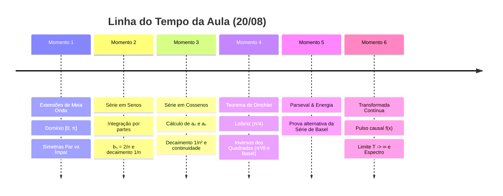

# 🔴 Live da Aula: Séries e Transformada de Fourier — $f(x) = \pi - x$ (USP)
> **Data:** 20 de Agosto  
> **Status:** Acompanhamento em tempo real — Análise Espectral e Extensões de Meia Onda.  
> **Objetivo deste arquivo:** Decodificar os momentos da aula, passos algébricos na lousa e intuições imediatas do professor.

---

## ⏱️ Linha do Tempo & Momentos da Aula

---

## ⚡ Momentos da Lousa & Notas Rápidas

### Momento 1: Termo Geral da Série em $[-\pi, \pi]$

A série canônica é escrita como:

$$
S(x) = \frac{a_0}{2} + \sum_{n=1}^\infty \left[ a_n \cos(nx) + b_n \sin(nx) \right]
$$

Com as fórmulas de Euler-Fourier:

$$
a_0 = \frac{1}{\pi}\int_{-\pi}^\pi f(x)\,dx, \quad a_n = \frac{1}{\pi}\int_{-\pi}^\pi f(x)\cos(nx)\,dx, \quad b_n = \frac{1}{\pi}\int_{-\pi}^\pi f(x)\sin(nx)\,dx
$$

---

### Momento 2: Extensão Ímpar de $f(x) = \pi - x$ (Série em Senos)

Por paridade, $a_0 = 0$ e $a_n = 0$.

O coeficiente $b_n$ é obtido por:

$$
b_n = \frac{2}{\pi}\int_0^\pi (\pi - x)\sin(nx)\,dx = \frac{2}{n}
$$

A série resultante é:

$$
S_{\text{sen}}(x) = \sum_{n=1}^\infty \frac{2}{n}\sin(nx) = 2\left( \sin(x) + \frac{\sin(2x)}{2} + \frac{\sin(3x)}{3} + \dots \right)
$$

---

### Momento 3: Extensão Par de $f(x) = \pi - x$ (Série em Cossenos)

Por paridade, $b_n = 0$.

Os coeficientes $a_0$ e $a_n$ são:

$$
\frac{a_0}{2} = \frac{\pi}{2}, \quad a_n = \frac{2(1 - (-1)^n)}{\pi n^2} = \begin{cases} 0, & n \text{ par} \\ \dfrac{4}{\pi n^2}, & n \text{ impar} \end{cases}
$$

A série resultante é:

$$
S_{\text{cos}}(x) = \frac{\pi}{2} + \frac{4}{\pi}\sum_{k=1}^\infty \frac{\cos((2k-1)x)}{(2k-1)^2}
$$

---

### Momento 4: Séries Numéricas via Dirichlet

Avaliando no ponto $x = \frac{\pi}{2}$ na Série de Senos:

$$
\sum_{k=1}^\infty \frac{(-1)^{k-1}}{2k-1} = 1 - \frac{1}{3} + \frac{1}{5} - \frac{1}{7} + \dots = \frac{\pi}{4}
$$

Avaliando no ponto $x = 0$ na Série de Cossenos:

$$
\sum_{k=1}^\infty \frac{1}{(2k-1)^2} = 1 + \frac{1}{3^2} + \frac{1}{5^2} + \dots = \frac{\pi^2}{8} \implies \sum_{n=1}^\infty \frac{1}{n^2} = \frac{\pi^2}{6}
$$

---

### Momento 5: Transformada de Fourier Contínua

Para o pulso isolado causal $f(x) = \pi - x$ em $[0, \pi]$:

$$
\hat{f}(\omega) = \int_0^\pi (\pi - x) e^{-i\omega x}\,dx = \frac{-i\pi\omega + e^{-i\omega\pi} - 1}{\omega^2}
$$
