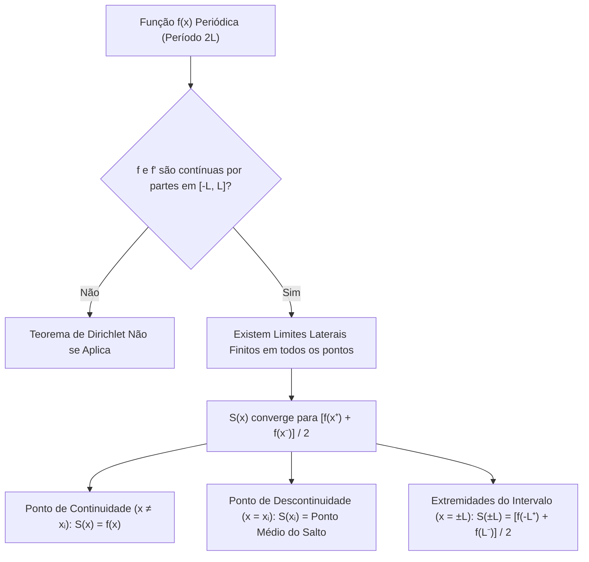
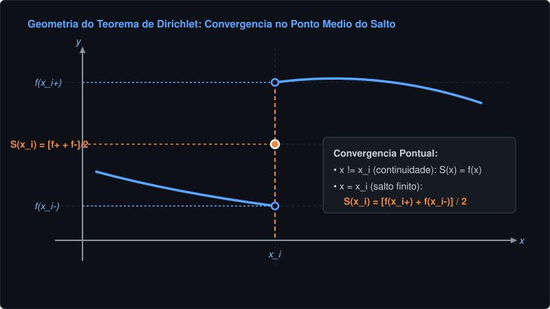
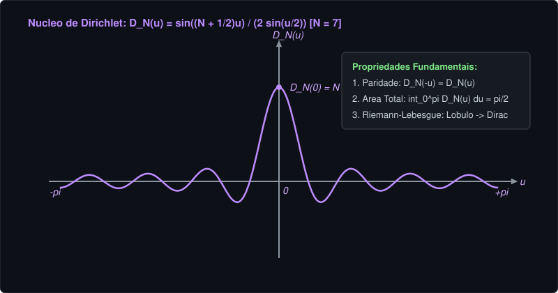
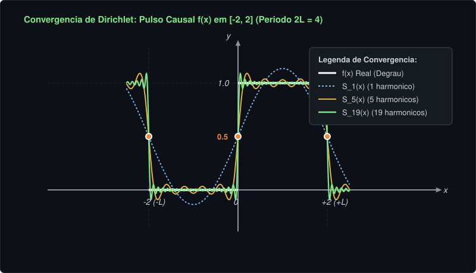
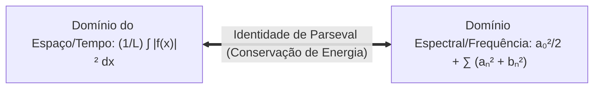
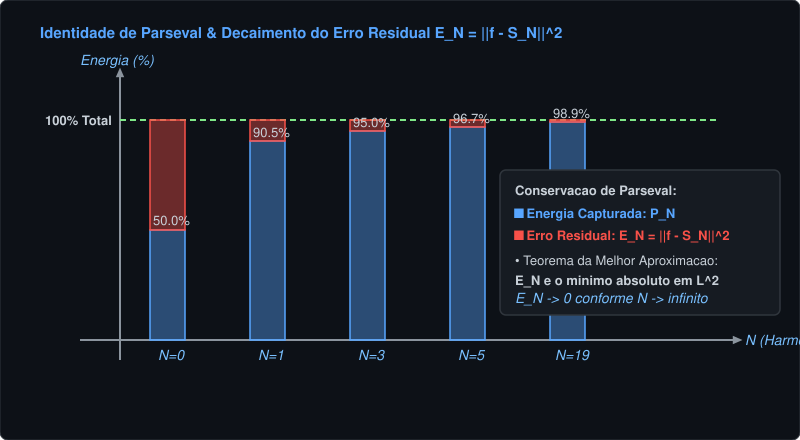

# 📘 Teorema de Convergência Pontual de Fourier (Dirichlet) em Intervalos Arbitrários $[-L, L]$
> **Disciplina:** Análise de Fourier / Cálculo Avançado — USP  
> **Tema:** Enunciado Formal, Hipóteses de Continuidade por Partes, Dedução Rigorosa com Núcleo de Dirichlet, Lema de Riemann-Lebesgue, Identidade de Parseval e Erro Quadrático Residual $E_N$  
> **Data de Referência:** 20 de Agosto  
> **Padrão:** Rigor acadêmico USP, rastreabilidade matemática total e conformidade estrita com o [GitHub Docs](https://docs.github.com/pt/get-started/writing-on-github).

---

## 📑 Sumário
1. [Enunciado Formal do Teorema de Dirichlet em [-L, L]](#1-enunciado-formal-do-teorema-de-dirichlet-em--l-l)
2. [Visualização Geométrica do Salto e Limites Laterais](#2-visualização-geométrica-do-salto-e-limites-laterais)
3. [Dedução Completa: O Núcleo de Dirichlet e Riemann-Lebesgue](#3-dedução-completa-o-núcleo-de-dirichlet-e-riemann-lebesgue)
4. [Exemplo Canônico Resolvido: Pulso Causal em [-2, 2] com Período 2L = 4](#4-exemplo-canônico-resolvido-pulso-causal-em--2-2-com-período-2l--4)
5. [Análise de Convergência Pontual e Extremidades](#5-análise-de-convergência-pontual-e-extremidades)
6. [O Fenômeno de Gibbs nas Proximidades do Salto](#6-o-fenômeno-de-gibbs-nas-proximidades-do-salto)
7. [Identidade de Parseval e Conservação de Energia](#7-identidade-de-parseval-e-conservação-de-energia)
8. [O Erro Quadrático Médio Residual E_N e a Melhor Aproximação](#8-o-erro-quadrático-médio-residual-e_n-e-a-melhor-aproximação)
9. [Guia Técnico: Renderização de Gráficos Matemáticos no GitHub Markdown](#9-guia-técnico-renderização-de-gráficos-matemáticos-no-github-markdown)
10. [Formulário de Bolso para Provas USP](#10-formulário-de-bolso-para-provas-usp)

---

## 1. Enunciado Formal do Teorema de Dirichlet em $[-L, L]$

O **Teorema de Dirichlet** estabelece as condições suficientes sob as quais a Série de Fourier de uma função $f(x)$ periódica de período $2L$ converge pontualmente para cada valor de $x \in \mathbb{R}$.

---

### 1.1 Definições e Hipóteses Fundamentais

Seja $f: \mathbb{R} \to \mathbb{R}$ uma função periódica de período $2L$, isto é, $f(x + 2L) = f(x)$ para todo $x \in \mathbb{R}$.

#### Hipótese 1: Continuidade por Partes de $f(x)$
A função $f$ possui no máximo um número finito de descontinuidades de salto no intervalo fundamental $[-L, L]$, denotadas por $\{x_1, x_2, \dots, x_k\}$. Em cada ponto $x_i$, existem e são **finitos** os limites laterais à direita e à esquerda:

$$
f(x_i^+) = \lim_{h \to 0^+} f(x_i + h), \quad f(x_i^-) = \lim_{h \to 0^+} f(x_i - h)
$$

#### Hipótese 2: Continuidade por Partes da Derivada $f'(x)$
A derivada de primeira ordem $f'$ existe e é contínua em cada subintervalo aberto entre as descontinuidades, e existem e são **finitas** as derivadas laterais em todos os pontos:

$$
f'(x_i^+) = \lim_{h \to 0^+} \frac{f(x_i + h) - f(x_i^+)}{h}, \quad f'(x_i^-) = \lim_{h \to 0^+} \frac{f(x_i - h) - f(x_i^-)}{-h}
$$

---

### 1.2 Tese do Teorema

Sob as hipóteses 1 e 2, a Série de Fourier associada a $f(x)$:

$$
S(x) = \frac{a_0}{2} + \sum_{n=1}^\infty \left[ a_n \cos\left(\frac{n\pi x}{L}\right) + b_n \sin\left(\frac{n\pi x}{L}\right) \right]
$$

com coeficientes de Euler-Fourier dados por:

$$
a_0 = \frac{1}{L}\int_{-L}^L f(x)\,dx
$$

$$
a_n = \frac{1}{L}\int_{-L}^L f(x)\cos\left(\frac{n\pi x}{L}\right)dx, \quad b_n = \frac{1}{L}\int_{-L}^L f(x)\sin\left(\frac{n\pi x}{L}\right)dx
$$

**converge pontualmente para todo $x \in \mathbb{R}$** para o valor:

$$
S(x) = \frac{f(x^+) + f(x^-)}{2}
$$

> [!IMPORTANT]
> **Classificação dos Casos de Convergência Pontual:**  
> • Se $f(x)$ for contínua em $x$: $f(x^+) = f(x^-) = f(x)$, logo $S(x) = f(x)$.  
> • Se $x_i$ for um ponto de salto: a série converge para o ponto médio exato $S(x_i) = \frac{f(x_i^+) + f(x_i^-)}{2}$.  
> • Nas fronteiras do período ($x = \pm L$): a série converge para $S(L) = S(-L) = \frac{f(-L^+) + f(L^-)}{2}$.

---

## 2. Visualização Geométrica do Salto e Limites Laterais

Abaixo temos o diagrama vetorial ilustrando o comportamento da soma de Fourier $S(x)$ nas proximidades de um ponto de descontinuidade $x_i$:

---

## 3. Dedução Completa: O Núcleo de Dirichlet e Riemann-Lebesgue

A demonstração clássica do Teorema de Dirichlet revela o mecanismo pelo qual harmônicos trigonométricos infinitos realizam a filtragem seletiva de um ponto.

---

### 3.1 Etapa 1: Representação Integral da Soma Parcial $S_N(x)$

A soma parcial de ordem $N$ da Série de Fourier é definida como:

$$
S_N(x) = \frac{a_0}{2} + \sum_{n=1}^N \left[ a_n \cos\left(\frac{n\pi x}{L}\right) + b_n \sin\left(\frac{n\pi x}{L}\right) \right]
$$

Substituindo as definições integrais dos coeficientes com a variável muda de integração $t \in [-L, L]$:

$$
S_N(x) = \frac{1}{2L}\int_{-L}^L f(t)\,dt + \sum_{n=1}^N \left[ \left(\frac{1}{L}\int_{-L}^L f(t)\cos\left(\frac{n\pi t}{L}\right)dt\right)\cos\left(\frac{n\pi x}{L}\right) + \left(\frac{1}{L}\int_{-L}^L f(t)\sin\left(\frac{n\pi t}{L}\right)dt\right)\sin\left(\frac{n\pi x}{L}\right) \right]
$$

Aplicando a linearidade da integral e a identidade trigonométrica da subtração de arcos $\cos(A)\cos(B) + \sin(A)\sin(B) = \cos(A - B)$:

$$
S_N(x) = \frac{1}{L}\int_{-L}^L f(t) \left[ \frac{1}{2} + \sum_{n=1}^N \cos\left(\frac{n\pi (t - x)}{L}\right) \right] dt
$$

---

### 3.2 Etapa 2: A Forma Fechada do Núcleo de Dirichlet $D_N(u)$

Definimos o **Núcleo de Dirichlet** com a variável adimensional $u = \frac{\pi (t - x)}{L}$:

$$
D_N(u) = \frac{1}{2} + \sum_{n=1}^N \cos(nu)
$$

Multiplicamos ambos os lados por $2\sin\left(\frac{u}{2}\right)$ e utilizamos a relação de produto em soma $2\sin(A)\cos(B) = \sin(A+B) + \sin(A-B)$:

$$
2\sin\left(\frac{u}{2}\right) D_N(u) = \sin\left(\frac{u}{2}\right) + \sum_{n=1}^N \left[ \sin\left(\left(n + \frac{1}{2}\right)u\right) - \sin\left(\left(n - \frac{1}{2}\right)u\right) \right]
$$

A soma no lado direito é uma **série telescópica**, onde todos os termos intermediários se cancelam aos pares:

$$
2\sin\left(\frac{u}{2}\right) D_N(u) = \sin\left(\left(N + \frac{1}{2}\right)u\right)
$$

Isolando $D_N(u)$:

$$
D_N(u) = \frac{\sin\left(\left(N + \frac{1}{2}\right)u\right)}{2\sin\left(\frac{u}{2}\right)}
$$

---

### 3.3 Etapa 3: Propriedades de Simetria e Normalização

O Núcleo de Dirichlet satisfaz três propriedades determinantes:

#### Propriedade 1: Paridade
A função é estritamente par: $D_N(-u) = D_N(u)$.

#### Propriedade 2: Periodicidade
O núcleo é periódico com período $2\pi$: $D_N(u + 2\pi) = D_N(u)$.

#### Propriedade 3: Integral Normalizadora
Integrando termo a termo de $0$ a $\pi$:

$$
\int_0^\pi D_N(u)\,du = \int_0^\pi \frac{1}{2}\,du + \sum_{n=1}^N \int_0^\pi \cos(nu)\,du = \frac{\pi}{2} + \sum_{n=1}^N \left[ \frac{\sin(nu)}{n} \right]_0^\pi = \frac{\pi}{2} + 0 = \frac{\pi}{2}
$$

Em termos da variável original $t$ com escala $L$:

$$
\frac{1}{L}\int_0^L D_N\left(\frac{\pi u}{L}\right)du = \frac{1}{2}
$$

---

### 3.4 Etapa 4: Mudança de Variável e Isolamento do Salto

Fazendo a mudança de variável $u = t - x$, como a função e o integrando são periódicos de período $2L$, a integral sobre qualquer intervalo de comprimento $2L$ é idêntica:

$$
S_N(x) = \frac{1}{L}\int_{-L}^L f(x + u) D_N\left(\frac{\pi u}{L}\right)du
$$

Separando o intervalo $[-L, L]$ em semi-intervalos positivo $[0, L]$ e negativo $[-L, 0]$, e usando a paridade de $D_N$:

$$
S_N(x) = \frac{1}{L}\int_0^L f(x + u) D_N\left(\frac{\pi u}{L}\right)du + \frac{1}{L}\int_0^L f(x - u) D_N\left(\frac{\pi u}{L}\right)du
$$

Multiplicamos a quantidade $\frac{f(x^+) + f(x^-)}{2}$ pela integral normalizadora $\frac{1}{L}\int_0^L D_N\left(\frac{\pi u}{L}\right)du = \frac{1}{2}$:

$$
\frac{f(x^+) + f(x^-)}{2} = \frac{1}{L}\int_0^L f(x^+) D_N\left(\frac{\pi u}{L}\right)du + \frac{1}{L}\int_0^L f(x^-) D_N\left(\frac{\pi u}{L}\right)du
$$

Subtraindo as duas equações:

$$
S_N(x) - \frac{f(x^+) + f(x^-)}{2} = \frac{1}{L}\int_0^L [f(x + u) - f(x^+)] D_N\left(\frac{\pi u}{L}\right)du + \frac{1}{L}\int_0^L [f(x - u) - f(x^-)] D_N\left(\frac{\pi u}{L}\right)du
$$

---

### 3.5 Etapa 5: Aplicação do Lema de Riemann-Lebesgue

Substituindo a forma fechada de $D_N\left(\frac{\pi u}{L}\right)$:

$$
\frac{1}{L}\int_0^L [f(x + u) - f(x^+)] \frac{\sin\left(\left(N + \frac{1}{2}\right)\frac{\pi u}{L}\right)}{2\sin\left(\frac{\pi u}{2L}\right)} du = \int_0^L g(u) \sin\left(\left(N + \frac{1}{2}\right)\frac{\pi u}{L}\right) du
$$

onde a função auxiliar $g(u)$ é dada por:

$$
g(u) = \frac{f(x + u) - f(x^+)}{2L\sin\left(\frac{\pi u}{2L}\right)} = \left( \frac{f(x + u) - f(x^+)}{u} \right) \cdot \left( \frac{u}{2L\sin\left(\frac{\pi u}{2L}\right)} \right)
$$

Analisamos o comportamento de $g(u)$ quando $u \to 0^+$:
1. Pelo limite trigonométrico fundamental: $\lim_{u \to 0^+} \frac{u}{2L\sin\left(\frac{\pi u}{2L}\right)} = \frac{1}{\pi}$.
2. Pela existência da derivada lateral à direita: $\lim_{u \to 0^+} \frac{f(x + u) - f(x^+)}{u} = f'(x^+)$ (que é finito por hipótese!).

Portanto, o limite $\lim_{u \to 0^+} g(u) = \frac{f'(x^+)}{\pi}$ é **finito**, tornando $g(u)$ contínua por partes no intervalo fechado $[0, L]$.

Pelo **Lema de Riemann-Lebesgue**, se uma função $\phi(u)$ é contínua por partes em $[a, b]$, então:

$$
\lim_{\lambda \to \infty} \int_a b \phi(u) \sin(\lambda u)\,du = 0
$$

Tomando $\lambda = \left(N + \frac{1}{2}\right)\frac{\pi}{L} \to \infty$ quando $N \to \infty$:

$$
\lim_{N \to \infty} \left[ S_N(x) - \frac{f(x^+) + f(x^-)}{2} \right] = 0 + 0 = 0
$$

Concluímos com rigor absoluto:

$$
\lim_{N \to \infty} S_N(x) = S(x) = \frac{f(x^+) + f(x^-)}{2} \quad \blacksquare
$$

---

## 4. Exemplo Canônico Resolvido: Pulso Causal em $[-2, 2]$ com Período $2L = 4$

Considere a função $f(x)$ definida no intervalo $[-2, 2]$ (com semi-período $L = 2$ e período $2L = 4$):

$$
f(x) = \begin{cases} 1, & 0 < x < 2 \\ 0, & -2 < x < 0 \end{cases}
$$

estendida periodicamente para todo $\mathbb{R}$ com período $4$.

---

### 4.1 Cálculo do Termo Médio ($a_0$)

$$
a_0 = \frac{1}{L}\int_{-L}^L f(x)\,dx = \frac{1}{2}\int_0^2 1\,dx = \frac{1}{2}[2 - 0] = 1 \implies \frac{a_0}{2} = \frac{1}{2}
$$

---

### 4.2 Cálculo dos Coeficientes dos Cossenos ($a_n$)

$$
a_n = \frac{1}{2}\int_0^2 1 \cdot \cos\left(\frac{n\pi x}{2}\right)dx = \frac{1}{2} \left[ \frac{2}{n\pi}\sin\left(\frac{n\pi x}{2}\right) \right]_0^2 = \frac{1}{n\pi}\left( \sin(n\pi) - \sin(0) \right) = 0 \quad (\forall n \ge 1)
$$

---

### 4.3 Cálculo dos Coeficientes dos Senos ($b_n$)

$$
b_n = \frac{1}{2}\int_0^2 1 \cdot \sin\left(\frac{n\pi x}{2}\right)dx = \frac{1}{2} \left[ -\frac{2}{n\pi}\cos\left(\frac{n\pi x}{2}\right) \right]_0^2 = -\frac{1}{n\pi}\left( \cos(n\pi) - \cos(0) \right) = \frac{1 - (-1)^n}{n\pi}
$$

Análise de paridade do índice:
* Se $n$ for **par** ($n = 2k$): $1 - (-1)^{2k} = 0 \implies b_{2k} = 0$.
* Se $n$ for **ímpar** ($n = 2k-1$): $1 - (-1)^{2k-1} = 2 \implies b_{2k-1} = \frac{2}{(2k-1)\pi}$.

---

### 4.4 A Série de Fourier do Pulso Causal

Substituindo os coeficientes na fórmula canônica:

$$
S(x) = \frac{1}{2} + \frac{2}{\pi}\sum_{k=1}^\infty \frac{\sin\left(\frac{(2k-1)\pi x}{2}\right)}{2k-1} = \frac{1}{2} + \frac{2}{\pi}\left[ \frac{\sin\left(\frac{\pi x}{2}\right)}{1} + \frac{\sin\left(\frac{3\pi x}{2}\right)}{3} + \frac{\sin\left(\frac{5\pi x}{2}\right)}{5} + \dots \right]
$$

---

## 5. Análise de Convergência Pontual e Extremidades

Vamos verificar a previsão teórica do Teorema de Dirichlet em todos os regimes do domínio:

---

### Caso 1: Pontos de Continuidade no Intervalo Positivo ($x \in (0, 2)$)
No interior do intervalo, a função é constante e igual a $1$.

Avaliando em $x = 1$:

$$
S(1) = \frac{1}{2} + \frac{2}{\pi}\left[ \sin\left(\frac{\pi}{2}\right) + \frac{\sin\left(\frac{3\pi}{2}\right)}{3} + \frac{\sin\left(\frac{5\pi}{2}\right)}{5} + \dots \right] = \frac{1}{2} + \frac{2}{\pi}\left( 1 - \frac{1}{3} + \frac{1}{5} - \frac{1}{7} + \dots \right)
$$

Pela Série de Gregory-Leibniz $\left(1 - \frac{1}{3} + \frac{1}{5} - \dots = \frac{\pi}{4}\right)$:

$$
S(1) = \frac{1}{2} + \frac{2}{\pi}\left(\frac{\pi}{4}\right) = \frac{1}{2} + \frac{1}{2} = 1 = f(1) \quad \checkmark
$$

---

### Caso 2: Pontos de Continuidade no Intervalo Negativo ($x \in (-2, 0)$)
Avaliando em $x = -1$:

$$
S(-1) = \frac{1}{2} + \frac{2}{\pi}\left[ -\sin\left(\frac{\pi}{2}\right) - \frac{\sin\left(\frac{3\pi}{2}\right)}{3} - \dots \right] = \frac{1}{2} - \frac{2}{\pi}\left(\frac{\pi}{4}\right) = \frac{1}{2} - \frac{1}{2} = 0 = f(-1) \quad \checkmark
$$

---

### Caso 3: Ponto de Descontinuidade Central ($x_0 = 0$)
O ponto $x = 0$ é a fronteira entre os dois valores: $f(0^+) = 1$ e $f(0^-) = 0$.

#### Média Teórica de Dirichlet:

$$
\frac{f(0^+) + f(0^-)}{2} = \frac{1 + 0}{2} = \frac{1}{2}
$$

Avaliando a série diretamente em $x = 0$:

$$
S(0) = \frac{1}{2} + \frac{2}{\pi}\sum_{k=1}^\infty \frac{\sin(0)}{2k-1} = \frac{1}{2} + 0 = \frac{1}{2} \quad \checkmark
$$

---

### Caso 4: Extremidades do Domínio Periódico ($x = \pm 2$)
Pela periodicidade $2L = 4$, temos $f(2^-) = 1$ e $f(-2^+) = 0$.

#### Média Teórica de Dirichlet:

$$
\frac{f(-2^+) + f(2^-)}{2} = \frac{0 + 1}{2} = \frac{1}{2}
$$

Avaliando a série em $x = 2$:

$$
S(2) = \frac{1}{2} + \frac{2}{\pi}\sum_{k=1}^\infty \frac{\sin((2k-1)\pi)}{2k-1} = \frac{1}{2} + 0 = \frac{1}{2} \quad \checkmark
$$

---

## 6. O Fenômeno de Gibbs nas Proximidades do Salto

> [!WARNING]
> **Sobrelevação Inevitável (Gibbs):**  
> Embora a Série de Fourier convirja pontualmente em cada ponto fixo $x$, a convergência não é uniforme em nenhum intervalo que contenha descontinuidades. Próximo a $x = 0$, as somas parciais $S_N(x)$ exibem oscilações com sobrelevação assintótica de aproximadamente $8.95\%$ da altura do salto: $\lim_{N \to \infty} \max_x S_N(x) \approx 1 + 0.0895 = 1.0895$.

---

## 7. Identidade de Parseval e Conservação de Energia

A **Identidade de Parseval** é a generalização direta do **Teorema de Pitágoras** para o espaço de Hilbert $L^2[-L, L]$ de dimensão infinita.

### 7.1 Enunciado Formal em Intervalo Arbitrário $[-L, L]$

Para qualquer função $f(x)$ de quadrado integrável em $[-L, L]$:

$$
\frac{a_0^2}{2} + \sum_{n=1}^\infty (a_n^2 + b_n^2) = \frac{1}{L}\int_{-L}^L [f(x)]^2\,dx
$$

---

### 7.2 O Significado Profundo de Parseval

1. **Significado Geométrico (Álgebra Linear em $L^2$):**  
   O quadrado da norma de um vetor $\lVert f \rVert^2 = \langle f, f \rangle = \int_{-L}^L [f(x)]^2 dx$ é igual à soma dos quadrados de todas as suas projeções ortogonais nos eixos da base $\{1/\sqrt{2}, \cos(n\pi x/L), \sin(n\pi x/L)\}$.
2. **Significado Físico (Engenharia Elétrica / Sinais):**  
   A **energia média total** de uma onda ou sinal elétrico dissipada em um período é rigorosamente igual à **soma da potência de todas as suas harmônicas individuais**. Nenhuma energia é criada ou destruída na decomposição de Fourier.

---

### 7.3 Verificação de Parseval no Pulso Causal em $[-2, 2]$ ($L = 2$)

#### Energia no Domínio do Espaço:

$$
\frac{1}{L}\int_{-L}^L [f(x)]^2\,dx = \frac{1}{2}\int_0^2 1^2\,dx = \frac{1}{2}(2) = 1
$$

#### Energia no Domínio da Frequência:
Os coeficientes obtidos foram $a_0 = 1 \implies \frac{a_0^2}{2} = \frac{1}{2}$, $a_n = 0$ e $b_{2k-1} = \frac{2}{(2k-1)\pi}$:

$$
\frac{a_0^2}{2} + \sum_{k=1}^\infty b_{2k-1}^2 = \frac{1}{2} + \sum_{k=1}^\infty \left( \frac{2}{(2k-1)\pi} \right)^2 = \frac{1}{2} + \frac{4}{\pi^2}\sum_{k=1}^\infty \frac{1}{(2k-1)^2}
$$

Como sabemos da Série de Fourier que $\sum_{k=1}^\infty \frac{1}{(2k-1)^2} = \frac{\pi^2}{8}$:

$$
\text{Potencia Espectral} = \frac{1}{2} + \frac{4}{\pi^2}\left( \frac{\pi^2}{8} \right) = \frac{1}{2} + \frac{1}{2} = 1
$$

A igualdade $1 = 1$ fecha com precisão exata!

---

## 8. O Erro Quadrático Médio Residual $E_N$ e a Melhor Aproximação

Considere uma aproximação trigonométrica arbitrária de grau $N$ dada por:

$$
T_N(x) = \frac{\alpha_0}{2} + \sum_{n=1}^N \left[ \alpha_n \cos\left(\frac{n\pi x}{L}\right) + \beta_n \sin\left(\frac{n\pi x}{L}\right) \right]
$$

O **Erro Quadrático Médio** (distância em $L^2$) entre $f(x)$ e $T_N(x)$ é definido como:

$$
E_N(\alpha, \beta) = \lVert f - T_N \rVert^2 = \int_{-L}^L [f(x) - T_N(x)]^2\,dx
$$

---

### 8.1 Dedução: Por que os Coeficientes de Fourier são Ótimos?

Expandindo o quadrado do integrando:

$$
E_N = \int_{-L}^L [f(x)]^2\,dx - 2\int_{-L}^L f(x)T_N(x)\,dx + \int_{-L}^L [T_N(x)]^2\,dx
$$

Pelas propriedades de ortogonalidade das funções trigonométricas em $[-L, L]$:

$$
\int_{-L}^L [T_N(x)]^2\,dx = L\left[ \frac{\alpha_0^2}{2} + \sum_{n=1}^N (\alpha_n^2 + \beta_n^2) \right]
$$

$$
\int_{-L}^L f(x)T_N(x)\,dx = L\left[ \frac{\alpha_0 a_0}{2} + \sum_{n=1}^N (\alpha_n a_n + \beta_n b_n) \right]
$$

Substituindo e completando quadrados perfeitos para cada coeficiente:

$$
E_N = \int_{-L}^L [f(x)]^2\,dx - L\left[ \frac{a_0^2}{2} + \sum_{n=1}^N (a_n^2 + b_n^2) \right] + L\left[ \frac{(\alpha_0 - a_0)^2}{2} + \sum_{n=1}^N [(\alpha_n - a_n)^2 + (\beta_n - b_n)^2] \right]
$$

Como $(\alpha_n - a_n)^2 \ge 0$ e $(\beta_n - b_n)^2 \ge 0$, o erro $E_N$ atinge seu **mínimo global estrito** se e somente se:

$$
\alpha_0 = a_0, \quad \alpha_n = a_n, \quad \beta_n = b_n \quad (\forall n = 1, \dots, N)
$$

> [!IMPORTANT]
> **Teorema da Melhor Aproximação em $L^2$:**  
> A soma parcial de Fourier $S_N(x)$ é o polinômio trigonométrico de grau $N$ que **minimiza o erro quadrático médio**. Nenhuma outra combinação de frequências pode aproximar $f(x)$ melhor em energia.

---

### 8.2 A Expressão Exata do Erro Residual $E_N$ e Desigualdade de Bessel

O erro residual mínimo associado à soma parcial $S_N(x)$ é:

$$
E_N = \lVert f - S_N \rVert^2 = \int_{-L}^L [f(x)]^2\,dx - L\left[ \frac{a_0^2}{2} + \sum_{n=1}^N (a_n^2 + b_n^2) \right]
$$

Como $E_N \ge 0$, decorre imediatamente a **Desigualdade de Bessel**:

$$
\frac{a_0^2}{2} + \sum_{n=1}^N (a_n^2 + b_n^2) \le \frac{1}{L}\int_{-L}^L [f(x)]^2\,dx
$$

Pela Identidade de Parseval, podemos reescrever o erro residual como a **energia contida em todas as harmônicas truncadas de alta frequência ($n > N$)**:

$$
E_N = L \sum_{n=N+1}^\infty (a_n^2 + b_n^2)
$$

Conforme $N \to \infty$, o resto da série convergente tende a zero:

$$
\lim_{N \to \infty} E_N = \lim_{N \to \infty} \lVert f - S_N \rVert^2 = 0
$$

Isto prova a **convergência em média quadrática ($L^2$)** da Série de Fourier!

---

### 8.3 Tabela de Convergência de Energia e Erro Residual no Pulso Causal

Para o pulso causal com $L = 2$, a energia total é $\int_{-2}^2 [f(x)]^2 dx = 2$. O erro residual para $K$ harmônicos ímpares é:

$$
E_K = 2 - 2\left[ \frac{1}{2} + \frac{4}{\pi^2}\sum_{k=1}^K \frac{1}{(2k-1)^2} \right] = 1 - \frac{8}{\pi^2}\sum_{k=1}^K \frac{1}{(2k-1)^2}
$$

| Harmônicos Incluídos ($N$) | Energia Capturada ($P_N$) | Percentual de Energia | Erro Residual $E_N$ | Erro Relativo (%) |
| :--- | :--- | :--- | :--- | :--- |
| **$N = 0$ (Apenas Nível DC)** | $1.0000$ | $50.00\%$ | $1.0000$ | $50.00\%$ |
| **$N = 1$ (Harmônico Fundamental)** | $1.8106$ | $90.53\%$ | $0.1894$ | $9.47\%$ |
| **$N = 3$ (Até 3º Harmônico)** | $1.9006$ | $95.03\%$ | $0.0994$ | $4.97\%$ |
| **$N = 5$ (Até 5º Harmônico)** | $1.9330$ | $96.65\%$ | $0.0670$ | $3.35\%$ |
| **$N = 9$ (Até 9º Harmônico)** | $1.9582$ | $97.91\%$ | $0.0418$ | $2.09\%$ |
| **$N = 19$ (Até 19º Harmônico)** | $1.9784$ | $98.92\%$ | $0.0216$ | $1.08\%$ |
| **$N \to \infty$ (Série Completa)** | $2.0000$ | $100.00\%$ | $0.0000$ | $0.00\%$ |

---

## 9. Guia Técnico: Renderização de Gráficos Matemáticos no GitHub Markdown

Para renderizar visualizações matemáticas e diagramas com excelência visual e versionamento nativo no GitHub Docs, adotamos a seguinte arquitetura:

| Recurso Visual | Tecnologia Adotada | Vantagens no GitHub Docs |
| :--- | :--- | :--- |
| **Gráficos Analíticos e Vetoriais** | SVG Nativo (`.svg`) via Script Python | Resolução infinita (vetorial), leveza, suporte transparente a Dark Mode, 100% livre de dependências externas. |
| **Diagramas de Fluxo e Árvores de Decisão** | `mermaid` (GFM Nativo) | Renderização automática em blocos de código sem necessidade de imagens externas. |
| **Equações e Fórmulas** | GitHub Math (`$...$` e `$$...$$`) | MathJax/KaTeX integrado oficial com suporte a numeração e matrizes. |

---

## 10. Formulário de Bolso para Provas USP

### Resumo Operacional de Fourier em Intervalo $[-L, L]$:

$$
S(x) = \frac{a_0}{2} + \sum_{n=1}^\infty \left[ a_n \cos\left(\frac{n\pi x}{L}\right) + b_n \sin\left(\frac{n\pi x}{L}\right) \right]
$$

$$
\begin{cases}
a_0 = \dfrac{1}{L}\displaystyle\int_{-L}^L f(x)\,dx \\
a_n = \dfrac{1}{L}\displaystyle\int_{-L}^L f(x)\cos\left(\dfrac{n\pi x}{L}\right)dx \\
b_n = \dfrac{1}{L}\displaystyle\int_{-L}^L f(x)\sin\left(\dfrac{n\pi x}{L}\right)dx
\end{cases}
$$

$$
\text{Convergencia Pontual: } S(x) = \frac{f(x^+) + f(x^-)}{2}
$$

$$
\text{Identidade de Parseval: } \frac{a_0^2}{2} + \sum_{n=1}^\infty (a_n^2 + b_n^2) = \frac{1}{L}\int_{-L}^L [f(x)]^2\,dx
$$

$$
\text{Erro Quadratico Residual: } E_N = \lVert f - S_N \rVert^2 = L \sum_{n=N+1}^\infty (a_n^2 + b_n^2)
$$
