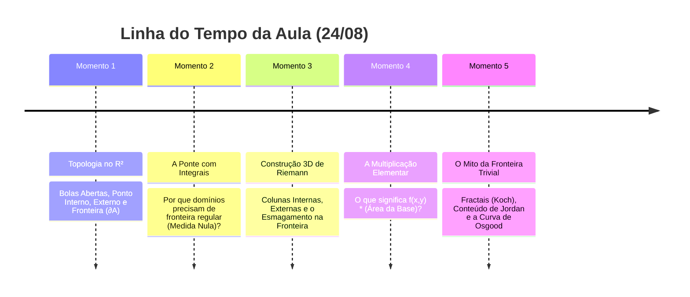

# 🔴 Live da Aula: Integrais Duplas — Fundamentos e Topologia no $\mathbb{R}^2$ (USP)
> **Data:** 24 de Agosto  
> **Status:** Acompanhamento em tempo real — Topologia no $\mathbb{R}^2$, Fronteiras Fractais e Integrabilidade de Riemann.  
> **Objetivo deste arquivo:** Decodificar os momentos da aula, passos algébricos e intuições conceituais do professor.

---

## ⏱️ Linha do Tempo & Momentos da Aula



---

## ⚡ Momentos da Lousa & Notas Rápidas

### Momento 1: Topologia Básica no $\mathbb{R}^2$

#### Bola Aberta (Vizinhança) de raio $r \gt 0$ em torno de $(x_0, y_0)$

$$
B_r(x_0, y_0) = \lbrace (x, y) \in \mathbb{R}^2 \mid (x - x_0)^2 + (y - y_0)^2 \lt r^2 \rbrace
$$

#### Classificação de Pontos em relação a um conjunto $A \subset \mathbb{R}^2$
* **Ponto Interno ($P \in \text{int}(A)$):** Existe $r \gt 0$ tal que $B_r(P) \subset A$.
* **Ponto Externo ($P \in \text{ext}(A)$):** Existe $r \gt 0$ tal que $B_r(P) \cap A = \emptyset$.
* **Ponto de Fronteira ($P \in \partial A$):** Para todo $r \gt 0$, $B_r(P)$ contém pontos de $A$ e de fora de $A$.

#### Tipos de Conjuntos
* **Aberto:** Todos os seus pontos são internos ($A = \text{int}(A)$). Não contém a fronteira.
* **Fechado:** Contém toda a sua fronteira ($\partial A \subset A$). Seu complementar é aberto.
* **Limitado:** Cabe dentro de uma bola grande de raio finito $R$.
* **Compacto:** Fechado e limitado no $\mathbb{R}^2$ (Teorema de Heine-Borel).

---

### Momento 2: Por que precisamos disso para Integrais Duplas?

1. **Em Cálculo 1:** Integramos em intervalos $[a, b]$. A fronteira são apenas 2 pontos: $\lbrace a, b \rbrace$.
2. **Em Cálculo 2/3 (Integrais Duplas):** O domínio $D \subset \mathbb{R}^2$ pode ter qualquer formato (círculo, triângulo, etc.).
3. **A Definição de Riemann em Domínios Gerais:**
   Colocamos $D$ dentro de um retângulo $R = [a,b] \times [c,d]$ e estendemos $f$ por zero:

$$
\tilde{f}(x, y) = \begin{cases} f(x, y), & \text{se } (x, y) \in D \\ 0, & \text{se } (x, y) \notin D \end{cases}
$$

* **Onde $\tilde{f}$ é descontínua?** Exatamente na **fronteira $\partial D$**!
* Para a integral $\iint_D f\,dA$ existir (Critério de Integrabilidade de Riemann/Lebesgue), a fronteira $\partial D$ deve ser bem comportada (área zero / conteúdo nulo de Jordan).

---

### Momento 3: A Construção dos Prismas 3D de Riemann na Lousa

Ao particionar o retângulo $R$ em retângulos $R_{ij} = [x_{i-1}, x_i] \times [y_{j-1}, y_j]$ de base $\Delta A_{ij} = \Delta x_i \Delta y_j$:

```text
                 3 TIPOS DE COLUNAS 3D (PRISMAS)
                 
         z ^
           │         ┌────────┐ ◄── COLUNA INTERNA:
           │         │ f(x,y) │     Altura real da superfície,
           │         │        │     volume = f(x_ij*, y_ij*) * ΔA
           │    ┌────┤        ├────┐
           │    │    │        │    │◄── COLUNAS DA FRONTEIRA:
           │    │ ?  │        │  ? │    Corta a borda (salto de f para 0).
           │  ──┴────┴────────┴────┴──> (x,y)
           │    COLUNAS EXTERNAS:
           │    Altura = 0, Volume = 0
```

#### Classificação dos Retângulos da Partição:
1. **Retângulos Internos ($R_{ij} \subset \text{int}(D)$):** Altura $\tilde{f} = f(x, y) \gt 0$. Formam colunas com o volume sob a superfície real.
2. **Retângulos Externos ($R_{ij} \subset \text{ext}(D)$):** Altura $\tilde{f} = 0$. Volume da coluna é nulo ($0 \cdot \Delta A = 0$).
3. **Retângulos da Fronteira ($R_{ij} \cap \partial D \neq \emptyset$):** Cortam a borda de $D$.
   * Na **Soma Inferior de Darboux ($s$):** A altura mínima dentro do retângulo é $0$ (porque pega o lado de fora) $\implies$ volume $0$.
   * Na **Soma Superior de Darboux ($S$):** A altura máxima é $\le M$ (o pico de $f$) $\implies$ volume $M \Delta A_{ij}$.

#### Como o Teorema resolve o "Problema da Fronteira"?
A diferença máxima de erro entre a estimativa por cima e por baixo é limitada por:

$$
S(f, \mathcal{P}) - s(f, \mathcal{P}) \le M \sum_{R_{ij} \text{ cortam } \partial D} \text{Area}(R_{ij})
$$

Se a fronteira $\partial D$ tiver **conteúdo nulo de Jordan (área zero)**, conforme a malha fica mais fina ($\Delta x, \Delta y \to 0$), a soma das áreas de todos os retângulos que tocam a fronteira vai para zero:

$$
\lim_{\|\mathcal{P}\| \to 0} \sum_{R_{ij} \text{ cortam } \partial D} \text{Area}(R_{ij}) = 0
$$

O erro na fronteira é **esmagado para zero**, garantindo que a aproximação 3D convirja exatamente para o volume verdadeiro!

---

### Momento 4: O Que Significa $f(x, y) \times (\text{Area da Base})$?

A expressão elementar $\tilde{f}(x_{ij}^{\ast}, y_{ij}^{\ast}) \, \Delta A_{ij}$ possui duas interpretações imediatas:

#### 1. Interpretação Geométrica (Volume do Prisma 3D)
* $\Delta A_{ij} = \Delta x_i \Delta y_j$ é a **área do chão** (um pequeno retângulo no plano $xy$).
* $\tilde{f}(x_{ij}^{\ast}, y_{ij}^{\ast})$ é a **altura** até o teto curvo $z = f(x, y)$.
* $\text{Volume de um Prisma Reto} = (\text{Area da Base}) \times (\text{Altura}) = \Delta A_{ij} \cdot \tilde{f}(x_{ij}^{\ast}, y_{ij}^{\ast})$.
* A soma dupla $\sum \sum \tilde{f}(x, y) \Delta A$ é a soma dos volumes de todos os "edifícios/colunas", aproximando o **volume total sob a superfície**.

#### 2. Interpretação Física (Massa de uma Chapa)
* Se $f(x, y)$ for a **densidade superficial de massa** ($\text{g/cm}^2$).
* $\Delta A_{ij}$ for a área daquele pequeno pedaço de chapa ($\text{cm}^2$).
* $\text{Massa do pedacinho} = \text{Densidade} \times \text{Area} = f(x, y) \cdot \Delta A$ (em gramas).
* A soma dupla é a **massa total da chapa plana**.

---

### Momento 5: O Debate na Aula sobre Fronteiras Fractais & Patológicas

Um colega comentou: *"A fronteira deveria ser algo trivial!"*  
O professor deu ênfase a por que isso **NÃO é trivial**:

1. **Nem toda fronteira é um círculo liso:** Existem domínios cujas fronteiras são **fractais** ou curvas não-diferenciáveis em lugar nenhum.
2. **O Floco de Neve de Koch (Fractal Integrável):**
   * Perímetro: Infinito ($\infty$).
   * Dimensão: $d \approx 1{,}2618$.
   * Área 2D da fronteira: **Zero** ($\text{Area}(\partial D) = 0$).
   * **Resultado:** É integrável à Riemann!
3. **A Curva de Osgood (A Fronteira Monstro / Não Integrável):**
   * Curva contínua e fechada de Jordan sem auto-interseção, mas com **área bidimensional positiva** ($\text{Area}(\partial D) \gt 0$).
   * Para uma região limitada por Osgood, a Soma Superior de Darboux nunca encontra a Soma Inferior. A integral de Riemann **falha completamente**!
   * É exatamente por causa de fronteiras como as de Osgood que precisamos do critério topológico formal de **Conteúdo Nulo de Jordan**.

---

### Momento 6: A Definição Formal de Conteúdo Nulo no $\mathbb{R}^2$

O professor formalizou matematicamente o conceito de conjunto de área nula (Jordan):

#### Definição Formal (Lousa):
Um conjunto $A \subset \mathbb{R}^2$ tem **conteúdo nulo** (ou conteúdo de Jordan zero) se, para todo $\varepsilon \gt 0$, existe uma família finita de retângulos $\lbrace R_1, R_2, \dots, R_k \rbrace$ satisfazendo simultaneamente:

1. **Cobertura do Conjunto:** $A \subseteq \bigcup_{i=1}^k R_i$.
2. **Soma das Áreas Menor que $\varepsilon$:** $\sum_{i=1}^k \text{Area}(R_i) \lt \varepsilon$.

#### A Intuição da Definição:
* Não importa quão pequeno seja o número $\varepsilon \gt 0$ escolhido (ex: $10^{-6}$ ou $10^{-100}$), você sempre consegue cobrir o conjunto $A$ usando um número **finito** de retângulos cuja soma total de áreas seja menor que $\varepsilon$.
* **Exemplos Canônicos de Conteúdo Nulo:**
  * Qualquer conjunto finito de pontos $\lbrace P_1, \dots, P_n \rbrace$.
  * Qualquer segmento de reta ou arco de circunferência.
  * O gráfico de qualquer função contínua $y = g(x)$ em um intervalo fechado $[a, b]$.
  * A fronteira $\partial D$ de qualquer região comum da Engenharia.

---

### Momento 7: A Intuição: Como Diabos um Contorno Pode Ter Área?

A intuição clássica da geometria diz: *"Uma linha tem comprimento, mas largura zero, logo sua área bidimensional deveria ser sempre zero!"*

Para todas as figuras da vida real (círculos, retângulos, triângulos), isso está **100% correto**! Mas a matemática pura descobriu cenários patológicos:

#### 1. A Analogia do Fio de Costura Infinitamente Dobrado (Curvas de Peano / Hilbert)
* Pense em um único fio de costura 1D (comprimento, largura zero).
* Se você esticar o fio no chão, ele tem área zero.
* Mas se você começar a dobrar esse fio em zig-zag infinito tão apertado que ele passa por **todos os pontos** de uma sala $1 \times 1$:
* O fio continua sendo uma linha 1D contínua, mas ele **preencheu completamente** o chão 2D da sala, ocupando uma área de $1\text{ m}^2$!

#### 2. O Exemplo Matemático Imediato: Os Pontos Racionais $\mathbb{Q}^2$
* Considere o conjunto $A = [0, 1] \times [0, 1] \cap \mathbb{Q}^2$ (apenas pontos de coordenadas racionais no quadrado).
* **Qual é a fronteira $\partial A$?**
  * Pegue qualquer ponto $(x, y)$ do quadrado unitário.
  * Qualquer círculo que você desenhe em volta dele (por menor que seja) contém infinitos pontos racionais (dentro de $A$) e infinitos irracionais (fora de $A$).
  * **Conclusão:** Todo ponto do quadrado $[0, 1]^2$ é ponto de fronteira ($\partial A = [0, 1]^2$).
  * **A Área da Fronteira é:** $\text{Area}(\partial A) = 1 \times 1 = 1 \gt 0$!

#### 3. Por que isso importa para nós?
O professor exige que a fronteira tenha **conteúdo nulo** exatamente para **proibir esses domínios patológicos**, garantindo que a integral de Riemann funcione com segurança nas formas da engenharia!
