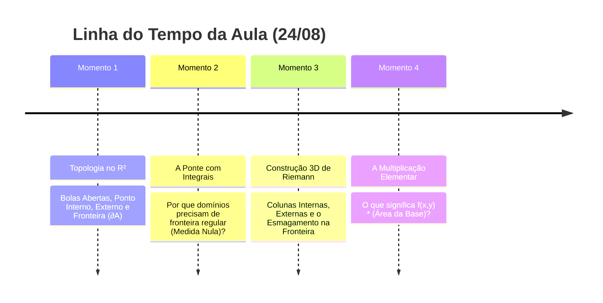

# 🔴 Live da Aula: Integrais Duplas — Fundamentos e Topologia no $\mathbb{R}^2$ (USP)
> **Data:** 24 de Agosto  
> **Status:** Acompanhamento em tempo real — Topologia no $\mathbb{R}^2$, Fronteira e Domínios de Integrabilidade.  
> **Objetivo deste arquivo:** Decodificar os momentos da aula, passos algébricos e intuições conceituais do professor.

---

## ⏱️ Linha do Tempo & Momentos da Aula



---

## ⚡ Momentos da Lousa & Notas Rápidas

### Momento 1: Topologia Básica no $\mathbb{R}^2$

#### Bola Aberta (Vizinhança) de raio $r > 0$ em torno de $(x_0, y_0)$

$$
B_r(x_0, y_0) = \{ (x, y) \in \mathbb{R}^2 \mid (x - x_0)^2 + (y - y_0)^2 < r^2 \}
$$

#### Classificação de Pontos em relação a um conjunto $A \subset \mathbb{R}^2$
* **Ponto Interno ($P \in \text{int}(A)$):** Existe $r > 0$ tal que $B_r(P) \subset A$.
* **Ponto Externo ($P \in \text{ext}(A)$):** Existe $r > 0$ tal que $B_r(P) \cap A = \emptyset$.
* **Ponto de Fronteira ($P \in \partial A$):** Para todo $r > 0$, $B_r(P)$ contém pontos de $A$ e de fora de $A$.

#### Tipos de Conjuntos
* **Aberto:** Todos os seus pontos são internos ($A = \text{int}(A)$). Não contém a fronteira.
* **Fechado:** Contém toda a sua fronteira ($\partial A \subset A$). Seu complementar é aberto.
* **Limitado:** Cabe dentro de uma bola grande de raio finito $R$.
* **Compacto:** Fechado e limitado no $\mathbb{R}^2$ (Teorema de Heine-Borel).

---

### Momento 2: Por que precisamos disso para Integrais Duplas?

1. **Em Cálculo 1:** Integramos em intervalos $[a, b]$. A fronteira são apenas 2 pontos: $\{a, b\}$.
2. **Em Cálculo 2/3 (Integrais Duplas):** O domínio $D \subset \mathbb{R}^2$ pode ter qualquer formato (círculo, triângulo, etc.).
3. **A Definição de Riemann em Domínios Gerais:**
   Colocamos $D$ dentro de um retângulo $R = [a,b] \times [c,d]$ e estendemos $f$ por zero:

$$
\tilde{f}(x, y) = \begin{cases} f(x, y), & \text{se } (x, y) \in D \\ 0, & \text{se } (x, y) \notin D \end{cases}
$$

* **Onde $\tilde{f}$ é descontínua?** Exatamente na **fronteira $\partial D$**!
* Para a integral $\iint_D f\,dA$ existir (Critério de Integrabilidade de Riemann/Lebesgue), a fronteira $\partial D$ deve ser bem comportada (área zero / conteúdo nulo de Jordan).

---

### Momento 3: A Construção dos Prismas 3D de Riemann na Lousa

Ao particionar o retângulo $R$ em retângulos $R_{ij} = [x_{i-1}, x_i] \times [y_{j-1}, y_j]$ de base $\Delta A_{ij} = \Delta x_i \Delta y_j$:

```text
                 3 TIPOS DE COLUNAS 3D (PRISMAS)
                 
         z ^
           │         ┌────────┐ ◄── COLUNA INTERNA:
           │         │ f(x,y) │     Altura real da superfície,
           │         │        │     volume = f(x_ij*, y_ij*) * ΔA
           │    ┌────┤        ├────┐
           │    │    │        │    │◄── COLUNAS DA FRONTEIRA:
           │    │ ?  │        │  ? │    Corta a borda (salto de f para 0).
           │  ──┴────┴────────┴────┴──> (x,y)
           │    COLUNAS EXTERNAS:
           │    Altura = 0, Volume = 0
```

#### Classificação dos Retângulos da Partição:
1. **Retângulos Internos ($R_{ij} \subset \text{int}(D)$):** Altura $\tilde{f} = f(x, y) > 0$. Formam colunas com o volume sob a superfície real.
2. **Retângulos Externos ($R_{ij} \subset \text{ext}(D)$):** Altura $\tilde{f} = 0$. Volume da coluna é nulo ($0 \cdot \Delta A = 0$).
3. **Retângulos da Fronteira ($R_{ij} \cap \partial D \neq \emptyset$):** Cortam a borda de $D$.
   * Na **Soma Inferior de Darboux ($s$):** A altura mínima dentro do retângulo é $0$ (porque pega o lado de fora) $\implies$ volume $0$.
   * Na **Soma Superior de Darboux ($S$):** A altura máxima é $\le M$ (o pico de $f$) $\implies$ volume $M \Delta A_{ij}$.

#### Como o Teorema resolve o "Problema da Fronteira"?
A diferença máxima de erro entre a estimativa por cima e por baixo é limitada por:

$$
S(f, \mathcal{P}) - s(f, \mathcal{P}) \le M \sum_{R_{ij} \text{ cortam } \partial D} \text{Area}(R_{ij})
$$

Se a fronteira $\partial D$ tiver **conteúdo nulo de Jordan (área zero)**, conforme a malha fica mais fina ($\Delta x, \Delta y \to 0$), a soma das áreas de todos os retângulos que tocam a fronteira vai para zero:

$$
\lim_{\|\mathcal{P}\| \to 0} \sum_{R_{ij} \text{ cortam } \partial D} \text{Area}(R_{ij}) = 0
$$

O erro na fronteira é **esmagado para zero**, garantindo que a aproximação 3D convirja exatamente para o volume verdadeiro!

---

### Momento 4: O Que Significa $f(x, y) \times (\text{Area da Base})$?

A expressão elementar $f(x_{ij}^*, y_{ij}^*) \, \Delta A_{ij}$ possui duas interpretações imediatas:

#### 1. Interpretação Geométrica (Volume do Prisma 3D)
* $\Delta A_{ij} = \Delta x_i \Delta y_j$ é a **área do chão** (um pequeno retângulo no plano $xy$).
* $f(x_{ij}^*, y_{ij}^*)$ é a **altura** até o teto curvo $z = f(x, y)$.
* $\text{Volume de um Prisma Reto} = (\text{Area da Base}) \times (\text{Altura}) = \Delta A_{ij} \cdot f(x_{ij}^*, y_{ij}^*)$.
* A soma dupla $\sum \sum f(x, y) \Delta A$ é a soma dos volumes de todos os "edifícios/colunas", aproximando o **volume total sob a superfície**.

#### 2. Interpretação Física (Massa de uma Chapa)
* Se $f(x, y)$ for a **densidade superficial de massa** ($\text{g/cm}^2$).
* $\Delta A_{ij}$ for a área daquele pequeno pedaço de chapa ($\text{cm}^2$).
* $\text{Massa do pedacinho} = \text{Densidade} \times \text{Area} = f(x, y) \cdot \Delta A$ (em gramas).
* A soma dupla é a **massa total da chapa plana**.
