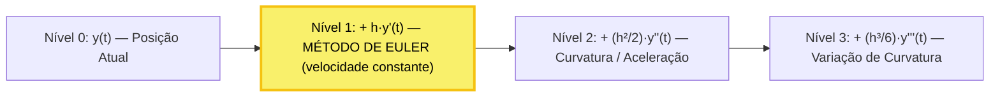
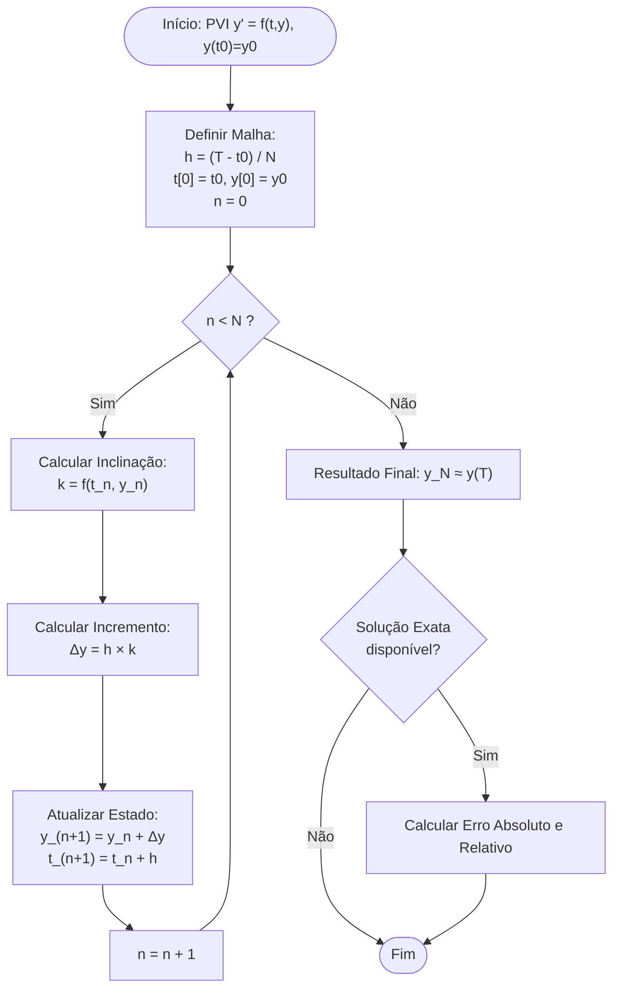

# Guia Supremo: Resolução Numérica de EDOs por Taylor e Método de Euler

> **Material Didático Completo: Da Intuição Geométrica ao Rigor Matemático e Aplicação Prática**
> *Equipe Didática: Rigor Matemático (USP), Pedagogia Visual, Engenharia de Roteiros e Cálculo Numérico.*

---

## Sumário Executivo

1. [Módulo 1 — A Grande Intuição Visual e Física](#módulo-1--a-grande-intuição-visual-e-física)
   - 1.1 O que é uma EDO no mundo real? O campo de direções
   - 1.2 A metáfora do carro na estrada: prevendo o futuro pela velocidade atual
   - 1.3 Por que a Série de Taylor é a chave mestra?
   - 1.4 Por que o método erra? "A curva faz curva, a reta vai reto"
   - 1.5 O papel crucial do passo $h$: dirigindo de olhos fechados
   - 1.6 Erro Local vs Erro Global: a bola de neve
2. [Módulo 2 — Fundamentação Matemática Rigorosa](#módulo-2--fundamentação-matemática-rigorosa)
   - 2.1 Problema de Valor Inicial (PVI) e Teorema de Picard-Lindelöf
   - 2.2 Expansão em Série de Taylor com Resto de Lagrange
   - 2.3 Dedução formal do Método de Euler Explícito
   - 2.4 Análise do Erro Local de Truncamento (LTE)
   - 2.5 Análise do Erro Global de Truncamento (GTE)
   - 2.6 Estabilidade Absoluta (Dahlquist) e o Passo Crítico
   - 2.7 Métodos de Taylor de Ordens Superiores e Runge-Kutta
3. [Módulo 3 — O Roteiro Definitivo de Resolução](#módulo-3--o-roteiro-definitivo-de-resolução)
   - 3.1 As 5 Etapas Infalíveis
   - 3.2 Fluxograma Lógico do Algoritmo
   - 3.3 A Tabela Padrão de Cálculo Manual
   - 3.4 Checklist de Prova: Os 7 erros mais comuns
   - 3.5 Pseudocódigo Universal
4. [Módulo 4 — Caderno de Exercícios Resolvidos na Unha](#módulo-4--caderno-de-exercícios-resolvidos-na-unha)
5. [Módulo 5 — Implementação Computacional em Python](#módulo-5--implementação-computacional-em-python)

---

## Módulo 1 — A Grande Intuição Visual e Física

Se você já sentiu que equações diferenciais parecem um amontoado abstrato de símbolos, este módulo foi feito para você. Vamos reconstruir cada conceito a partir da física do dia a dia.

---

### 1.1 O Que é uma EDO no Mundo Real?

Imagine que você está navegando em um barco à noite, em um oceano desconhecido. Você **não possui um mapa com a trajetória desenhada** — você não conhece a solução analítica $y(t)$.

Entretanto, você tem uma **bússola inteligente** e um velocímetro. Em qualquer posição $(t, y)$ onde seu barco estiver, esse visor informa:
> *"Neste ponto exato, sua taxa de variação deve ser $y' = f(t, y)$."*

Isso é exatamente o que significa uma **Equação Diferencial Ordinária (EDO) de 1ª Ordem**:

$$\frac{dy}{dt} = f(t, y)$$

```
  y (Posição)
  ^
  |     \   \   |   /   /   /   --> O Campo de Direções
  |      \   \  |  /   /   /        (Milhares de pequenas setinhas)
  |       -   - o -   -   -         Você está no ponto 'o' = (t0, y0)
  |      /   /  |  \   \   \        A equação diz apenas a inclinação
  |     /   /   |   \   \   \       instantânea para o próximo instante!
  +-------------------------------> t (Tempo)
```

Uma EDO **não é uma curva estática pronta**. Ela é uma **regra local de navegação**. Resolver uma EDO numericamente significa colocar o barco no ponto inicial $(t_0, y_0)$ e navegar passo a passo.

---

### 1.2 A Metáfora do Carro: Prevendo o Futuro Pela Velocidade Atual

Você está dirigindo em uma rodovia. Às 14h00 ($t_0$), você está no km 100 ($y_0$) e o velocímetro marca 80 km/h.

Onde você estará daqui a $h$ horas? A intuição básica nos dá:

$$\text{Posição Futura} \approx \text{Posição Atual} + (\text{Velocidade Atual}) \times (\text{Tempo Decorrido})$$

$$\text{Novo } y = \text{Antigo } y + h \cdot (\text{Taxa de Variação})$$

Matematicamente:

$$\boxed{y_{n+1} = y_n + h \cdot f(t_n, y_n)}$$

```
  y (Posição)
  ^
  |                                 * (Ponto Real da Curva y(t_n + h))
  |                                /
  |                 o------------* (Previsão de Euler: y_{n+1})
  |                /             |
  |               /              |  Cateto = h * f(t_n, y_n)
  |              /               |
  |  (t_n, y_n) o----------------+
  |             |<------ h ----->|
  +-------------------------------------> t (Tempo)
               t_n              t_{n+1}
```

O **Método de Euler** é a extensão geométrica direta disso:
1. Comece em $(t_n, y_n)$.
2. Trace a **reta tangente** à curva naquele ponto — cuja inclinação é $f(t_n, y_n)$.
3. Caminhe sobre essa reta por uma distância horizontal $h$.
4. O ponto onde você aterrissou é a sua aproximação $y_{n+1}$.

---

### 1.3 Por Que a Série de Taylor é a Chave Mestra?

De onde vem essa aproximação com rigor? Ela vem da **Série de Taylor**:

$$y(t + h) = \underbrace{y(t)}_{\text{Posição}} + \underbrace{h \cdot y'(t)}_{\text{Velocidade}} + \underbrace{\frac{h^2}{2!} y''(t)}_{\text{Aceleração}} + \underbrace{\frac{h^3}{3!} y'''(t)}_{\text{Variação da aceleração}} + \cdots$$



#### O que Euler fez?

> *"Vou pegar apenas a posição e a velocidade, e jogar todo o resto fora!"*

$$y(t + h) \approx y(t) + h \cdot y'(t)$$

Como a nossa EDO nos dá $y'(t) = f(t, y)$, chegamos diretamente à fórmula de Euler.

---

### 1.4 Por Que o Método Erra? "A Curva Faz Curva, a Reta Vai Reto"

```
     Estrada Real (Curva y(t))
             .--""--.
           .'        '.  <--- A realidade faz curva!
          /            \
  -------o-------------->  *  (Onde Euler foi parar: reta tangente)
       (t_0)              |
                          | <--- ERRO LOCAL (~h²/2 · y'')
```

O termo que Euler jogou fora é exatamente o termo da curvatura:

$$\text{Erro de 1 Passo} \approx \frac{h^2}{2} \, y''(\xi)$$

- Se $y'' > 0$ (curva para cima), Euler **subestima** o valor real.
- Se $y'' < 0$ (curva para baixo), Euler **superestima** o valor real.

---

### 1.5 O Papel Crucial do Passo $h$: Dirigindo de Olhos Fechados

| Tamanho do Passo ($h$) | Precisão do Caminho | Custo Computacional | Risco Prático |
| :--- | :--- | :--- | :--- |
| **Muito Grande** | Péssima | Quase instantâneo | Explosão numérica / Instabilidade |
| **Ideal / Equilibrado** | Alta | Razoável | Erro controlado e previsível |
| **Excessivamente Pequeno** | Altíssima na teoria | Lento (milhões de passos) | **Erro de Arredondamento** de ponto flutuante |

> [!WARNING]
> **A Ilusão do Passo Zero**: No computador, você não pode fazer $h = 10^{-25}$. Números em ponto flutuante (`float64`) têm limite de precisão finita. Se $h$ for minúsculo demais, somar $y + h \cdot f(t,y)$ sofre de cancelamento catastrófico e o erro de máquina destrói o resultado!

---

### 1.6 Erro Local vs Erro Global: A Bola de Neve

```
PASSO 1:
Curva Real:     o ~~~~~~~~~~ (Real 1)
Previsão Euler: o ----------> (Euler 1)  [Erro Local 1: O(h^2)]
                                   \
PASSO 2:                            \---> Você parte do lugar ERRADO!
Curva Real:     o ~~~~~~~~~~~~~~~~~~~~~~ (Real 2)
Previsão Euler:              (Euler 1) ----------> (Euler 2)
                                                   [Erro Acumulado cresce!]
```

1. **Erro Local de Truncamento** — $O(h^2)$: erro cometido em **um único passo**, proporcional a $h^2$.

2. **Erro Global de Truncamento** — $O(h)$: acumulação ao longo de $N = \frac{T - t_0}{h}$ passos:

$$\text{Erro Global} \approx N \times O(h^2) \approx \frac{T - t_0}{h} \cdot O(h^2) = O(h)$$

> [!NOTE]
> **Por que Euler é um método de "Primeira Ordem"?**
> Porque o **Erro Global** cai linearmente com $h$. Cortar o passo pela metade ($h \to h/2$) reduz o erro total pela **metade**.

---

## Módulo 2 — Fundamentação Matemática Rigorosa

---

### 2.1 Problema de Valor Inicial (PVI) e Teorema de Picard-Lindelöf

Seja $I = [t_0, T] \subset \mathbb{R}$ e $\Omega \subseteq \mathbb{R}^d$. O **PVI de 1ª Ordem** é:

$$\begin{cases}
\dfrac{dy}{dt}(t) = f(t, y(t)), & t \in [t_0, T] \\
y(t_0) = y_0
\end{cases}$$

#### Condição de Lipschitz

$f(t, y)$ é dita **Lipschitziana em $y$** se existe $L \ge 0$ tal que:

$$\|f(t, u) - f(t, v)\| \le L \|u - v\|, \quad \forall t \in [t_0, T], \quad \forall u, v \in \Omega$$

#### Teorema de Picard-Lindelöf

Se $f(t,y)$ é contínua e Lipschitziana em $y$, a equação integral de Volterra:

$$y(t) = y_0 + \int_{t_0}^t f(s, y(s)) \, ds$$

possui uma **única** solução $y \in C^1([t_0, t_0 + \alpha], \mathbb{R}^d)$.

---

### 2.2 Expansão em Série de Taylor com Resto de Lagrange

Discretizando $[t_0, T]$ em $N$ passos com $h = \frac{T - t_0}{N}$ e nós $t_n = t_0 + n h$.

Pelo Teorema de Taylor, se $y \in C^2([t_0, T])$:

$$y(t_n + h) = y(t_n) + h \, y'(t_n) + \frac{h^2}{2} \, y''(\xi_n), \quad \xi_n \in (t_n, t_n + h)$$

Como $y'(t_n) = f(t_n, y(t_n))$, temos:

$$y(t_{n+1}) = y(t_n) + h \, f(t_n, y(t_n)) + \frac{h^2}{2} \, y''(\xi_n)$$

---

### 2.3 Dedução do Método de Euler Explícito

Desprezando o termo de resto $\frac{h^2}{2} y''(\xi_n)$:

$$\begin{cases}
y_0 = y(t_0) \\
y_{n+1} = y_n + h \, f(t_n, y_n), \quad n = 0, 1, \dots, N-1
\end{cases}$$

---

### 2.4 Análise do Erro Local de Truncamento (LTE)

O **Erro Local por Passo** ($d_{n+1}$), com $y_n = y(t_n)$:

$$d_{n+1} = y(t_{n+1}) - \bigl[ y(t_n) + h \, f(t_n, y(t_n)) \bigr] = \frac{h^2}{2} \, y''(\xi_n) = O(h^2)$$

O **Erro Local de Truncamento Normalizado** ($\tau_n$):

$$\tau_n(h) = \frac{y(t_{n+1}) - y(t_n)}{h} - f(t_n, y(t_n)) = \frac{h}{2} \, y''(\xi_n) = O(h)$$

Como $\lim_{h \to 0} \max_n \|\tau_n(h)\| = 0$, o Método de Euler é **consistente de 1ª ordem**.

---

### 2.5 Análise do Erro Global de Truncamento (GTE) via Lema de Grönwall

Definindo o erro acumulado $e_n = y(t_n) - y_n$:

$$e_{n+1} = e_n + h \bigl[ f(t_n, y(t_n)) - f(t_n, y_n) \bigr] + \frac{h^2}{2} \, y''(\xi_n)$$

Aplicando a norma, a desigualdade triangular e a condição de Lipschitz com $M_2 = \sup_t \|y''(t)\|$:

$$\|e_{n+1}\| \le (1 + hL) \|e_n\| + \frac{M_2}{2} h^2$$

Pelo **Lema de Grönwall Discreto**, com $e_0 = 0$:

$$\|e_n\| \le \frac{M_2}{2L} \bigl( e^{L(t_n - t_0)} - 1 \bigr) \, h$$

Logo:

$$\max_{0 \le n \le N} \|y(t_n) - y_n\| \le C \cdot h = O(h)$$

---

### 2.6 Estabilidade Absoluta (Dahlquist) e o Passo Crítico

Para a equação teste de Dahlquist:

$$y' = \lambda y, \quad \lambda \in \mathbb{C}, \quad \text{Re}(\lambda) < 0$$

A relação de Euler produz:

$$y_{n+1} = (1 + h\lambda) \, y_n \implies y_n = (1 + z)^n y_0, \quad z = h\lambda$$

A **Região de Estabilidade Absoluta** exige $|1 + z| < 1$ — um disco unitário centrado em $(-1, 0)$:

$$\mathcal{S} = \{ z \in \mathbb{C} : |z + 1| < 1 \}$$

Para $\lambda \in \mathbb{R}$ com $\lambda < 0$, a estabilidade impõe o **Passo Crítico**:

$$\boxed{h \le \frac{2}{|\lambda|} = h_{\text{crítico}}}$$

> Se $h > \frac{2}{|\lambda|}$, as soluções numéricas explodem exponencialmente, mesmo que a solução real decaia para zero!

---

### 2.7 Métodos de Taylor de Ordens Superiores e Runge-Kutta

Pela regra da cadeia para derivadas totais:

$$y'(t) = f(t, y)$$

$$y''(t) = \frac{\partial f}{\partial t} + \frac{\partial f}{\partial y} f(t, y) = f_t + f_y \, f$$

O **Método de Taylor de Ordem 2**:

$$\boxed{y_{n+1} = y_n + h \, f(t_n, y_n) + \frac{h^2}{2} \bigl[ f_t(t_n, y_n) + f_y(t_n, y_n) \, f(t_n, y_n) \bigr]}$$

- **Erro Local**: $O(h^3)$ — **Erro Global**: $O(h^2)$

> **A Origem de Runge-Kutta**: Como calcular $f_t, f_y, f_{yy}\dots$ torna-se inviável para sistemas grandes, Runge e Kutta criaram métodos que alcançam a mesma precisão de Taylor avaliando $f(t,y)$ em pontos intermediários inteligentes, sem calcular nenhuma derivada analítica!

---

## Módulo 3 — O Roteiro Definitivo de Resolução

---

### 3.1 As 5 Etapas Infalíveis

```
  +--------------------------------------------------------+
  | PASSO 1: Identificar e Isolar os Ingredientes do PVI   |
  |   - Forma Normal: y' = f(t,y)                          |
  |   - Ponto Inicial: (t0, y0)                            |
  |   - Intervalo [t0, T] e Passo h (ou Numero N)          |
  +----------------------------+---------------------------+
                               |
                               v
  +--------------------------------------------------------+
  | PASSO 2: Construir a Malha Temporal                    |
  |   - h = (T - t0) / N                                   |
  |   - Nos: tn = t0 + n * h, para n = 0, 1, ..., N        |
  +----------------------------+---------------------------+
                               |
                               v
  +--------------------------------------------------------+
  | PASSO 3: Montar a Relacao de Recorrencia de Euler      |
  |   - y_(n+1) = y_n + h * f(tn, yn)                      |
  +----------------------------+---------------------------+
                               |
                               v
  +--------------------------------------------------------+
  | PASSO 4: Preencher a Tabela de Iteracoes               |
  |   - Calcular a inclinacao f(tn, yn)                    |
  |   - Multiplicar por h: Delta_y = h * f(tn, yn)         |
  |   - Somar: y_(n+1) = yn + Delta_y                      |
  +----------------------------+---------------------------+
                               |
                               v
  +--------------------------------------------------------+
  | PASSO 5: Calcular Erros e Interpretar Resultados       |
  |   - E_abs = |y(tn) - yn|                               |
  |   - E_rel = (|y(tn) - yn| / |y(tn)|) * 100%            |
  +--------------------------------------------------------+
```

---

### 3.2 Fluxograma Lógico do Algoritmo



---

### 3.3 A Tabela Padrão de Cálculo Manual

Em qualquer prova ou lista de exercícios, organize seus cálculos com estas 6 colunas:

| $n$ | $t_n$ | $y_n$ | $f(t_n, y_n)$ | $\Delta y = h \cdot f(t_n, y_n)$ | $y_{n+1} = y_n + \Delta y$ |
| :---: | :---: | :---: | :---: | :---: | :---: |
| **0** | $t_0$ | $y_0$ | $f(t_0, y_0)$ | $h \cdot f(t_0, y_0)$ | $y_1$ |
| **1** | $t_0 + h$ | $y_1$ | $f(t_1, y_1)$ | $h \cdot f(t_1, y_1)$ | $y_2$ |
| $\vdots$ | $\vdots$ | $\vdots$ | $\vdots$ | $\vdots$ | $\vdots$ |
| **$N-1$** | $t_{N-1}$ | $y_{N-1}$ | $f(t_{N-1}, y_{N-1})$ | $h \cdot f(t_{N-1}, y_{N-1})$ | $y_N \approx y(T)$ |

---

### 3.4 Checklist de Prova: Os 7 Erros Mais Frequentes

| # | Erro Comum | Consequência | Como Evitar |
|---|---|---|---|
| **1** | **Não isolar $y'$ antes de começar** | Erra a função $f(t,y)$ | Isole $y'$ no rascunho: se a EDO é $y' + 2ty = 1$, escreva $y' = 1 - 2ty$ |
| **2** | **Trocar $t$ por $y$ ao avaliar $f(t_n, y_n)$** | Se $f(t,y) = t^2 - y$, calcular $y^2 - t$ | Escreva com parênteses: $f(t_n, y_n) = (t_n)^2 - (y_n)$ |
| **3** | **Esquecer de multiplicar por $h$** | Fazer $y_{n+1} = y_n + f(t_n, y_n)$ | Crie a coluna separada $\Delta y = h \cdot f(t_n, y_n)$ |
| **4** | **Confundir $N$ com $N+1$ iterações** | Fazer uma iteração a mais ou parar antes | Para chegar em $y(T)$ são exatamente **$N$ iterações** |
| **5** | **Arredondamento Prematuro** | Usar apenas 2 casas decimais nas contas | Mantenha **4 a 6 casas decimais** durante as contas |
| **6** | **Usar o $t$ errado na inclinação** | Avaliar $f(t_{n+1}, y_n)$ em vez de $f(t_n, y_n)$ | Euler Explícito sempre avalia $f$ no **início do intervalo** ($t_n$) |
| **7** | **Esquecer a calculadora em Radianos** | Errar valores com $\sin(t)$ ou $\cos(t)$ | **Use sempre o modo RAD** em qualquer EDO trigonométrica |

---

### 3.5 Pseudocódigo Universal

```
ENTRADA: f, t0, y0, T, h
SAÍDA:   vetores t[0..N] e y[0..N]

N = arredonda((T - t0) / h)
t[0] = t0
y[0] = y0

PARA n = 0 ATÉ N-1 FAÇA:
    k      = f(t[n], y[n])
    y[n+1] = y[n] + h * k
    t[n+1] = t[n] + h
FIM_PARA

RETORNAR t, y
```

---

## Módulo 4 — Caderno de Exercícios Resolvidos na Unha

---

### 4.1 Exemplo 1: PVI Teórico Clássico com Solução Exata

$$\begin{cases} y'(t) = y(t) - t^2 + 1, \quad t \in [0, 1] \\ y(0) = 0.5 \end{cases}$$

- **Passo**: $h = 0.2 \implies N = \dfrac{1.0 - 0.0}{0.2} = 5$
- **Solução Exata**: $y(t) = (t + 1)^2 - 0.5 \, e^t$
- **Recorrência**: $y_{n+1} = y_n + 0.2 \cdot (y_n - t_n^2 + 1)$

---

#### Resolução Detalhada Passo a Passo

**Passo 0 → 1** ($t_0 = 0.0 \to t_1 = 0.2$, com $y_0 = 0.5$):

$$f(0.0,\ 0.5) = 0.5 - 0.0^2 + 1 = 1.500000$$

$$\Delta y_0 = 0.2 \times 1.500000 = 0.300000$$

$$y_1 = 0.500000 + 0.300000 = \mathbf{0.800000}$$

$$y_{\text{exato}}(0.2) = (1.2)^2 - 0.5 \, e^{0.2} = 1.440000 - 0.610701 = \mathbf{0.829299}$$

$$E_{\text{abs}} = |0.829299 - 0.800000| = \mathbf{0.029299} \quad (3.53\%)$$

---

**Passo 1 → 2** ($t_1 = 0.2 \to t_2 = 0.4$, com $y_1 = 0.8$):

$$f(0.2,\ 0.8) = 0.8 - (0.2)^2 + 1 = 1.760000$$

$$\Delta y_1 = 0.2 \times 1.760000 = 0.352000$$

$$y_2 = 0.800000 + 0.352000 = \mathbf{1.152000}$$

$$y_{\text{exato}}(0.4) = (1.4)^2 - 0.5 \, e^{0.4} = 1.960000 - 0.745912 = \mathbf{1.214088}$$

$$E_{\text{abs}} = |1.214088 - 1.152000| = \mathbf{0.062088} \quad (5.11\%)$$

---

**Passo 2 → 3** ($t_2 = 0.4 \to t_3 = 0.6$, com $y_2 = 1.152$):

$$f(0.4,\ 1.152) = 1.152 - (0.4)^2 + 1 = 1.992000$$

$$\Delta y_2 = 0.2 \times 1.992000 = 0.398400$$

$$y_3 = 1.152000 + 0.398400 = \mathbf{1.550400}$$

$$y_{\text{exato}}(0.6) = (1.6)^2 - 0.5 \, e^{0.6} = 2.560000 - 0.911059 = \mathbf{1.648941}$$

$$E_{\text{abs}} = |1.648941 - 1.550400| = \mathbf{0.098541} \quad (5.98\%)$$

---

**Passo 3 → 4** ($t_3 = 0.6 \to t_4 = 0.8$, com $y_3 = 1.5504$):

$$f(0.6,\ 1.5504) = 1.5504 - (0.6)^2 + 1 = 2.190400$$

$$\Delta y_3 = 0.2 \times 2.190400 = 0.438080$$

$$y_4 = 1.550400 + 0.438080 = \mathbf{1.988480}$$

$$y_{\text{exato}}(0.8) = (1.8)^2 - 0.5 \, e^{0.8} = 3.240000 - 1.112770 = \mathbf{2.127230}$$

$$E_{\text{abs}} = |2.127230 - 1.988480| = \mathbf{0.138750} \quad (6.52\%)$$

---

**Passo 4 → 5** ($t_4 = 0.8 \to t_5 = 1.0$, com $y_4 = 1.98848$):

$$f(0.8,\ 1.98848) = 1.98848 - (0.8)^2 + 1 = 2.348480$$

$$\Delta y_4 = 0.2 \times 2.348480 = 0.469696$$

$$y_5 = 1.988480 + 0.469696 = \mathbf{2.458176}$$

$$y_{\text{exato}}(1.0) = (2.0)^2 - 0.5 \, e^{1.0} = 4.000000 - 1.359141 = \mathbf{2.640859}$$

$$E_{\text{abs}} = |2.640859 - 2.458176| = \mathbf{0.182683} \quad (6.92\%)$$

---

### 4.2 Tabela Consolidada e Demonstração da Ordem $O(h)$

| $n$ | $t_n$ | $y_n$ (Euler) | $y(t_n)$ (Exato) | Erro Absoluto | Erro Relativo (%) |
| :---: | :---: | :---: | :---: | :---: | :---: |
| 0 | 0.0 | 0.500000 | 0.500000 | 0.000000 | 0.0000% |
| 1 | 0.2 | 0.800000 | 0.829299 | 0.029299 | 3.5330% |
| 2 | 0.4 | 1.152000 | 1.214088 | 0.062088 | 5.1139% |
| 3 | 0.6 | 1.550400 | 1.648941 | 0.098541 | 5.9760% |
| 4 | 0.8 | 1.988480 | 2.127230 | 0.138750 | 6.5225% |
| 5 | 1.0 | 2.458176 | 2.640859 | 0.182683 | 6.9176% |

#### Teste de Convergência Empírica em $t = 0.8$

| Passo $h$ | $N$ Passos | $y(0.8)$ Euler | Erro Absoluto | Razão de Redução do Erro |
| :---: | :---: | :---: | :---: | :---: |
| 0.4 | 2 | 1.876000 | 0.251230 | — |
| 0.2 | 4 | 1.988480 | 0.138750 | 0.251230 / 0.138750 = **1.81** |
| 0.1 | 8 | 2.053847 | 0.073383 | 0.138750 / 0.073383 = **1.89** |
| 0.05 | 16 | 2.089422 | 0.037807 | 0.073383 / 0.037807 = **1.94** |

> Conforme $h \to 0$, a razão converge para **2.00**, confirmando a ordem teórica $O(h^1)$.

---

### 4.3 Exemplo 2: Aplicação Física (Lei do Resfriamento de Newton)

Um café quente a $90^\circ\text{C}$ esfria em uma sala a $20^\circ\text{C}$:

$$\begin{cases} \dfrac{dT}{dt} = -0.1 (T - 20) \\ T(0) = 90^\circ\text{C} \end{cases}$$

- **Intervalo**: $t \in [0, 5 \text{ min}]$, com passo $h = 1 \text{ min}$
- **Solução Exata**: $T(t) = 20 + 70 \, e^{-0.1 t}$
- **Recorrência**: $T_{n+1} = 0.9 \, T_n + 2.0$

| $n$ | $t_n$ (min) | $T_n$ Euler (°C) | $T(t_n)$ Exato (°C) | Erro Absoluto (°C) | Erro Relativo (%) |
| :---: | :---: | :---: | :---: | :---: | :---: |
| 0 | 0 | 90.0000 | 90.0000 | 0.0000 | 0.0000% |
| 1 | 1 | 83.0000 | 83.3386 | 0.3386 | 0.4063% |
| 2 | 2 | 76.7000 | 77.3112 | 0.6112 | 0.7905% |
| 3 | 3 | 71.0300 | 71.8573 | 0.8273 | 1.1513% |
| 4 | 4 | 65.9270 | 66.9224 | 0.9954 | 1.4874% |
| 5 | 5 | 61.3343 | 62.4571 | 1.1228 | 1.7978% |

---

### 4.4 Exemplo 3: Comparativo Direto — Euler vs Taylor 2ª Ordem

Usando a mesma EDO $y' = y - t^2 + 1$ com $y(0)=0.5$ e $h=0.2$:

- $y'' = f'(t,y) = y - t^2 - 2t + 1$
- **Fórmula Taylor 2**: $y_{n+1} = y_n + h f + \frac{h^2}{2} f'$

| $t_n$ | $y(t_n)$ Exato | Euler (Ordem 1) | Erro Abs. Euler | Taylor 2ª Ordem | Erro Abs. Taylor 2 | Ganho de Precisão |
| :---: | :---: | :---: | :---: | :---: | :---: | :---: |
| 0.0 | 0.500000 | 0.500000 | 0.000000 | 0.500000 | 0.000000 | — |
| 0.2 | 0.829299 | 0.800000 | 0.029299 | 0.830000 | **0.000701** | **41.8x mais preciso!** |
| 0.4 | 1.214088 | 1.152000 | 0.062088 | 1.215800 | **0.001712** | **36.3x mais preciso!** |

---

## Módulo 5 — Implementação Computacional em Python

Abaixo encontra-se o script completo, modular e pronto para execução.

```python
"""
================================================================================
SIMULADOR DIDÁTICO: MÉTODO DE EULER & SÉRIE DE TAYLOR PARA EDOs
================================================================================
"""

import numpy as np
import matplotlib.pyplot as plt


def metodo_euler(f, t0, y0, tf, h):
    """Resolve numericamente o PVI y' = f(t, y) pelo Método de Euler Explícito."""
    n_passos = int(round((tf - t0) / h))
    t = np.linspace(t0, tf, n_passos + 1)
    y = np.zeros(n_passos + 1)
    y[0] = y0
    for n in range(n_passos):
        y[n + 1] = y[n] + h * f(t[n], y[n])
    return t, y


def metodo_taylor_ordem2(f, f_prime, t0, y0, tf, h):
    """Resolve numericamente o PVI y' = f(t, y) pelo Método de Taylor de 2ª Ordem."""
    n_passos = int(round((tf - t0) / h))
    t = np.linspace(t0, tf, n_passos + 1)
    y = np.zeros(n_passos + 1)
    y[0] = y0
    for n in range(n_passos):
        y_prime = f(t[n], y[n])
        y_sec = f_prime(t[n], y[n])
        y[n + 1] = y[n] + h * y_prime + (h**2 / 2.0) * y_sec
    return t, y


if __name__ == "__main__":
    def f1(t, y):
        return y - t**2 + 1

    def f1_prime(t, y):
        return y - t**2 - 2*t + 1

    def sol_exata1(t):
        return (t + 1)**2 - 0.5 * np.exp(t)

    t0, y0, tf, h = 0.0, 0.5, 1.0, 0.2

    t_eul, y_eul = metodo_euler(f1, t0, y0, tf, h)
    t_tay, y_tay = metodo_taylor_ordem2(f1, f1_prime, t0, y0, tf, h)
    y_ex = sol_exata1(t_eul)

    print("=" * 82)
    print(f"{'TABELA COMPARATIVA DE RESULTADOS (h = 0.2)':^82}")
    print("=" * 82)
    print(f"{'n':^4} | {'t_n':^6} | {'Euler':^13} | {'Taylor 2':^16} | {'Exato':^11} | {'Erro Euler':^13}")
    print("-" * 82)
    for n in range(len(t_eul)):
        err = abs(y_ex[n] - y_eul[n])
        print(f"{n:^4} | {t_eul[n]:^6.1f} | {y_eul[n]:^13.6f} | {y_tay[n]:^16.6f} | {y_ex[n]:^11.6f} | {err:^13.6f}")
    print("=" * 82)

    plt.figure(figsize=(10, 6))
    t_curva = np.linspace(t0, tf, 200)
    plt.plot(t_curva, sol_exata1(t_curva), 'k-', lw=2.5, label='Solucao Analitica Exata')
    plt.plot(t_eul, y_eul, 'ro--', lw=1.8, markersize=8, label='Metodo de Euler (h=0.2)')
    plt.plot(t_tay, y_tay, 'bs:', lw=1.8, markersize=7, label='Taylor 2a Ordem (h=0.2)')
    plt.title("Comparativo: Euler vs Taylor 2a Ordem vs Solucao Exata", fontsize=14, fontweight='bold')
    plt.xlabel("Tempo t", fontsize=12)
    plt.ylabel("Solucao y(t)", fontsize=12)
    plt.grid(True, linestyle='--', alpha=0.6)
    plt.legend(fontsize=11)
    plt.tight_layout()
    plt.show()
```

---

*Material preparado com rigor e carinho para os seus estudos na USP.*
