# 🎓 Material Integrado de Preparação P1 — Engenharia / USP

---

## 📌 Visão Geral do Repositório

Este repositório reúne o acervo completo de preparação para as avaliações de **P1**, organizado em pastas temáticas para cada uma das **4 disciplinas essenciais** de exatas e bioengenharia, além de um **Plano Mestre de Estudos de Emergência**. 

Toda a documentação foi otimizada para o **GitHub Flavored Markdown (GFM)**, garantindo renderização de fórmulas em $\text{\LaTeX}$, suporte nativo a diagramas em Mermaid, blocos de alerta contextualizados (`> [!NOTE]`, `> [!IMPORTANT]`, `> [!TIP]`, `> [!WARNING]`, `> [!CAUTION]`) e barras de navegação relativa de alta usabilidade.

---

## 🗺️ Mapa de Navegação do Repositório

```mermaid
graph TD
    Root[" Hub Central (README.md)"] --> P1["🚨 Plano de Emergência"]
    Root --> D1["📐 Cálculo II (calculo/)"]
    Root --> D2["💻 Métodos Numéricos (numericos/)"]
    Root --> D3["🧪 Química de Semicondutores (quimica/)"]
    Root --> D4["⚡ Eletrofisiologia (eletrofisiologia/)"]
    
    P1 --> P1_File["plano_estudos_emergencia.md"]
    
    D1 --> C1["calculo/calculo_resumo.md"]
    D1 --> C2["calculo/calculo_roteiro.md"]
    D1 --> C3["calculo/calculo_exercicios.md"]
    D1 --> C4["calculo/calculo_taylor.md"]
    D1 --> C5["calculo/calculo_macetes.md"]
    
    D2 --> N1["numericos/numericos_resumo.md"]
    D2 --> N2["numericos/numericos_roteiro.md"]
    D2 --> N3["numericos/numericos_exercicios.md"]
    
    D3 --> Q1["quimica/quimica_resumo.md"]
    D3 --> Q2["quimica/quimica_roteiro.md"]
    D3 --> Q3["quimica/quimica_exercicios.md"]
    
    D4 --> E1["eletrofisiologia/eletrofisiologia_resumo.md"]
    D4 --> E2["eletrofisiologia/eletrofisiologia_roteiro.md"]
    D4 --> E3["eletrofisiologia/eletrofisiologia_exercicios.md"]
```

---

## 📚 Índice Geral de Materiais por Pasta

| Disciplina / Pasta | 📘 Resumos e Guias | 🎯 Roteiro de Resolução | 📝 Exercícios Resolvidos |
| :--- | :--- | :--- | :--- |
| **📐 [Cálculo II](./calculo/)** | [Séries e Convergência](./calculo/calculo_resumo.md) [Taylor 1 e 2 var](./calculo/calculo_taylor.md) [⚡ Macetes Algébricos](./calculo/calculo_macetes.md) | [Roteiro em 4 Passos](./calculo/calculo_roteiro.md) | [Lista Resolvida Q1-Q3](./calculo/calculo_exercicios.md) |
| **💻 [Métodos Numéricos](./numericos/)** | [EDOs, Taylor e Runge-Kutta](./numericos/numericos_resumo.md) | [Roteiro de Discretização](./numericos/numericos_roteiro.md) | [Exercícios Roma et al. (Cap. 2 e 3)](./numericos/numericos_exercicios.md) |
| **🧪 [Química](./quimica/)** | [Semicondutores e CMP](./quimica/quimica_resumo.md) | [Roteiro Redox e Faraday](./quimica/quimica_roteiro.md) | [Lista Resolvida 01](./quimica/quimica_exercicios.md) |
| **⚡ [Eletrofisiologia](./eletrofisiologia/)** | [Biopotenciais e GHK](./eletrofisiologia/eletrofisiologia_resumo.md) | [Roteiro de Casos Clínicos](./eletrofisiologia/eletrofisiologia_roteiro.md) | [5 Estudos de Caso](./eletrofisiologia/eletrofisiologia_exercicios.md) |
| **🚨 Plano de Emergência** | [🔥 Plano Mestre de Estudos](./plano_estudos_emergencia.md) | - | - |

---

## 🎯 Síntese dos Módulos das Disciplinas

### 📐 1. Cálculo II: Séries de Potências e Convergência (`calculo/`)
- **Escopo:** Análise teórica e prática do Raio de Convergência ($R$), Intervalo de Convergência, Teste da Razão e Polinômios de Taylor (1 e 2 variáveis).
- **Destaques:** Aproximação de Taylor/Maclaurin (1 var e 2 var com Matriz Hessiana), testes de fronteiras e macetes algébricos.
- 🔗 **Acesse:** [Resumo](./calculo/calculo_resumo.md) | [⚡ Macetes Algébricos](./calculo/calculo_macetes.md) | [📐 Taylor (1 e 2 var)](./calculo/calculo_taylor.md) | [Roteiro](./calculo/calculo_roteiro.md) | [Exercícios](./calculo/calculo_exercicios.md)

### 💻 2. Métodos Numéricos (MAP2220): EDOs, Taylor e Runge-Kutta (`numericos/`)
- **Escopo:** Redução para Forma Normal (Sistemas de 1ª Ordem), Erro de Discretização Local e Consistência (Seção 2.1), Erro Global e Convergência (Seção 2.2), Métodos da Série de Taylor (Seção 3.1) e Famílias de Runge-Kutta explícitas (Seção 3.2 - Euler Aprimorado, Ponto Médio e RK4).
- **Destaques:** Análise de consistência $q$, provas de convergência com constante de Lipschitz $L$, a barreira de Butcher e o contra-exemplo de Stetter (método inconsistente convergente).
- 🔗 **Acesse:** [Resumo](./numericos/numericos_resumo.md) | [Roteiro](./numericos/numericos_roteiro.md) | [Exercícios](./numericos/numericos_exercicios.md)

### 🧪 3. Química de Semicondutores e Processos Microeletrônicos (`quimica/`)
- **Escopo:** Oxidação seca de silício ($\text{Si} + \text{O}_2 \to \text{SiO}_2$), consumo de substrato $x_{\text{Si}}$, Polimento Químico-Mecânico (CMP Dual Damascene), balanceamento redox íon-elétron e 1ª Lei de Faraday na eletrodeposição de $\text{Cu}$.
- **Destaques:** Resolução com dados reais de densidade atômica e taxas de deposição em $\text{nm/s}$.
- 🔗 **Acesse:** [Resumo](./quimica/quimica_resumo.md) | [Roteiro](./quimica/quimica_roteiro.md) | [Exercícios](./quimica/quimica_exercicios.md)

### ⚡ 4. Eletrofisiologia e Biopotenciais Celulares (`eletrofisiologia/`)
- **Escopo:** Biofísica da membrana celular, Equação de Nernst ($E_{\text{ion}}$), Equação de Goldman-Hodgkin-Katz ($V_m$) e fases do Potencial de Ação.
- **Destaques:** 5 estudos de caso práticos e clínicos (Tetrodotoxina/Fugu, Parada cardíaca por $\text{KCl}$, Lidocaína, Hipercalemia em renal crônico e Efeitos da temperatura).
- 🔗 **Acesse:** [Resumo](./eletrofisiologia/eletrofisiologia_resumo.md) | [Roteiro](./eletrofisiologia/eletrofisiologia_roteiro.md) | [Exercícios](./eletrofisiologia/eletrofisiologia_exercicios.md)

### 🚨 5. Plano Mestre de Estudos de Emergência
- **Escopo:** Planejamento de estudo de alta intensidade em blocos (Sprint Plan) para a véspera e a manhã da prova, distribuição de tempo por peso de disciplina e checklist de aprendizagem rápida.
- 🔗 **Acesse:** [Plano Mestre de Emergência](./plano_estudos_emergencia.md)

---

## 🛠️ Instruções de Uso e Navegação

1. **Estudo Sequencial por Disciplina:**
   - Comece pelo **Resumo Teórico** da matéria para fixar conceitos e fórmulas básicas.
   - Siga para o **Roteiro de Resolução** para memorizar o algoritmo de passos.
   - Pratique com a **Lista de Exercícios Resolvidos** para validar a execução.
2. **Revisão de Emergência:**
   - Acesse diretamente o [Plano Mestre de Emergência](./plano_estudos_emergencia.md) e siga a divisão de blocos sugerida.
3. **Navegação no GitHub:**
   - Todos os arquivos possuem barras de navegação no cabeçalho e no rodapé para alternar entre resumos, roteiros, exercícios e retornar ao README com apenas um clique.

---

**Boa sorte nos estudos e excelente prova! 🚀**

