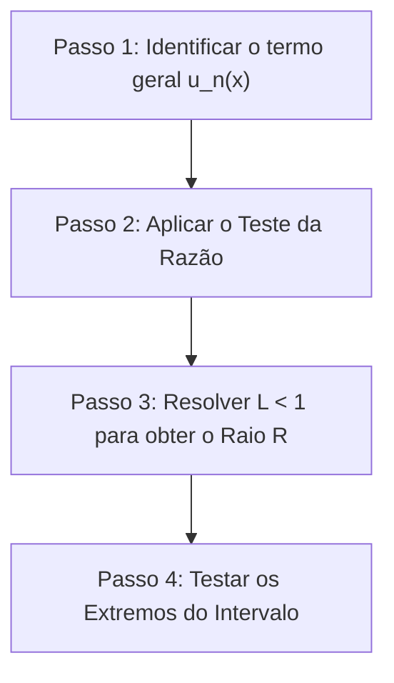



---
> **Navegação Rápida:**  
> [⬅️ Voltar ao README](../README.md) | [📘 Resumo Teórico](./calculo_resumo.md) | [⚡ Macetes Algébricos](./calculo_macetes.md) | [🎯 Roteiro de Resolução](./calculo_roteiro.md) | [📝 Lista de Exercícios](./calculo_exercicios.md) | [🚨 Plano de Emergência](../plano_estudos_emergencia.md)
---

# Roteiro de Resolução: Passo a Passo para Séries de Potências e Convergência

> [!NOTE]
> **O QUE FAZER E POR QUÊ:** Este guia apresenta o algoritmo exato que você deve seguir na prova para resolver qualquer questão sobre Raio, Intervalo e Conjunto de Convergência de Séries de Potências.

---

## Roteiro Geral de 4 Passos

---

### Passo 1: Identificar o termo geral $u_n(x)$
- **O que fazer:** Escreva claramente o termo de ordem $n$ da série, $u_n(x)$.
- **Por quê:** O teste da razão analisa como o termo evolui de $n$ para $n+1$.

---

### Passo 2: Calcular a razão $\left| \frac{u_{n+1}(x)}{u_n(x)} \right|$ e o limite $L$
- **O que fazer:** 
  1. Calcule $u_{n+1}(x)$ substituindo cada $n$ por $(n+1)$.
  2. Monte a fração $\left| \frac{u_{n+1}(x)}{u_n(x)} \right| = |u_{n+1}(x)| \cdot \frac{1}{|u_n(x)|}$.
  3. Simplifique fatoriais ($(n+1)! = (n+1)n!$), potências ($a^{k(n+1)} = a^{kn} \cdot a^k$) e termos alternados ($|(-1)^n| = 1$).
  4. Calcule $L = \lim_{n \to \infty} \left| \frac{u_{n+1}(x)}{u_n(x)} \right|$.
- **Por quê:** Pelo Teste da Razão de D'Alembert, se $L < 1$ a série converge absolutamente, e se $L > 1$ ela diverge.

---

### Passo 3: Determinar o Raio de Convergência $R$
- **O que fazer:**
  - Se o limite der $L = |x - x_0| \cdot K$:
    - Imponha $L < 1 \implies K |x - x_0| < 1 \implies |x - x_0| < \frac{1}{K}$.
    - O Raio de Convergência é $R = \frac{1}{K}$.
  - Se o limite der $L = 0$ para qualquer $x$:
    - O Raio de Convergência é $R = \infty$.
  - Se o limite der $\infty$ para $x \neq x_0$:
    - O Raio de Convergência é $R = 0$.
- **Por quê:** O raio define a distância a partir do centro $x_0$ dentro da qual a convergência é garantida.

---

### Passo 4: Testar as Extremidades do Intervalo (Fronteiras)
> [!IMPORTANT]
> O Teste da Razão é inconclusivo na fronteira ($L = 1$). Somente o teste direto na fronteira revela se os pontos extremos pertencem ao intervalo de convergência.

- **O que fazer:**
  - Se $R$ for finito, substitua $x = x_0 - R$ e $x = x_0 + R$ na série original.
  - Para cada ponto, você obterá uma série numérica (sem a variável $x$).
  - Aplique testes de séries numéricas:
    - **Série $p$:** $\sum \frac{1}{n^p}$ (converge para $p > 1$).
    - **Leibniz (Séries Alternadas):** Se os termos em valor absoluto decrescem para $0$, a série converge.
    - **Teste da Divergência:** Se o termo geral não vai a zero, diverge.
  - Ajuste os colchetes do intervalo:
    - Extremo convergente $\to$ usa colchete fechado `[` ou `]`.
    - Extremo divergente $\to$ usa parêntese aberto `(` ou `)`.

---
> **Navegação Rápida:**  
> [⬅️ Voltar ao README](../README.md) | [📘 Resumo Teórico](./calculo_resumo.md) | [⚡ Macetes Algébricos](./calculo_macetes.md) | [🎯 Roteiro de Resolução](./calculo_roteiro.md) | [📝 Lista de Exercícios](./calculo_exercicios.md) | [🔝 Voltar ao Topo](#topo)
