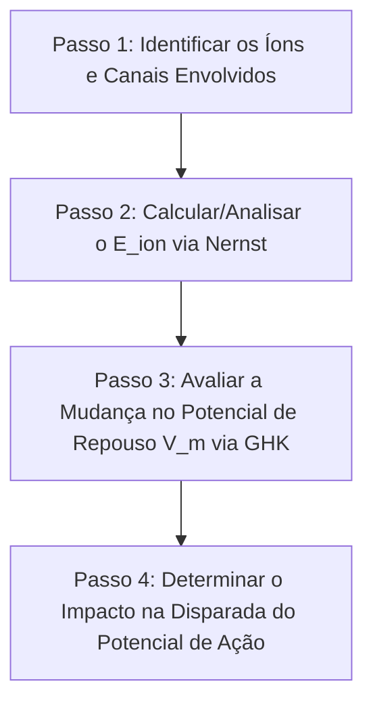



---
> **Navegação Rápida:**  
> [⬅️ Voltar ao README](../README.md) | [📘 Resumo Teórico](./eletrofisiologia_resumo.md) | [🎯 Roteiro de Resolução](./eletrofisiologia_roteiro.md) | [📝 Lista de Exercícios](./eletrofisiologia_exercicios.md) | [🚨 Plano de Emergência](../plano_estudos_emergencia.md)
---

# Roteiro de Resolução: Análise Eletrofisiológica e Casos Clínicos

> [!NOTE]
> **O QUE FAZER E POR QUÊ:** Algoritmo sistemático para analisar qualquer alteração em potenciais de membrana, efeitos de toxinas/fármacos e desequilíbrios eletrolíticos na prova.

---

## Roteiro Geral de Análise Eletrofisiológica de 4 Passos

---

### Passo 1: Identificar o Alvo Fisiológico (Íon ou Canal Iônico)
- **O que fazer:** Verifique qual íon ($\text{Na}^+, \text{K}^+, \text{Cl}^-, \text{Ca}^{2+}$) ou qual canal (voltagem-dependente, bomba $\text{Na}^+/\text{K}^+$, vazamento) foi alterado pelo agente de teste ou patologia.
- **Por quê:** Diferentes canais afetam fases distintas do potencial de ação (Canais de $\text{Na}^+ \to$ Despolarização; Canais de $\text{K}^+ \to$ Repolarização e Repouso).

---

### Passo 2: Calcular a variação de $E_{\text{ion}}$ pela Equação de Nernst
- **O que fazer:**
  - Aplique $E_{\text{ion}} = \frac{61{,}54}{z} \log_{10} \left(\frac{[\text{Íon}]_{\text{fora}}}{[\text{Íon}]_{\text{dentro}}}\right)$.
  - Se $[\text{Íon}]_{\text{fora}}$ aumenta em cátion ($\text{K}^+$): $E_{\text{K}}$ fica **menos negativo** (ex: sobe de $-95\text{ mV}$ para $-70\text{ mV}$).
  - Se a razão $[\text{Íon}]_{\text{fora}}/[\text{Íon}]_{\text{dentro}}$ inverte: o sinal de $E_{\text{ion}}$ inverte de positivo para negativo.
- **Por quê:** O potencial de Nernst dita o limite para onde o potencial de membrana quer ser puxado quando aquele canal abre.

---

### Passo 3: Avaliar o Potencial de Membrana de Repouso ($V_m$) via GHK
- **O que fazer:** 
  - Se a permeabilidade $P_{\text{K}}$ for alterada ou se $[\text{K}^+]_{\text{fora}}$ aumentar, $V_m$ seguirá o movimento de $E_{\text{K}}$.
  - **Despolarização de Repouso:** $V_m$ fica menos negativo (mais próximo de $0\text{ mV}$).
  - **Hiperpolarização de Repouso:** $V_m$ fica mais negativo.
- **Por quê:** Em repouso, a membrana é predominantemente permeável ao potássio ($P_{\text{K}}$).

---

### Passo 4: Concluir as Consequências Clínicas / Fisiológicas
> [!IMPORTANT]
> - **Bloqueio de canais de $\text{Na}^+$ (TTX, Lidocaína):** Impede o disparo de potenciais de ação. Causa anestesia ou paralisia.
> - **Hipercalemia sustentada (Injeção de $\text{KCl}$):** Despolarização sustentada inativa permanentemente os canais de $\text{Na}^+$ (porta de inativação fecha), impedindo a repolarização. O coração para em diástole (assistolia).
> - **Temperatura baixa (Frio):** Desacelera a cinética de abertura/fechamento das comportas iônicas e reduz a condução axonial.

- **Por quê:** Conecta a biofísica molecular com a manifestação clínica final.

---
> **Navegação Rápida:**  
> [⬅️ Voltar ao README](../README.md) | [📘 Resumo Teórico](./eletrofisiologia_resumo.md) | [🎯 Roteiro de Resolução](./eletrofisiologia_roteiro.md) | [📝 Lista de Exercícios](./eletrofisiologia_exercicios.md) | [🔝 Voltar ao Topo](#topo)
