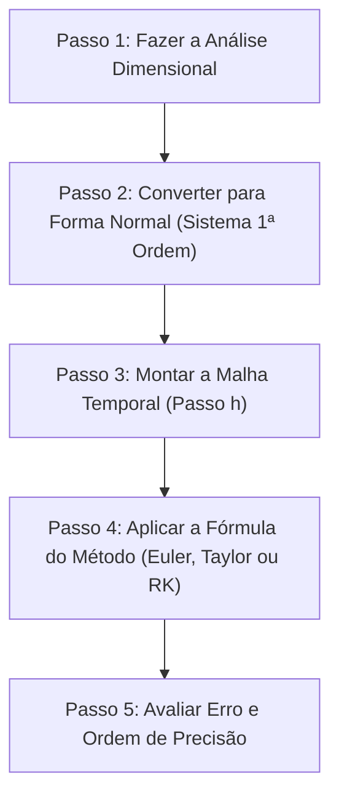



---
> **Navegação Rápida:**  
> [⬅️ Voltar ao README](../README.md) | [📘 Resumo Teórico](./numericos_resumo.md) | [🎯 Roteiro de Resolução](./numericos_roteiro.md) | [📝 Lista de Exercícios](./numericos_exercicios.md) | [🚨 Plano de Emergência](../plano_estudos_emergencia.md)
---

# Roteiro Prático e Mastigado de Resolução: Métodos Numéricos (MAP2220)

> [!NOTE]
> **RECEITA DE BOLO PARA A PROVA:** Guia algorítmico passo a passo sem complicação para você resolver qualquer questão de EDO, redução de ordem, análise de consistência e métodos de Taylor/Runge-Kutta sem travar.

---

## 🗺️ O Mapa do Caminho em 5 Passos

---

### 📝 PASSO 1: Análise Dimensional (Como achar as unidades dos parâmetros)

- **O que fazer na prova:**
  1. Olhe para a variável principal $y$ (ex: população $[\text{ind}]$) e para o tempo $t$ (ex: $[\text{s}]$).
  2. Escreva as unidades das derivadas:
     - 1ª Derivada $y'$: $[\text{ind} \cdot \text{s}^{-1}]$
     - 2ª Derivada $y''$: $[\text{ind} \cdot \text{s}^{-2}]$ (esta é a unidade da **aceleração**!).
  3. **Regra de Ouro:** Todos os termos somados na EDO precisam ter exatamente a mesma unidade da 2ª derivada!
  4. Iguale a unidade de cada termo a $[\text{ind} \cdot \text{s}^{-2}]$ para achar a unidade dos parâmetros ($\gamma, r, K, g(t)$).

---

### 📝 PASSO 2: Converter para a Forma Normal (Reduzir a EDO de 2ª ordem)

- **O que fazer na prova:**
  1. Isole a derivada de maior ordem $y''$ no lado esquerdo da igualdade.
  2. Defina as duas variáveis mágicas:
     - $y_1 = y$ (Posição / Quantidade)
     - $y_2 = y'$ (Velocidade / Taxa)
  3. Escreva o sistema de 1ª ordem de forma limpa:

$$
\begin{cases}
\frac{dy_1}{dt} = y_2 \\
\frac{dy_2}{dt} = \text{Tudo o que sobrou no lado direito da EDO isolada}
\end{cases}
$$

  4. Não esqueça de colocar as Condições Iniciais no vetor $\mathbf{y}_0 = \begin{bmatrix} y_1(t_0) \\ y_2(t_0) \end{bmatrix} = \begin{bmatrix} y(t_0) \\ y'(t_0) \end{bmatrix}$.

---

### 📝 PASSO 3: Montar a Malha Temporal

- **O que fazer na prova:**
  1. Calcule o tamanho do passo $h = \frac{T - t_0}{m}$ (onde $T$ é o tempo final e $m$ é o número de divisões).
  2. Defina os instantes de tempo $t_0, t_1 = t_0 + h, t_2 = t_0 + 2h, \dots$

---

### 📝 PASSO 4: Escolher e Aplicar a Fórmula Pedida

#### **Opção 1: Se a prova pedir Método de Euler Explícito**

$$
\begin{cases}
y_{1, n+1} = y_{1,n} + h \cdot y_{2,n} \\
y_{2, n+1} = y_{2,n} + h \cdot f_2(t_n, y_{1,n}, y_{2,n})
\end{cases}
$$

#### **Opção 2: Se a prova pedir Método de Euler Aprimorado (Heun - RK2)**
1. Calcule o vetor de inclinação 1: $\boldsymbol{\kappa}_1 = \mathbf{F}(t_n, \mathbf{y}_n)$
2. Calcule o vetor de inclinação 2: $\boldsymbol{\kappa}_2 = \mathbf{F}(t_n + h, \mathbf{y}_n + h \boldsymbol{\kappa}_1)$
3. Atualize: $\mathbf{y}_{n+1} = \mathbf{y}_n + \frac{h}{2} (\boldsymbol{\kappa}_1 + \boldsymbol{\kappa}_2)$

#### **Opção 3: Se a prova pedir Método do Ponto Médio (Euler Modificado - RK2)**
1. Calcule a inclinação 1: $\boldsymbol{\kappa}_1 = \mathbf{F}(t_n, \mathbf{y}_n)$
2. Calcule a inclinação no meio: $\boldsymbol{\kappa}_2 = \mathbf{F}\left(t_n + \frac{h}{2}, \mathbf{y}_n + \frac{h}{2} \boldsymbol{\kappa}_1\right)$
3. Atualize: $\mathbf{y}_{n+1} = \mathbf{y}_n + h \cdot \boldsymbol{\kappa}_2$

#### **Opção 4: Se a prova pedir Série de Taylor de 2ª Ordem ($T_2$)**
1. Derive $f(t,y)$ em relação a $t$ e $y$ no papel para achar $D f = f_t + f_y f$.
2. Substitua na fórmula: $y_{n+1} = y_n + h f(t_n, y_n) + \frac{h^2}{2} D f(t_n, y_n)$.

---

### 📝 PASSO 5: Verificar a Ordem e o Erro (Se for pedido)

- **Para testar Consistência de um Método:**
  - Substitua a expansão de Taylor de $y(t_n + h)$ na fórmula do método e veja qual potência de $h$ sobra.
  - Se o menor termo restante for $h^1 \implies$ **1ª Ordem de Consistência ($q=1$)**.
  - Se o menor termo restante for $h^2 \implies$ **2ª Ordem de Consistência ($q=2$)**.

---

---
> **Navegação Rápida:**  
> [⬅️ Voltar ao README](../README.md) | [📘 Resumo Teórico](./numericos_resumo.md) | [🎯 Roteiro de Resolução](./numericos_roteiro.md) | [📝 Lista de Exercícios](./numericos_exercicios.md) | [🔝 Voltar ao Topo](#topo)
