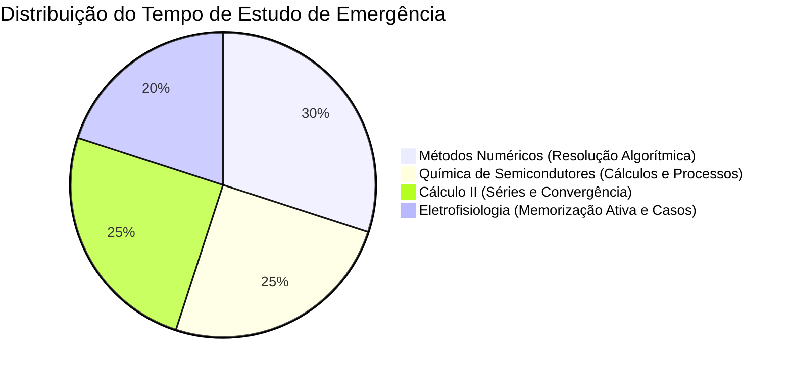

---
> **Navegação Rápida:**  
> [⬅️ Voltar ao README](./README.md) | [📐 Cálculo II](./calculo/calculo_resumo.md) | [💻 Métodos Numéricos](./numericos/numericos_resumo.md) | [🧪 Química](./quimica/quimica_resumo.md) | [⚡ Eletrofisiologia](./eletrofisiologia/eletrofisiologia_resumo.md)
---

# Plano Mestre de Estudos de Emergência para a Prova de Amanhã

> [!IMPORTANT]
> **Consultoria Pessoal de Estudos:** Guia tático de sobrevivência de alta intensidade para dominar as 4 disciplinas na véspera e manhã da prova.

---

## 1. Estratégia de Priorização e Alocação de Tempo

### **Por que essa divisão?**
- **Métodos Numéricos & Química (55% do tempo):** São matérias com exercícios longos de desenvolvimento, onde o erro de cálculo ou de dedução custa muitos pontos. Exigem treino prático de escrita.
- **Cálculo II (25% do tempo):** O escopo é focado especificamente no algoritmo de convergência de séries de potências (questões 1 a 3). Dominando o roteiro de 4 passos, você garante 100% da nota nesta seção.
- **Eletrofisiologia (20% do tempo):** Matéria altamente conceitual e lógica. O estudo eficiente deve ser feito por **Repetição Espaçada e Recall Ativo** (explicar para si mesmo os 5 casos práticos).

---

## 2. Cronograma de Estudos por Blocos (Sprint Plan)

### **BLOCO NOITE (Véspera da Prova)**

| Horário / Bloco | Disciplina | Foco Prático | Material de Apoio |
| :--- | :--- | :--- | :--- |
| **Bloco 1 (50 min)** | **Métodos Numéricos** | Ler o Roteiro e refazer do zero a conversão da EDO para sistema de 1ª ordem e discretização de Euler (Itens 2 e 4). | [`numericos_roteiro.md`](./numericos/numericos_roteiro.md), [`numericos_exercicios.md`](./numericos/numericos_exercicios.md) |
| *Pausa (10 min)* | *Descanso / Hidratação* | - | - |
| **Bloco 2 (50 min)** | **Química** | Resolver a questão de consumo de silício ($x_{\text{Si}}$), balancear a reação redox e calcular a eletrodeposição de $\text{Cu}$ por Faraday. | [`quimica_roteiro.md`](./quimica/quimica_roteiro.md), [`quimica_exercicios.md`](./quimica/quimica_exercicios.md) |
| *Pausa (10 min)* | *Descanso / Hidratação* | - | - |
| **Bloco 3 (40 min)** | **Cálculo II** | Resolver as Questões 1 (a,b), 2 e 3 (a,b,c,d) focando na aplicação do Teste da Razão e limites. | [`calculo_roteiro.md`](./calculo/calculo_roteiro.md), [`calculo_exercicios.md`](./calculo/calculo_exercicios.md) |
| *Pausa (10 min)* | *Descanso / Hidratação* | - | - |
| **Bloco 4 (40 min)** | **Eletrofisiologia** | Fazer o Recall Ativo dos 5 Casos Clínicos (Frio, TTX, KCl, Lidocaína, Hipercalemia). | [`eletrofisiologia_roteiro.md`](./eletrofisiologia/eletrofisiologia_roteiro.md), [`eletrofisiologia_exercicios.md`](./eletrofisiologia/eletrofisiologia_exercicios.md) |

---

### **BLOCO MANHÃ (Reta Final / Pré-Prova)**

| Tempo | Disciplina / Ação | Ação de Emergência |
| :--- | :--- | :--- |
| **30 min** | **Revisão de Fórmulas-Chave** | Rever as equações de Nernst ($E_{\text{ion}}$), Goldman ($V_m$), Faraday ($m = \frac{M I t}{n F}$), e o Raio $R = \lim \left|\frac{c_n}{c_{n+1}}\right|$. |
| **20 min** | **Checklist de Verificação** | Tentar escrever de memória as variáveis de estado do Euler Explícito para a EDO populacional. |
| **10 min** | **Reset Mental** | Pausa total de telas, respiração e foco. |

---

## 3. Checklist de Verificação de Aprendizagem

Antes de entrar na sala de prova, certifique-se de que você consegue responder "SIM" para as seguintes perguntas:

- [ ] **Cálculo:** Sei como aplicar o Teste da Razão e testar as extremidades para achar o raio $R$ e o intervalo de convergência?
- [ ] **Numéricos:** Sei fazer a análise dimensional de cada termo da EDO populacional e reescrevê-la na forma de sistema de 1ª ordem?
- [ ] **Numéricos:** Sei montar a fórmula do Euler Explícito na forma vetorial $\mathbf{y}_{n+1} = \mathbf{y}_n + h \mathbf{F}(t_n, \mathbf{y}_n)$?
- [ ] **Química:** Sei por que o consumo de Silício $x_{\text{Si}}$ dá cerca de $13{,}28\text{ nm}$ para $25\text{ nm}$ de $\text{SiO}_2$?
- [ ] **Química:** Sei explicar os 2 mecanismos (Químico e Mecânico) do CMP no processo Dual Damascene?
- [ ] **Química:** Sei calcular a massa depositada por Faraday $m = \frac{M I t}{n F}$ e converter para taxa em $\text{nm/s}$?
- [ ] **Eletrofisiologia:** Sei por que a injeção de KCl causa parada cardíaca em assistolia (diástole) via despolarização sustentada?
- [ ] **Eletrofisiologia:** Sei por que o TTX do Baiacu e a Lidocaína bloqueiam o potencial de ação sem alterar o potencial de repouso?

---

## 4. Táticas de Resolução Durante a Prova

> [!TIP]
> 1. **Gestão do Tempo na Prova:**
>    - Comece pelas questões de **Cálculo** e **Química (Exercícios 3 e 4)** que são resoluções numéricas/algorítmicas diretas e garantem pontos rápidos.
>    - Em seguida, resolva a questão de **Métodos Numéricos**, estruturando a resposta em passos bem delimitados (Item 1, Item 2, Item 3, Item 4a e 4b).
>    - Por fim, responda as questões conceituais de **Eletrofisiologia** e **Química teórica (CMP Dual Damascene)** com tópicos claros e objetivos.

> [!WARNING]
> 2. **Evite Erros Bobos:**
>    - Em **Cálculo**, não esqueça de testar as extremidades $x = x_0 \pm R$.
>    - Em **Química**, lembre-se de converter o tempo de minutos para segundos ($t = 10\text{ min} = 600\text{ s}$) e a corrente para Amperes.
>    - Em **Numéricos**, identifique claramente os valores iniciais discretos $y_{1,0} = N_0$ e $y_{2,0} = v_0$.

---
> **Navegação Rápida:**  
> [⬅️ Voltar ao README](./README.md) | [📐 Cálculo II](./calculo/calculo_resumo.md) | [💻 Métodos Numéricos](./numericos/numericos_resumo.md) | [🧪 Química](./quimica/quimica_resumo.md) | [⚡ Eletrofisiologia](./eletrofisiologia/eletrofisiologia_resumo.md) | [🔝 Voltar ao Topo](#topo)