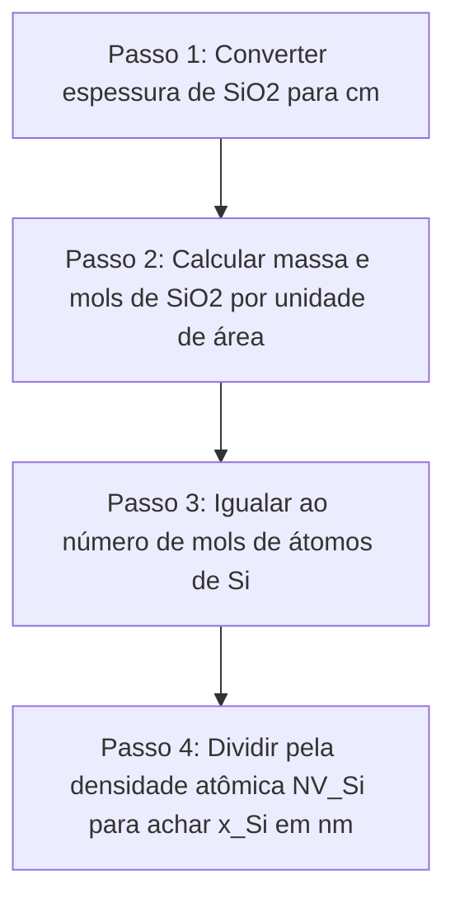
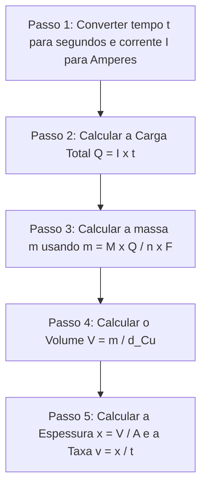



---
> **Navegação Rápida:**  
> [⬅️ Voltar ao README](../README.md) | [📘 Resumo Teórico](./quimica_resumo.md) | [🎯 Roteiro de Resolução](./quimica_roteiro.md) | [📝 Lista de Exercícios](./quimica_exercicios.md) | [🚨 Plano de Emergência](../plano_estudos_emergencia.md)
---

# Roteiro de Resolução: Química de Semicondutores e Eletroquímica

> [!NOTE]
> **O QUE FAZER E POR QUÊ:** Guia algorítmico passo a passo para calcular consumo de silício em oxidação, balancear reações redox de gravação/polimento e aplicar a Lei de Faraday em eletrodeposição.

---

## Roteiro 1: Consumo de Silício na Oxidação Seca

- **Por quê:** O oxigênio reage consumindo o silício do próprio substrato. A proporção estequiométrica de $\text{Si}:\text{SiO}_2$ é $1:1$.

> [!TIP]
> ### 📋 Tabela de Símbolos, Unidades e Análise Dimensional
> | Símbolo | Significado | Unidade Habitual | Dimensão Física |
> | :--- | :--- | :--- | :--- |
> | **$x_{\text{Si}}$** | Espessura de Silício consumido | $\text{nm}$ ($\text{cm}$) | $[L]$ (Comprimento) |
> | **$x_{\text{SiO}_2}$** | Espessura de $\text{SiO}_2$ formada | $\text{nm}$ ($\text{cm}$) | $[L]$ (Comprimento) |
> | **$d_{\text{SiO}_2}$** | Densidade do $\text{SiO}_2$ ($2{,}65\text{ g/cm}^3$) | $\text{g/cm}^3$ | $[M \cdot L^{-3}]$ |
> | **$M_{\text{SiO}_2}$** | Massa molar do $\text{SiO}_2$ ($60{,}08\text{ g/mol}$) | $\text{g/mol}$ | $[M \cdot N^{-1}]$ |
> | **$N_A$** | Constante de Avogadro ($6{,}022 \times 10^{23}$) | $\text{atomos/mol}$ | $[N^{-1}]$ |
> | **$NV_{\text{Si}}$** | Densidade atômica do $\text{Si}$ ($5 \times 10^{22}$) | $\text{atomos/cm}^3$ | $[L^{-3}]$ |
> 
> **Fórmula direta com verificação dimensional:**

$$
x_{\text{Si}} = \frac{d_{\text{SiO}_2} \cdot N_A \cdot x_{\text{SiO}_2}}{M_{\text{SiO}_2} \cdot NV_{\text{Si}}} \quad \implies \quad [L] = \frac{[M \cdot L^{-3}] \cdot [N^{-1}] \cdot [L]}{[M \cdot N^{-1}] \cdot [L^{-3}]} = [L]
$$

---

## Roteiro 2: Balanceamento Redox de Oxidação do Cobre

1. **Escrever as semi-reações isoladas:**
   - Oxidação do metal: $\text{Cu} \to \text{Cu}^{2+} + 2e^-$
   - Redução do peróxido: $\text{H}_2\text{O}_2 + 2\text{H}^+ + 2e^- \to 2\text{H}_2\text{O}$
2. **Igualar o número de elétrons transferidos:**
   - Ambas as reações envolvem $2e^-$.
3. **Somar as equações e cancelar os elétrons:**
   - $\text{Cu} + \text{H}_2\text{O}_2 + 2\text{H}^+ \to \text{Cu}^{2+} + 2\text{H}_2\text{O}$
- **Por quê:** O peróxido de hidrogênio atua como agente oxidante forte e os prótons $\text{H}^+$ fornecem o meio ácido necessário.

---

## Roteiro 3: Cálculo de Eletrodeposição (Lei de Faraday)

- **Por quê:** A quantidade de matéria depositada eletroquimicamente é diretamente proporcional à quantidade de carga elétrica que atravessa a célula.

---
> **Navegação Rápida:**  
> [⬅️ Voltar ao README](../README.md) | [📘 Resumo Teórico](./quimica_resumo.md) | [🎯 Roteiro de Resolução](./quimica_roteiro.md) | [📝 Lista de Exercícios](./quimica_exercicios.md) | [🔝 Voltar ao Topo](#topo)
