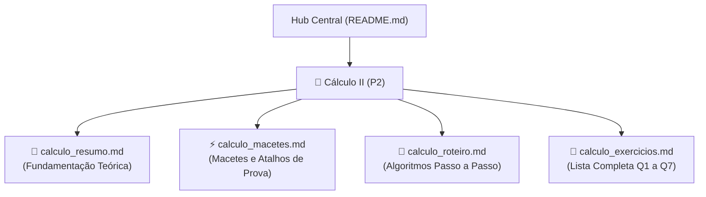

# 🎓 Material Integrado de Preparação P2 — Engenharia / USP

---

## 📌 Visão Geral do Repositório (P2)

Este repositório reúne o acervo completo de preparação para a avaliação de **P2**, cobrindo o conteúdo de **Séries de Potências, Séries de Maclaurin, Integração/Diferenciação Termo a Termo e Séries Numéricas com Estimativa de Erro**.

Toda a documentação foi formatada no padrão **GitHub Flavored Markdown (GFM)** com suporte nativo a fórmulas matemáticas em $\text{\LaTeX}$, diagramas em Mermaid e blocos de alerta contextualizados (`> [!NOTE]`, `> [!IMPORTANT]`, `> [!TIP]`, `> [!WARNING]`).

---

## 🗺️ Mapa de Navegação do Repositório (P2)

---

## 📚 Índice Geral de Materiais de Cálculo II (P2)

| Documento | Foco Principal | Conteúdo Chave |
| :--- | :--- | :--- |
| [📘 Resumo Teórico](./calculo_resumo.md) | Fundamentos Conceituais | Séries de Potências, Teorema do Raio/Intervalo, Maclaurin, Integração/Derivação Termo a Termo, Leibniz e Testes de Fronteira. |
| [⚡ Macetes Algébricos](./calculo_macetes.md) | Velocidade e Atalhos | Fatoriais instantâneos, limite de logaritmos, tabela das 6 séries notáveis, regra do $[0,1]$ e o truque da função oculta. |
| [🎯 Roteiro de Resolução](./calculo_roteiro.md) | Algoritmos de Prova | Fluxogramas Mermaid para os 5 tipos de problemas da lista/prova. |
| [📝 Exercícios Resolvidos](./calculo_exercicios.md) | Aplicação Prática Completa | Resolução detalhada de **todas as 7 questões** da lista de 10 de Agosto de 2026 (Q1 a Q7). |

---

## 🎯 Síntese dos Módulos de Cálculo II (P2)

### 📐 1. Séries de Potências e Convergência (Q1, Q2, Q3)
- **Escopo:** Teste da Razão de D'Alembert, reconhecimento de Séries Geométricas e cálculo do Raio de Convergência ($R$) e Intervalo de Convergência ($I$).
- 🔗 **Acesse:** [Resumo](./calculo_resumo.md) | [Macetes](./calculo_macetes.md) | [Exercícios Q1-Q3](./calculo_exercicios.md)

### 📐 2. Séries de Maclaurin Fundamentais (Q4)
- **Escopo:** Expansão de $e^{-x^2}$, $\cos(x^2)$, $\frac{x}{1+x^3}$, $\sinh(x)$ e $\cosh(x)$ sem derivar do zero.
- 🔗 **Acesse:** [Resumo](./calculo_resumo.md) | [Tabela de Maclaurin](./calculo_macetes.md#4--as-6-séries-de-maclaurin-fundamentais-x_0--0) | [Exercícios Q4](./calculo_exercicios.md#questão-4)

### 📐 3. Integração Termo a Termo e Séries Numéricas (Q5)
- **Escopo:** Obtenção de primitivas gerais e conversão de integrais definidas no intervalo $[0, 1]$ em séries numéricas puras.
- 🔗 **Acesse:** [Roteiro](./calculo_roteiro.md#tipo-3-integração-termo-a-termo-e-série-numérica-q5) | [Exercícios Q5](./calculo_exercicios.md#questão-5)

### 📐 4. Estimativa de Erro com Séries Alternadas (Q6)
- **Escopo:** Aplicação do Critério de Leibniz para aproximação de integrais com tolerância rigorosa (erro $< 0{,}001$).
- 🔗 **Acesse:** [Macetes de Erro](./calculo_macetes.md#6--estimativa-de-erro-com-séries-alternadas-resto-de-leibniz) | [Exercícios Q6](./calculo_exercicios.md#questão-6)

### 📐 5. Reconhecimento da Função Soma via Derivação/Integração (Q7)
- **Escopo:** Identificação da função algébrica $f(x)$ associada a séries com coeficientes variáveis através de integração e soma da PG.
- 🔗 **Acesse:** [Macetes](./calculo_macetes.md#7--o-truque-da-função-oculta-reconhecimento-via-derivada-integral) | [Exercícios Q7](./calculo_exercicios.md#questão-7)

---

**Bons estudos e excelente prova! 🚀**

