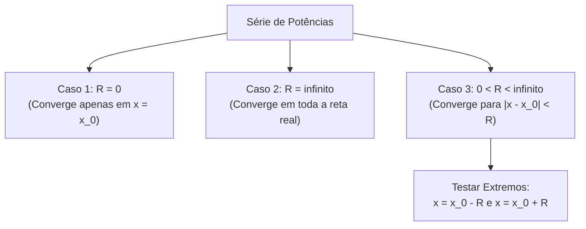

---
> **Navegação Rápida:**  
> [⬅️ Voltar ao README](./README.md) | [📘 Resumo Teórico](./calculo_resumo.md) | [⚡ Macetes Algébricos](./calculo_macetes.md) | [🎯 Roteiro de Resolução](./calculo_roteiro.md) | [📝 Exercícios Resolvidos](./calculo_exercicios.md)
---

# 📘 Resumo Teórico: Séries de Potências, Maclaurin e Integração (Cálculo II - P2)

> [!IMPORTANT]
> **Objetivo da P2:** Dominar a representação de funções por Séries de Potências, cálculo de Raio e Intervalo de Convergência, Integração e Diferenciação Termo a Termo e Estimativa Numérica com Séries Alternadas.

---

## 1. Definição de Série de Potências

Uma **Série de Potências** centrada em $x_0$ é uma série infinita da forma:
$$\sum_{n=0}^{\infty} c_n (x - x_0)^n = c_0 + c_1(x - x_0) + c_2(x - x_0)^2 + \dots$$

- $c_n$: coeficientes da série.
- $x_0$: centro da série (frequentemente $x_0 = 0$).
- $x$: variável real.

---

## 2. Teorema do Raio e Intervalo de Convergência

Para qualquer série de potências $\sum c_n (x - x_0)^n$, ocorre **exatamente um** dos três casos:

1. **$R = 0$:** A série converge **apenas** no centro $x = x_0$.
2. **$R = \infty$:** A série converge absolutamente para todo $x \in (-\infty, \infty) = \mathbb{R}$.
3. **$0 < R < \infty$:** Existe um número real positivo $R$ (o **Raio de Convergência**) tal que:
   - A série converge absolutamente para $|x - x_0| < R$, ou seja, $x \in (x_0 - R, x_0 + R)$.
   - A série diverge para $|x - x_0| > R$.
   - Nos extremos $x = x_0 - R$ e $x = x_0 + R$, a série pode convergir ou divergir (deve ser testada separadamente).

---

## 3. Testes Principais para o Raio de Convergência

### A) Teste da Razão de D'Alembert
Para a série de termos $u_n(x) = c_n (x - x_0)^n$, calcula-se:
$$L = \lim_{n \to \infty} \left| \frac{u_{n+1}(x)}{u_n(x)} \right|$$
- Se $L < 1 \implies$ **Converge absolutamente**.
- Se $L > 1 \implies$ **Diverge**.
- Se $L = 1 \implies$ **Inconclusivo (Fronteira)**.

Quando a potência for exatamente $(x-x_0)^n$, o raio $R$ é dado diretamente por:
$$R = \lim_{n \to \infty} \left| \frac{c_n}{c_{n+1}} \right|$$

---

## 4. Séries de Taylor e Maclaurin

Se uma função $f(x)$ possui derivadas de todas as ordens em $x_0$, sua **Série de Taylor** em torno de $x_0$ é:
$$f(x) = \sum_{n=0}^{\infty} \frac{f^{(n)}(x_0)}{n!} (x - x_0)^n = f(x_0) + f'(x_0)(x - x_0) + \frac{f''(x_0)}{2!}(x - x_0)^2 + \dots$$

Quando o centro é $x_0 = 0$, a série é denominada **Série de Maclaurin**:
$$f(x) = \sum_{n=0}^{\infty} \frac{f^{(n)}(0)}{n!} x^n$$

---

## 5. Teorema da Diferenciação e Integração Termo a Termo

> [!NOTE]
> Se uma função $f(x) = \sum_{n=0}^{\infty} c_n (x - x_0)^n$ tem raio de convergência $R > 0$, então $f$ é contínua e diferenciável no intervalo aberto $(x_0 - R, x_0 + R)$, e podemos:

1. **Diferenciar Termo a Termo:**
   $$f'(x) = \sum_{n=1}^{\infty} n c_n (x - x_0)^{n-1}$$

2. **Integrar Termo a Termo:**
   $$\int f(x) \, dx = C + \sum_{n=0}^{\infty} c_n \frac{(x - x_0)^{n+1}}{n+1}$$

> [!TIP]
> **Propriedade Fundamental:** A diferenciação e a integração termo a termo **mantêm o mesmo Raio de Convergência ($R$)** da série original (embora o comportamento nos extremos $x = x_0 \pm R$ possa mudar).

---

## 6. Teorema do Resto de Leibniz (Estimativa de Séries Alternadas)

Se $\sum_{n=0}^{\infty} (-1)^n b_n$ é uma série alternada que satisfaz o Critério de Leibniz:
1. $b_n > 0$ para todo $n$
2. $b_{n+1} \le b_n$ (sequência decrescente)
3. $\lim_{n \to \infty} b_n = 0$

Então a soma infinita $S = \sum_{n=0}^{\infty} (-1)^n b_n$ converge e a soma parcial truncada $S_N = \sum_{n=0}^{N} (-1)^n b_n$ aproxima $S$ com erro limitado por:
$$|S - S_N| \le b_{N+1}$$

---

## 7. Tabela de Testes para Séries Numéricas de Fronteira

| Teste | Forma do Termo Geral | Critério de Convergência |
| :--- | :--- | :--- |
| **Série $p$** | $\sum \frac{1}{n^p}$ | Converge se $p > 1$; Diverge se $p \le 1$. |
| **Harmônica** | $\sum \frac{1}{n}$ | Diverge ($p=1$). |
| **Harmônica Alternada** | $\sum \frac{(-1)^n}{n}$ | Converge condicionalmente (Leibniz). |
| **Série de Bertrand** | $\sum \frac{1}{n \ln n}$ | Diverge (pelo Teste da Integral). |
| **Bertrand Alternada** | $\sum \frac{(-1)^n}{n \ln n}$ | Converge (por Leibniz). |
| **Teste da Divergência** | $\lim_{n \to \infty} a_n \neq 0$ | A série **diverge** imediatamente. |

---
> **Navegação Rápida:**  
> [⬅️ Voltar ao README](./README.md) | [📘 Resumo Teórico](./calculo_resumo.md) | [⚡ Macetes Algébricos](./calculo_macetes.md) | [🎯 Roteiro de Resolução](./calculo_roteiro.md) | [📝 Exercícios Resolvidos](./calculo_exercicios.md) | [🔝 Voltar ao Topo](#topo)
