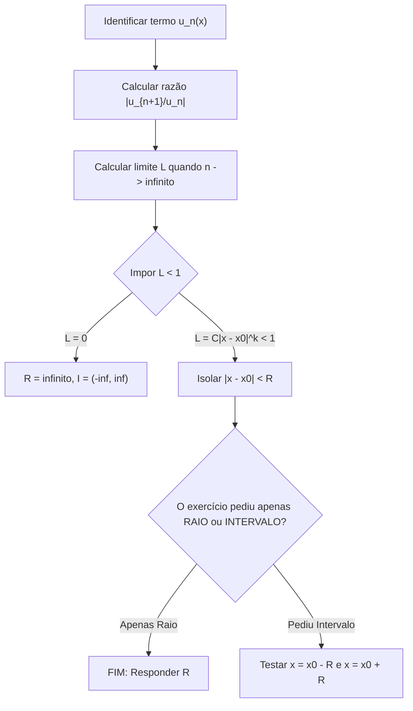
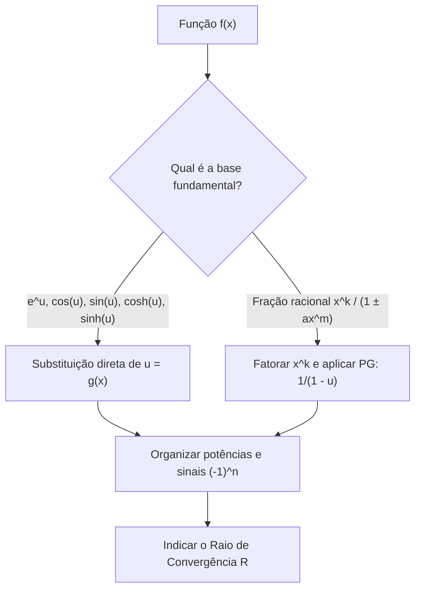
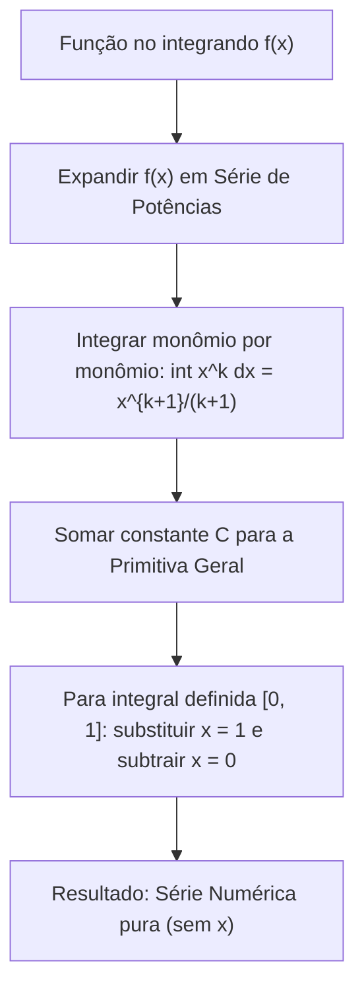
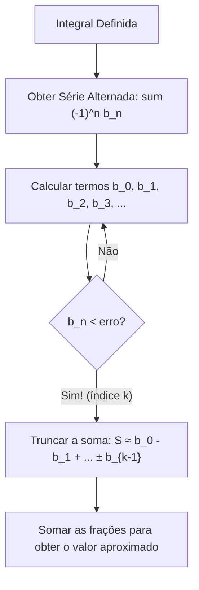
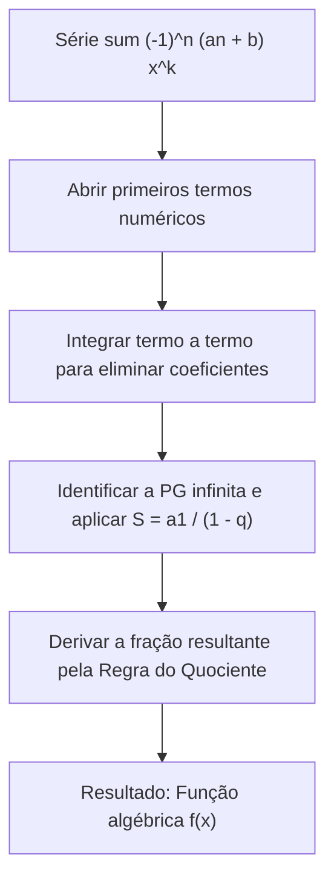

---
> **Navegação Rápida:**  
> [⬅️ Voltar ao README](./README.md) | [📘 Resumo Teórico](./calculo_resumo.md) | [⚡ Macetes Algébricos](./calculo_macetes.md) | [🎯 Roteiro de Resolução](./calculo_roteiro.md) | [📝 Exercícios Resolvidos](./calculo_exercicios.md)
---

# 🎯 Roteiro de Resolução Passo a Passo (Cálculo II - P2)

> [!NOTE]
> **Como usar este guia:** Escolha o tipo de questão que você está enfrentando na lista ou na prova e siga o algoritmo correspondente para resolver sem erro.

---

## 📌 Tipo 1: Raio e Intervalo de Convergência (Q1, Q2, Q3)

### Checklist de Execução:
1. **Termo Geral:** Identifique $u_n(x)$ com todos os sinais e índices.
2. **Montar Razão:** $\left|\frac{u_{n+1}(x)}{u_n(x)}\right| = |u_{n+1}(x)| \cdot \frac{1}{|u_n(x)|}$.
3. **Cancelar:** Fatoriais $\to \frac{1}{n+1}$, potências $\to x^k$, polinômios/logaritmos $\to 1$.
4. **Impor $L < 1$:** Isole $|x - x_0| < R$.
5. **Se pediu Intervalo:** Substitua cada extremo e use Leibniz, Série $p$ ou Teste da Divergência.

---

## 📌 Tipo 2: Obter Séries de Potências em torno de $x_0 = 0$ (Q4)

### Checklist de Execução:
1. Isole potências externas multiplicando a fração: $f(x) = x^k \cdot \left(\frac{1}{1 \pm a x^m}\right)$.
2. Troque a variável $u$ na série fundamental correspondente.
3. Distribua potências de $x$: $x^k \cdot x^{mn} = x^{mn+k}$.
4. Escreva tanto a forma somatório ($\sum$) quanto os primeiros 3 a 4 termos abertos.

---

## 📌 Tipo 3: Integração Termo a Termo e Série Numérica (Q5)

---

## 📌 Tipo 4: Avaliação Numérica com Erro Menor que $\varepsilon$ (Q6)

---

## 📌 Tipo 5: Achar a Função Oculta de uma Série (Q7)

---
> **Navegação Rápida:**  
> [⬅️ Voltar ao README](./README.md) | [📘 Resumo Teórico](./calculo_resumo.md) | [⚡ Macetes Algébricos](./calculo_macetes.md) | [🎯 Roteiro de Resolução](./calculo_roteiro.md) | [📝 Exercícios Resolvidos](./calculo_exercicios.md) | [🔝 Voltar ao Topo](#topo)
