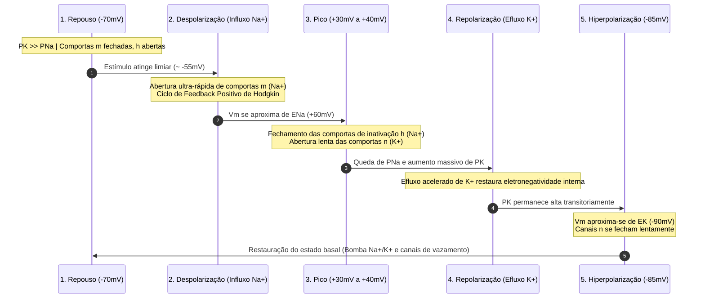

# Relatório do Especialista Forense em Eletrofisiologia Celular & Engenharia Reversa de IA

**Autor:** Agente Forense de Potencial de Membrana e Engenharia Reversa de Prompts  
**Disciplina:** Eletrofisiologia  
**Objetivo:** Analisar minuciosamente a fundamentação biofísica da P1, dissecar o padrão de geração de rubricas por IA do professor e estabelecer as diretrizes invioláveis de correção para a P2.

---

## 1. Resolução Eletrofisiológica Forense da Questão da P1

### 1.1. Enunciado da Prova Anterior
> *"O potencial elétrico de membrana de uma célula excitável varia durante o potencial de ação. Explique o fenômeno responsável por essa variação."*

---

### 1.2. Fundamentação Biofísica Integral

#### A. Estado de Repouso e Gradientes Eletroquímicos
A membrana celular fosfolipídica atua como um capacitor dielétrico imperfeito que separa dois compartimentos condutores com distribuições iônicas assimétricas, mantidas ativamente pela bomba eletrogênica $\text{Na}^+/\text{K}^+$-ATPase ($3\,\text{Na}^+$ ejetados para cada $2\,\text{K}^+$ internalizados com consumo de ATP):
* **Meio Intracelular:** Alta concentração de $\text{K}^+$ ($\approx 140\text{ mM}$), baixa de $\text{Na}^+$ ($\approx 10\text{–}14\text{ mM}$), baixa de $\text{Cl}^-$ ($\approx 4\text{–}10\text{ mM}$) e alta concentração de ânions orgânicos impermeáveis ($\text{A}^-$, proteínas e fosfatos).
* **Meio Extracelular:** Baixa concentração de $\text{K}^+$ ($\approx 4\text{–}5\text{ mM}$), alta de $\text{Na}^+$ ($\approx 140\text{–}145\text{ mM}$) e alta de $\text{Cl}^-$ ($\approx 105\text{–}110\text{ mM}$).

Cada espécie iônica $i$ possui um **Potencial de Equilíbrio de Nernst** ($E_i$), no qual a força de difusão química (gerada pelo gradiente de concentração) é perfeitamente anulada pela força elétrica transmembrana:
$$E_i = \frac{RT}{z_i F} \ln \left( \frac{[i]_{\text{ext}}}{[i]_{\text{intra}}} \right)$$
Onde:
* $E_{\text{K}} \approx -90\text{ mV}$
* $E_{\text{Na}} \approx +60\text{ mV}$

O potencial de repouso da membrana ($V_{\text{repouso}} \approx -70\text{ mV}$) é determinado pela **Equação de Goldman-Hodgkin-Katz (GHK)**:
$$V_m = \frac{RT}{F} \ln \left( \frac{P_{\text{K}}[\text{K}^+]_{\text{ext}} + P_{\text{Na}}[\text{Na}^+]_{\text{ext}} + P_{\text{Cl}}[\text{Cl}^-]_{\text{intra}}}{P_{\text{K}}[\text{K}^+]_{\text{intra}} + P_{\text{Na}}[\text{Na}^+]_{\text{intra}} + P_{\text{Cl}}[\text{Cl}^-]_{\text{ext}}} \right)$$
No repouso, a permeabilidade ao potássio é de 20 a 50 vezes superior à do sódio ($P_{\text{K}} \gg P_{\text{Na}}$) devido à condutância aberta dos canais de vazamento de $\text{K}^+$ ($\text{K}_{2\text{P}}$ / *leak channels*), aproximando $V_m$ de $E_{\text{K}}$.

```
        EXTRACELULAR (Alta [Na+], Baixa [K+], Baixa carga negativa)
  +++++++++++++++++++++++++++++++++++++++++++++++++++++++++++++++++++++ Membrana
  --------------------------------------------------------------------- Excitável
        INTRACELULAR (Alta [K+], Baixa [Na+], Ânions fixos A-)
```

---

#### B. Dinâmica Biofísica do Potencial de Ação
O potencial de ação é uma variação transitória, do tipo "tudo-ou-nada", desencadeada pela alteração estocástica e coordenada das condutâncias iônicas de membrana mediadas por **canais dependentes de voltagem e do tempo** ($\text{Na}_v$ e $\text{K}_v$).



1. **Despolarização Inicial:** Quando a membrana atinge o limiar de excitação ($\approx -55\text{ mV}$), os sensores de voltagem do domínio S4 dos canais $\text{Na}_v$ sofrem translocação conformacional, abrindo com altíssima velocidade as comportas de ativação ($m$). O influxo massivo de $\text{Na}^+$ a favor do seu gradiente eletroquímico despolariza ainda mais a membrana, estabelecendo o ciclo de **feedback positivo de Hodgkin**.
2. **Inativação do Sódio e Ativação Retardada do Potássio:** Próximo ao pico ($+30\text{ mV}$ a $+40\text{ mV}$), duas dinâmicas temporais ocorrem simultaneamente:
   - A comporta de inativação ($h$) dos canais $\text{Na}_v$ se fecha espontaneamente (*ball-and-chain mechanism*), cessando a corrente de entrada de sódio ($I_{\text{Na}} \rightarrow 0$).
   - As comportas de ativação ($n$) dos canais de potássio voltagem-dependentes ($\text{K}_v$) abrem-se com cinética mais lenta (*delayed rectifiers*).
3. **Repolarização:** O efluxo vigoroso de $\text{K}^+$, impulsionado pela repulsão eletrostática interna positiva e pelo gradiente químico, retira cargas positivas do citoplasma, promovendo a repolarização célere de volta aos valores negativos.
4. **Hiperpolarização Pós-Potencial e Recuperação:** Devido ao fechamento lento das comportas $n$, a permeabilidade ao potássio permanece momentaneamente superior à de repouso, puxando $V_m$ para valores próximos a $E_{\text{K}}$ ($-85\text{ mV}$ a $-90\text{ mV}$). Conforme os canais $\text{K}_v$ se fecham e os canais $\text{Na}_v$ transicionam do estado inativado para o estado fechado responsivo, o potencial basal de $-70\text{ mV}$ é restabelecido.

---

## 2. Engenharia Reversa do Prompt e Rubrica da IA do Professor

### 2.1. Anatomia do Metaprompt do Professor
Ao inspecionar a imagem do gabarito fornecida, podemos reconstituir a lógica algorítmica exata utilizada pelo professor ao instruir o Large Language Model (LLM) que gerou a questão, o gabarito e a rubrica:

```markdown
[METAPROMPT REVERSO DO PROFESSOR]
Você é um professor universitário sênior de Biofísica e Eletrofisiologia.
Crie uma questão conceitual discursiva sobre [TÓPICO].
Forneça:
1. Um gabarito canônico, denso e formal, que explique a causalidade física dos fenômenos.
2. Uma régua de correção estritamente cumulativa em 4 faixas de proficiência (25%, 50%, 75%, 100%), onde cada nível exige a presença mandatória dos conceitos anteriores adicionada de uma nova camada de rigor mecânico e parametrização física.
```

---

### 2.2. A Lógica da Régua Cumulativa de Pontuação

| Faixa | Nome do Nível | Requisito Cobrado na P1 | Padrão Estrutural da IA |
| :--- | :--- | :--- | :--- |
| **25%** | **Premissa Estrutural** | *"Menciona que o potencial de membrana depende das diferentes concentrações de íons dentro e fora da célula."* | Definição estática do substrato físico/químico onde o fenômeno ocorre. |
| **50%** | **Agente Dinâmico** | *"Menciona também que a abertura e o fechamento dos canais de sódio e potássio modificam o potencial de membrana."* | Identificação das peças móveis / transdutores que alteram o estado do sistema. |
| **75%** | **Causalidade Vetorial** | *"Explica que a entrada de sódio está associada à despolarização e que a saída de potássio está associada à repolarização."* | Associação inequívoca de causa e efeito com direcionalidade de fluxo e sinal elétrico. |
| **100%** | **Governança Físico-Temporal** | *"Apresenta os elementos anteriores e explica que os canais apresentam uma dinâmica dependente tanto da tensão da membrana quanto do tempo."* | Fechamento sistêmico através das variáveis de estado determinantes ($\Delta V$ e $\Delta t$). |

---

### 2.3. Projeção da Régua de Correção para a Questão da P2 (Op-Amp & ECG)

Com base nessa assinatura algorítmica, se o professor alimentar o LLM com o tema da P2 (*"Rejeição de modo comum e diferencial no Amp-Op e múltiplos ângulos no ECG"*), a matriz de correção invisível da IA exigirá:

* **Critério 25% (Premissas Fundamentais):** Identificar que o sinal biológico no ECG é uma diferença de potencial entre dois pontos e que existem interferências que incidem igualmente nesses pontos.
* **Critério 50% (Mecanismo dos Dispositivos):** Definir que o amplificador operacional amplifica a diferença ($v^+ - v^-$) com ganho $A_d$ e atenua tensões idênticas comuns ($v_{cm}$) com ganho $A_{cm}$ (rejeição de ruído/CMRR).
* **Critério 75% (Projeção Vetorial Cardíaca):** Explicar que o coração gera uma frente de onda de despolarização descrita como um dipolo vetorial tridimensional $\vec{p}(t)$ no espaço.
* **Critério 100% (Integração Geométrica e Espaço-Temporal):** Concluir que cada derivação mede a projeção escalar escalar monodimensional ($\vec{p} \cdot \vec{u}$) sob um ângulo específico; logo, múltiplos ângulos (planos frontal e horizontal) são necessários para reconstruir a amplitude e trajetória tridimensional do vetor cardíaco sem pontos cegos ortogonais.

---

### 2.4. Regras de Ouro Obrigatórias para os Próximos Agentes

Para que o resumo final atinja **100% de pontuação** em qualquer modelo de avaliação automática:

1. **Eliminar Preâmbulos e Rodeios:** Zero palavras como *"podemos dizer que"*, *"é interessante notar"*, *"em suma"*. Cada termo deve carregar significado técnico.
2. **Utilizar Conectivos de Causalidade Explícita:** Usar expressões de ligação causal direta (*"ao passo que"*, *"rejeitando"*, *"projetando"*, *"viabilizando"*).
3. **Casamento de Termos-Chave Inegociáveis:**
   - Para o Amp-Op: `diferencial`, `modo comum`, `amplificação`, `atenuação/rejeição de ruído`, `CMRR`.
   - Para o ECG: `dipolo elétrico cardíaco`, `vetor tridimensional`, `projeção escalar`, `planos frontal e transversal/horizontal`, `reconstrução espacial`.
