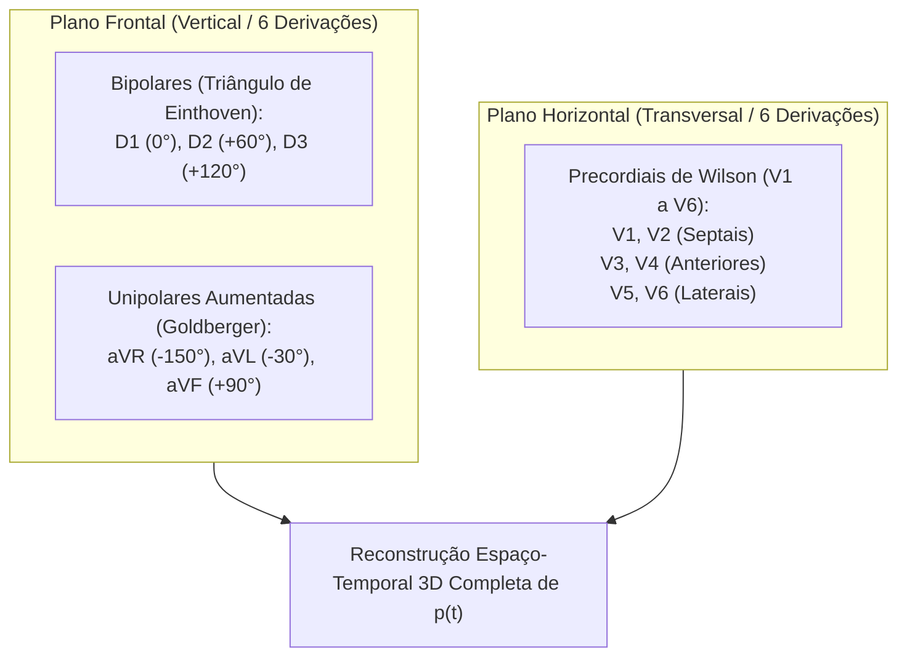

# Relatório do Especialista em Eletrocardiografia e Biofísica Cardíaca

**Autor:** Agente Especialista em Eletrofisiologia Cardíaca & ECG  
**Disciplina:** Eletrofisiologia  
**Tema:** Fundamentação Biofísica dos Múltiplos Ângulos de Medição no Eletrocardiograma (ECG)

---

## 1. O Coração como Dipolo Elétrico Tridimensional Equivalente

A atividade elétrica cardíaca tem origem na propagação sequencial de potenciais de ação pelas células miocárdicas (nodo sinoatrial $\rightarrow$ átrios $\rightarrow$ nodo atrioventricular $\rightarrow$ feixe de His e fibras de Purkinje $\rightarrow$ ventrículos).

```
                      +---------------+
                      | Nodo SA (0 ms)|
                      +-------+-------+
                              |
                     Despolarização Atrial (Onda P)
                              |
                      +-------v-------+
                      | Nodo AV (100ms) | (Retardo fisiológico)
                      +-------+-------+
                              |
                    Feixe de His e Purkinje
                              |
              +---------------+---------------+
              |                               |
    Despolarização Septal            Despolarização Ventricular
        (Vetor QRS 1)               Principal (Vetor QRS 2)
```

No meio condutor volumétrico do tórax (considerado um condutor ôhmico homogêneo em campo distante), as correntes iônicas geradas por milhões de miócitos despolarizando-se simultaneamente somam-se espacialmente. O campo elétrico resultante à distância é modelado fisicamente como um **dipolo elétrico cardíaco equivalente $\vec{p}(t)$**:
$$\vec{p}(t) = p_x(t)\,\hat{i} + p_y(t)\,\hat{j} + p_z(t)\,\hat{k}$$

Esse vetor elétrico instantâneo varia continuamente em **módulo (intensidade), direção e sentido** ao longo de cada fase do ciclo cardíaco (sístole e diástole elétricas: ondas P, complexo QRS e onda T).

---

## 2. Física da Projeção de Biopotenciais (Lei de Projeção Vetorial)

Um par de eletrodos posicionado sobre a pele define uma reta de sensibilidade no espaço, denominada **eixo de derivação**, caracterizado por um vetor unitário $\vec{u}_L$.

A diferença de potencial elétrico instantânea ($V_L(t)$) registrada entre esses dois pontos de medição é dada pelo **produto escalar** entre o vetor dipolo cardíaco instantâneo e o vetor unitário da derivação:
$$V_L(t) = \vec{p}(t) \cdot \vec{u}_L = \|\vec{p}(t)\| \cdot \cos(\theta)$$

Onde:
* $\|\vec{p}(t)\|$ é a magnitude do momento dipolar elétrico do coração no instante $t$.
* $\theta$ é o ângulo formado entre a direção do dipolo cardíaco e o eixo geométrico da derivação.

```
                           Eixo da Derivação (u_L)
              ------------------------------------------------->
                                 \     ^
                                  \    |  Projeção: V_L = |p| cos(θ)
                          θ        \   |
                                    \  |
                                     \ |
                                      v
                             Vetor Cardíaco p(t)
```

---

## 3. O Problema da Medição Monodimensional (Pontos Cegos)

Se utilizássemos apenas um único par de eletrodos (uma única derivação unidimensional):

1. **Perda de Componentes Ortogonais ($\theta = 90^\circ$):** Quando a frente de onda de despolarização propaga-se perpendicularmente ao eixo da derivação ($\theta = 90^\circ \Rightarrow \cos(90^\circ) = 0$), a voltagem registrada é identicamente nula ($V_L = 0$), mesmo que haja intensa atividade elétrica no miocárdio naquele instante.
2. **Ambiguidade de Módulo e Orientação:** Uma leitura de baixa amplitude em uma única derivação pode significar tanto um vetor cardíaco pequeno quanto um vetor cardíaco de grande magnitude orientado quase ortogonalmente ao eixo de medição.
3. **Incapacidade de Mapeamento Topográfico:** Não é possível diagnosticar isquemias locais, infartos regionais (ex.: parede anterior vs inferior) ou distúrbios de condução específicos com uma única perspectiva linear.

---

## 4. O Sistema de 12 Derivações e a Reconstrução Espacial 3D

Para reconstruir a trajetória tridimensional real do vetor cardíaco sem pontos cegos, o ECG padrão utiliza **12 ângulos de visualização (derivações)** distribuídos em dois planos anatômicos ortogonais:



### 4.1. Plano Frontal (Sistema Hexaxial de Cabrera)
Examina a propagação elétrica no sentido superior/inferior e direito/esquerdo:
* **Derivações Bipolares (Einthoven):**
  - $\text{D1} = \Phi_{\text{BE}} - \Phi_{\text{BD}}$ ($0^\circ$)
  - $\text{D2} = \Phi_{\text{PE}} - \Phi_{\text{BD}}$ ($+60^\circ$)
  - $\text{D3} = \Phi_{\text{PE}} - \Phi_{\text{BE}}$ ($+120^\circ$)
  *(Pela Lei de Einthoven: $\text{D2} = \text{D1} + \text{D3}$)*
* **Derivações Unipolares Aumentadas (Goldberger):** $\text{aVR}$ ($-150^\circ$), $\text{aVL}$ ($-30^\circ$) e $\text{aVF}$ ($+90^\circ$).

### 4.2. Plano Horizontal / Transversal (Derivações Precordiais de Wilson)
Examina a propagação no sentido ântero-posterior e septo-lateral:
* Seis eletrodos exploradores ($\text{V}_1$ a $\text{V}_6$) medidos em relação ao Terminal Central de Wilson ($\text{WCT} = (\Phi_{\text{BD}} + \Phi_{\text{BE}} + \Phi_{\text{PE}})/3$).

---

## 5. Síntese Conceitual Estruturada para a IA Corretora

* **Premissa:** A atividade elétrica do coração manifesta-se como um dipolo vetorial tridimensional $\vec{p}(t)$ dinâmico no espaço e no tempo.
* **Mecanismo:** Cada par de eletrodos / derivação registra apenas a projeção escalar unidimensional ($\vec{p}(t) \cdot \vec{u}_L = \|\vec{p}\|\cos\theta$) desse dipolo.
* **Necessidade de Múltiplos Ângulos:** Múltiplas derivações em planos distintos (frontal e horizontal) são obrigatórias para capturar componentes ortogonais sem pontos cegos e possibilitar a reconstrução espacial tridimensional completa da frente de onda cardíaca.
