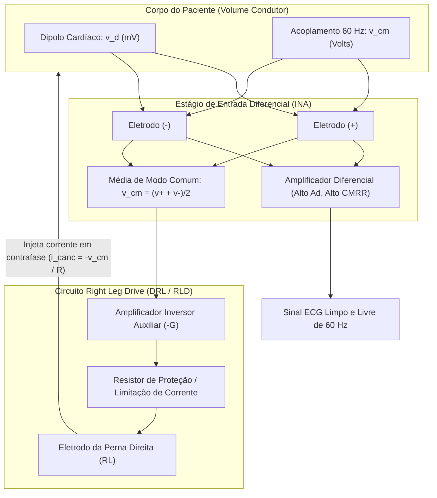

# Relatório do Engenheiro Biomédico: Interface Eletrodo-Amplificador & Cancelamento Ativo no ECG

**Autor:** Agente Engenheiro Biomédico (Especialista em Bioinstrumentação de Alta Resolução)  
**Disciplina:** Eletrofisiologia / Bioengenharia  
**Tema:** Amplificação Diferencial, Rejeição de Modo Comum e Cancelamento Ativo por Injeção de Corrente (*Right Leg Drive* - DRL)

---

## 1. O Desafio Fisiológico e Eletrônico da Medição de Biopotenciais

A aquisição do sinal de ECG na superfície corpórea enfrenta um ambiente hostil de ruído eletromagnético e acoplamento capacitivo:

```
               FONTE BIOLÓGICA (Coração)
               Dipolo Cardíaco: v_d ≈ 0.5 mV a 2 mV (0.05 Hz - 150 Hz)
                         |
                         v
              CORPO HUMANO COMO CONDUTOR
                         + <--- Acoplamento capacitivo da rede elétrica (60 Hz): v_cm ≈ 100 mV a 2 V
                         v
               ELETRODOS DE SUPERFÍCIE (Ag/AgCl)
                         |
                         v
           AMPLIFICADOR DE INSTRUMENTAÇÃO (INA)
           - Altíssima impedância de entrada (Z_in > 10^10 Ω)
           - Ganho Diferencial Elevado (A_d ≈ 100 a 1000)
           - Alto CMRR (> 100 dB) para atenuar v_cm
                         |
                         +---------> [LOOP DE CANCELAMENTO ATIVO DRL]
                                     Detecta v_cm -> Inverte (-G) -> Reinjeta corrente no paciente
```

---

## 2. A Técnica de Cancelamento Ativo: *Right Leg Drive* (DRL / RLD)

Nos sistemas de eletrocardiografia de **estado da arte**, o amplificador de instrumentação diferencial não atua sozinho. Para evitar que tensões de modo comum de alta amplitude saturem o estágio de entrada ou degradem a relação sinal-ruído (SNR), emprega-se a **Injeção Ativa de Corrente de Cancelamento**.



### 2.1. Princípio Físico do DRL
1. **Sensoriamento:** O circuito extrai a média instantânea das tensões de entrada, isto é, a tensão de modo comum $v_{cm} = \frac{v^+ + v^-}{2}$.
2. **Inversão e Ganho:** Um amplificador operacional auxiliar inverte a fase dessa tensão em $180^\circ$ e aplica um ganho de malha aberta $-G_{\text{DRL}}$, gerando uma tensão $v_{\text{DRL}} = -G_{\text{DRL}} \cdot v_{cm}$.
3. **Injeção Ativa:** Essa tensão invertida é conectada de volta ao paciente (geralmente através do eletrodo posicionado na perna direita - *Right Leg*).
4. **Anulação de Cargas:** A corrente injetada em contrafase drena e anula ativamente as correntes de deslocamento induzidas pela rede elétrica de $60\text{ Hz}$ no próprio corpo antes que elas gerem uma queda de tensão expressiva nos eletrodos de medição.
5. **Redução Efetiva da Impedância de Terra:** O circuito DRL reduz virtualmente a impedância do paciente ao terra em um fator $(1 + G_{\text{DRL}})$, abaixando $v_{cm}$ para menos de $1\%$ do seu valor original.

---

## 3. Sinergia Tripla do Estado da Arte

| Pilar | Mecanismo | Papel na Medição |
| :--- | :--- | :--- |
| **1. Ganho Diferencial ($A_d$)** | Amplifica $v_d = v^+ - v^-$ | Eleva a amplitude do biopotencial cardíaco de milivolts para a faixa de volts dos conversores A/D. |
| **2. Rejeição de Modo Comum (CMRR)** | Atenua $v_{cm}$ via $A_{cm} \rightarrow 0$ | Discrimina a diferença útil contra ruídos que entram igualmente nas duas portas do amplificador. |
| **3. Cancelamento Ativo (DRL)** | Injeta corrente em contrafase no paciente | Destrói a tensão de modo comum no próprio corpo do paciente, impedindo a saturação do circuito. |
| **4. Geometria Multiangular** | 12 derivações ($\vec{p} \cdot \vec{u}$) | Reconstitui a trajetória espacial tridimensional do vetor cardíaco sem pontos cegos ortogonais. |

---

## 4. Síntese Conceitual Integrada

No estado da arte da bioinstrumentação, a pureza do traçado eletrocardiográfico é obtida pela ação conjunta de:
1. Um estágio de alto ganho diferencial ($A_d$) com elevada Razão de Rejeição de Modo Comum ($\text{CMRR} = |A_d/A_{cm}|$).
2. Um circuito de cancelamento ativo (*Right Leg Drive* - DRL) que realimenta o paciente com uma corrente em contrafase para extinguir dinamicamente a interferência de $60\text{ Hz}$ na fonte.
3. Um conjunto multiangular de derivações nos planos frontal e horizontal que mapeia o dipolo elétrico cardíaco tridimensional $\vec{p}(t)$ através de múltiplas projeções escalares, eliminando pontos cegos ortogonais.
