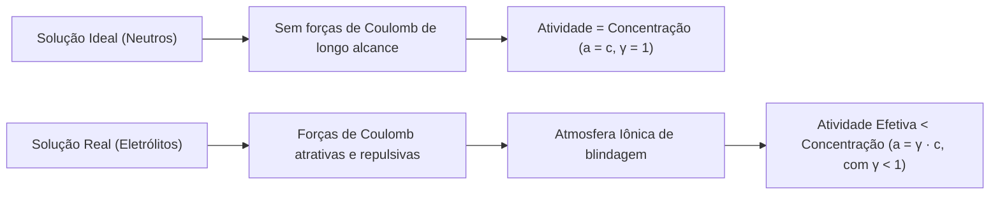

# 📘 Apostila Completa & Intuitiva: Teoria de Debye-Hückel, Atividades e Força Iônica

> **Disciplina:** Físico-Química / Química Analítica — USP  
> **Tema:** Termodinâmica de Eletrólitos, Força Iônica ($I$), Coeficiente de Atividade ($\gamma$), Dedução Rastreável das Leis de Debye-Hückel (Limite e Estendida) e Modelos de Alta Concentração (Davies & Pitzer)  
> **Público-alvo:** Estudantes que buscam compreensão física profunda e rigor matemático com rastreabilidade total de todas as passagens.

---

## 📑 Sumário

1. [A Grande Ideia Física: Por Que Soluções Reais de Eletrólitos Não São Ideais?](#1-a-grande-ideia-física-por-que-soluções-reais-de-eletrólitos-não-são-ideais)
2. [Por Que o Coeficiente de Atividade é Menor Que 1 (γ < 1)?](#2-por-que-o-coeficiente-de-atividade-é-menor-que-1-γ--1)
3. [Força Iônica (I): O Campo Elétrico Médio da Solução](#3-força-iônica-i-o-campo-elétrico-médio-da-solução)
4. [Dedução Rastreável da Teoria de Debye-Hückel (Passo a Passo)](#4-dedução-rastreável-da-teoria-de-debye-hückel-passo-a-passo)
5. [A Lei Limite de Debye-Hückel (Cargas Pontuais)](#5-a-lei-limite-de-debye-hückel-cargas-pontuais)
6. [A Equação Estendida de Debye-Hückel (Tamanho Iônico Finito)](#6-a-equação-estendida-de-debye-hückel-tamanho-iônico-finito)
7. [Tabela Completa de Termos, Grandezas e Unidades no SI](#7-tabela-completa-de-termos-grandezas-e-unidades-no-si)
8. [Comprimento de Debye (κ⁻¹) vs. Diâmetro Iônico (α): O Limite Físico do Modelo](#8-comprimento-de-debye-κ⁻¹-vs-diâmetro-iônico-α-o-limite-físico-do-modelo)
9. [Forças Iônicas Maiores (I > 0,05 M): Equações de Davies e Modelos de Pitzer](#9-forças-iônicas-maiores-i--005-m-equações-de-davies-e-modelos-de-pitzer)
10. [O Efeito Salting-Out e Por Que γ Pode Ficar Maior Que 1 (γ > 1)](#10-o-efeito-salting-out-e-por-que-γ-pode-ficar-maior-que-1-γ--1)
11. [Quadro Comparativo de Modelos & Guia de Decisão](#11-quadro-comparativo-de-modelos--guia-de-decisão)
12. [Exemplos Numéricos Canônicos Resolvidos Passo a Passo](#12-exemplos-numéricos-canônicos-resolvidos-passo-a-passo)

---

## 1. A Grande Ideia Física: Por Que Soluções Reais de Eletrólitos Não São Ideais?

Em uma solução ideal de solutos neutros (ex.: sacarose em água), as moléculas dispersas sofrem apenas forças de curto alcance (Van der Waals) desprezíveis a distâncias intermoleculares médias. O potencial químico coincide com a concentração molar ($c_i$):

$$
\mu_i = \mu_i^\circ + R \cdot T \cdot \ln\left(\frac{c_i}{c^\circ}\right)
$$

Ao dissolver sais ($\text{NaCl}$, $\text{CaCl}_2$), surgem cátions e ânions com **forças de Coulomb de longuíssimo alcance** ($F \propto 1/r^2$). A concentração física já não reflete o potencial termodinâmico disponível.



Para manter o formalismo termodinâmico sem alterar as funções de estado, introduz-se a **Atividade Química ($a_i$)**:

$$
a_i = \gamma_i \cdot \frac{c_i}{c^\circ}
$$

* $a_i$: Atividade termodinâmica (adimensional, "concentração efetiva").
* $c^\circ$: Concentração de estado padrão ($1\text{ mol}\cdot\text{L}^{-1}$).
* $\gamma_i$: **Coeficiente de atividade** (adimensional), que quantifica a não-idealidade.

---

## 2. Por Que o Coeficiente de Atividade é Menor Que 1 ($\gamma < 1$)?

### 2.1 A Atmosfera Iônica (Nuvem de Contra-Íons)
Estatisticamente no tempo, cada cátion é envolvido por um excesso local de carga negativa (ânions), e cada ânion por excesso de carga positiva (cátions).

```text
       [-]        [+]        [-]
            \      |      /
             \     |     /
      [+] ---- ( Cátion central ) ---- [+]
             /     |     \
            /      |      \
       [-]        [+]        [-]
       
      (Atmosfera Iônica: excesso líquido de contra-íons)
```

### 2.2 Estabilização Eletrostática e Energia Livre
A atração eletrostática íon-atmosfera é mais forte que as repulsões mútuas de mesma carga. Essa atração estabiliza o íon, reduzindo sua energia livre de Gibbs molar parcial ($\mu_i$) em relação ao estado isolado:

$$
\mu_i^{\text{real}} = \mu_i^{\text{ideal}} + \Delta G_{\text{eletrostatico}}
$$

Como a estabilização reduz a energia do sistema ($\Delta G_{\text{eletrostatico}} < 0$):

$$
R \cdot T \cdot \ln(\gamma_i) = \Delta G_{\text{eletrostatico}} < 0 \implies \ln(\gamma_i) < 0 \implies \mathbf{\gamma_i < 1}
$$

> [!TIP]
> **Intuição Física:** O íon está "blindado e retido" pela sua atmosfera. Ele tem menor tendência de escape (menor reatividade química para precipitar ou reagir) do que um íon ideal livre.

---

## 3. Força Iônica ($I$): O Campo Elétrico Médio da Solução

A força iônica mede a densidade global de campo elétrico criada pelo conjunto de íons na solução.

### 3.1 Definição Matemática
Proposta por Lewis e Randall (1921):

$$
I = \frac{1}{2} \sum_{i=1}^{n} c_i \cdot z_i^2
$$

* $c_i$: Concentração molar do íon $i$ ($\text{mol}\cdot\text{L}^{-1}$).
* $z_i$: Carga formal do íon $i$ ($+1, +2, +3, -1, -2$, etc.).

### 3.2 O Peso Quadrático da Carga ($z_i^2$)
Como a carga entra ao quadrado ($z_i^2$), íons polivalentes exercem influência desproporcional:

| Sal Dissolvido ($0{,}01\text{ M}$) | Cátion ($c_+ \cdot z_+^2$) | Ânion ($c_- \cdot z_-^2$) | Força Iônica ($I$) |
| :--- | :--- | :--- | :--- |
| $\text{NaCl}$ ($1:1$) | $0{,}01 \times (+1)^2 = 0{,}01$ | $0{,}01 \times (-1)^2 = 0{,}01$ | **$0{,}01\text{ M}$** |
| $\text{CaCl}_2$ ($2:1$) | $0{,}01 \times (+2)^2 = 0{,}04$ | $0{,}02 \times (-1)^2 = 0{,}02$ | **$0{,}03\text{ M}$** (3×) |
| $\text{MgSO}_4$ ($2:2$) | $0{,}01 \times (+2)^2 = 0{,}04$ | $0{,}01 \times (-2)^2 = 0{,}04$ | **$0{,}04\text{ M}$** (4×) |
| $\text{Al}_2(\text{SO}_4)_3$ ($3:2$) | $0{,}02 \times (+3)^2 = 0{,}18$ | $0{,}03 \times (-2)^2 = 0{,}12$ | **$0{,}15\text{ M}$** (15×) |

---

## 4. Dedução Rastreável da Teoria de Debye-Hückel (Passo a Passo)

Para entender a origem das constantes $A$ e $B$ e o expoente $\sqrt{I}$, seguimos a dedução canônica em 4 passos com todas as substituições explicitadas.

### Passo 1: A Eletrostática de Poisson
O potencial elétrico $\psi(r)$ a uma distância $r$ do íon central em coordenadas esféricas é regido pela **Equação de Poisson**:

$$
\nabla^2 \psi = \frac{1}{r^2} \frac{d}{dr}\left(r^2 \frac{d\psi}{dr}\right) = - \frac{\rho_e(r)}{\varepsilon_0 \cdot \varepsilon_r}
$$

* $\rho_e(r)$: Densidade volumétrica local de carga elétrica ($\text{C}\cdot\text{m}^{-3}$).
* $\varepsilon_0 \varepsilon_r$: Permissividade absoluta do meio dielétrico.

---

### Passo 2: A Distribuição de Boltzmann e a Linearização Audaz
A concentração local do íon $j$ segue a distribuição estatística de Boltzmann com energia potencial eletrostática $w_j = z_j e \psi(r)$:

$$
c_j(r) = c_j^\circ \cdot \exp\left( - \frac{z_j \cdot e \cdot \psi(r)}{k_B \cdot T} \right)
$$

A densidade de carga total na atmosfera iônica é a soma das cargas de todas as espécies:

$$
\rho_e(r) = \sum_j z_j \cdot e \cdot N_A \cdot c_j(r) = \sum_j z_j \cdot e \cdot N_A \cdot c_j^\circ \cdot \exp\left( - \frac{z_j \cdot e \cdot \psi(r)}{k_B \cdot T} \right)
$$

> ⚡ **A Manobra Audaz de Debye-Hückel (Linearização de Taylor):**
> * *Hipótese Física:* A energia de interação eletrostática é muito menor que a energia de agitação térmica ($|z_j e \psi| \ll k_B T$).
> * *Expansão:* Aplica-se $\exp(-x) \approx 1 - x$ para $x \ll 1$.

$$
\rho_e(r) \approx \sum_j z_j e N_A c_j^\circ \left( 1 - \frac{z_j e \psi(r)}{k_B T} \right)
$$

Pela **eletroneutralidade macroscópica da solução**, $\sum_j z_j e N_A c_j^\circ = 0$. Logo, o termo constante se anula, restando:

$$
\rho_e(r) \approx - \left( \frac{e^2 N_A \sum_j c_j^\circ z_j^2}{k_B T} \right) \cdot \psi(r) = - \left( \frac{2 N_A e^2 \rho_0 I}{k_B T} \right) \cdot \psi(r)
$$

Substituindo $\rho_e(r)$ na Equação de Poisson:

$$
\frac{1}{r^2} \frac{d}{dr}\left(r^2 \frac{d\psi}{dr}\right) = \kappa^2 \cdot \psi(r)
$$

Onde define-se o **parâmetro de blindagem de Debye ($\kappa$)**:

$$
\kappa = \sqrt{\frac{2 \cdot N_A \cdot e^2 \cdot \rho_0}{\varepsilon_0 \cdot \varepsilon_r \cdot k_B \cdot T}} \cdot \sqrt{I} = B \cdot \sqrt{I}
$$

---

### Passo 3: Resolução da EDO com Condições de Contorno
A solução geral com simetria esférica que tende a zero no infinito ($\psi \to 0$ quando $r \to \infty$) é:

$$
\psi(r) = C \cdot \frac{e^{-\kappa r}}{r}
$$

Determinando a constante $C$ na superfície do íon de diâmetro hidratado $\alpha_i$ (raio $a = \alpha_i/2$), obtém-se o potencial total na superfície:

$$
\psi(\text{superficie}) = \frac{z_i \cdot e}{4\pi \varepsilon_0 \varepsilon_r \alpha_i} \cdot \frac{1}{1 + \kappa \alpha_i}
$$

Subtraindo o potencial próprio gerado pelo íon isolado no vácuo ($\psi_{\text{proprio}} = \frac{z_i e}{4\pi \varepsilon_0 \varepsilon_r \alpha_i}$), isola-se o **potencial criado exclusivamente pela atmosfera iônica**:

$$
\psi_{\text{nuvem}} = \psi(\text{superficie}) - \psi_{\text{proprio}} = - \frac{z_i \cdot e \cdot \kappa}{4\pi \varepsilon_0 \varepsilon_r (1 + \kappa \alpha_i)}
$$

---

### Passo 4: Trabalho Eletrostático de Carregamento e Coeficiente $\gamma_i$
Calcula-se o trabalho molar de carregamento reversível do íon (método de Güntelberg):

$$
\Delta G_{\text{eletrostatico}} = N_A \int_0^{z_i e} \psi_{\text{nuvem}}(\lambda) \, d\lambda = - \frac{N_A \cdot z_i^2 \cdot e^2 \cdot \kappa}{8\pi \cdot \varepsilon_0 \cdot \varepsilon_r \cdot (1 + \kappa \alpha_i)}
$$

Como $\mu_i^{\text{excesso}} = R \cdot T \cdot \ln(\gamma_i) = \Delta G_{\text{eletrostatico}}$:

$$
\ln(\gamma_i) = - \frac{N_A \cdot z_i^2 \cdot e^2}{8\pi \cdot \varepsilon_0 \cdot \varepsilon_r \cdot R \cdot T} \cdot \frac{\kappa}{1 + \kappa \alpha_i}
$$

Substituindo $\kappa = B \sqrt{I}$ e convertendo $\ln$ para $\log_{10}$ ($\ln x = 2{,}3026 \log_{10} x$):

$$
\log_{10}(\gamma_i) = - \frac{A \cdot z_i^2 \cdot \sqrt{I}}{1 + B \cdot \alpha_i \cdot \sqrt{I}}
$$

Onde a constante universal $A$ surge analiticamente agrupada:

$$
A = \frac{e^3 \cdot N_A^2 \cdot \sqrt{2 \cdot \rho_0}}{2{,}3026 \cdot 8\pi \cdot (\varepsilon_0 \cdot \varepsilon_r \cdot R \cdot T)^{3/2}}
$$

---

## 5. A Lei Limite de Debye-Hückel (Cargas Pontuais)

Para soluções de diluição extrema ($I \le 0{,}01\text{ M}$), os íons estão distantes e o diâmetro iônico torna-se desprezível no denominador ($\kappa \alpha_i \ll 1 \implies 1 + B\alpha_i\sqrt{I} \approx 1$):

$$
\log_{10}(\gamma_i) = - A \cdot z_i^2 \cdot \sqrt{I}
$$

Para o coeficiente médio de atividade ($\gamma_\pm$):

$$
\log_{10}(\gamma_\pm) = - A \cdot |z_+ \cdot z_-| \cdot \sqrt{I}
$$

* Em água a $25^\circ\text{C}$: **$A \approx 0{,}509\text{ L}^{1/2}\cdot\text{mol}^{-1/2}$**.

---

## 6. A Equação Estendida de Debye-Hückel (Tamanho Iônico Finito)

Quando $0{,}01\text{ M} < I \le 0{,}10\text{ M}$, a aproximação $B\alpha\sqrt{I} \approx 0$ não pode ser feita:

$$
\log_{10}(\gamma_i) = - \frac{A \cdot z_i^2 \cdot \sqrt{I}}{1 + B \cdot \alpha_i \cdot \sqrt{I}}
$$

### 6.1 Formas Práticas a $25^\circ\text{C}$ em Água

* Com $\alpha_i$ em Picômetros ($\text{pm} = 10^{-12}\text{ m}$): $\log_{10}(\gamma_i) = - \frac{0{,}509 \cdot z_i^2 \cdot \sqrt{I}}{1 + \frac{\alpha_i \sqrt{I}}{305}}$
* Com $\alpha_i$ em Angströms ($\text{Å} = 10^{-10}\text{ m}$): $\log_{10}(\gamma_i) = - \frac{0{,}509 \cdot z_i^2 \cdot \sqrt{I}}{1 + 0{,}329 \cdot \alpha_i \sqrt{I}}$

---

## 7. Tabela Completa de Termos, Grandezas e Unidades no SI

| Símbolo | Nome do Termo | Papel Físico | Grandeza Física | Unidade no SI | Unidades Usuais |
| :--- | :--- | :--- | :--- | :--- | :--- |
| **$\gamma_i$** | Coeficiente de atividade individual | Desvio da idealidade termodinâmica | Adimensional | $1$ | Adimensional |
| **$\gamma_\pm$** | Coeficiente médio de atividade | Média geométrica de cátions e ânions | Adimensional | $1$ | Adimensional |
| **$z_i$** | Carga formal (valência) do íon | Número inteiro de cargas elementares | Adimensional | $1$ | $+1, +2, -1, -2$, etc. |
| **$z_+, z_-$** | Valências nominais dos íons | Cargas do cátion e ânion do sal | Adimensional | $1$ | Inteiros |
| **$I$** | Força Iônica | Campo eletrostático médio da solução | Concentração efetiva | $\text{mol}\cdot\text{m}^{-3}$ | $\text{mol}\cdot\text{L}^{-1}$ ($\text{M}$) ou $\text{mol}\cdot\text{kg}^{-1}$ |
| **$\alpha_i$** | Diâmetro efetivo hidratado | Distância mínima de aproximação inter-iônica | Comprimento | $\text{m}$ | $\text{pm}$, $\text{nm}$ ou $\text{Å}$ |
| **$A$** | Constante de Debye-Hückel | Coeficiente dielétrico-térmico do meio | Parâmetro do meio | $\text{m}^{3/2}\cdot\text{mol}^{-1/2}$ | $0{,}509\text{ L}^{1/2}\cdot\text{mol}^{-1/2}$ ($25^\circ\text{C}$, água) |
| **$B$** | Parâmetro eletrostático | Inverso de comprimento por força iônica | Parâmetro do meio | $\text{m}^{1/2}\cdot\text{mol}^{-1/2}$ | $0{,}329\text{ Å}^{-1}\cdot\text{M}^{-1/2}$ ou $3{,}29\text{ nm}^{-1}\cdot\text{M}^{-1/2}$ |
| **$\kappa^{-1}$** | Comprimento de Debye | Raio de blindagem da atmosfera iônica | Comprimento | $\text{m}$ | $\text{nm}$ ou $\text{Å}$ |
| **$\varepsilon_r$** | Permissividade relativa (constante dielétrica) | Atenuação do campo pelo solvente | Adimensional | $1$ | $78{,}54$ (água a $25^\circ\text{C}$) |
| **$\varepsilon_0$** | Permissividade do vácuo | Constante eletrostática universal | Permissividade | $\text{F}\cdot\text{m}^{-1}$ | $8{,}8542 \times 10^{-12}\text{ F}\cdot\text{m}^{-1}$ |
| **$e$** | Carga elementar | Carga de um elétron/próton | Carga elétrica | $\text{C}$ (Coulomb) | $1{,}6022 \times 10^{-19}\text{ C}$ |
| **$N_A$** | Constante de Avogadro | Partículas por quantidade de matéria | Contagem por mol | $\text{mol}^{-1}$ | $6{,}0221 \times 10^{23}\text{ mol}^{-1}$ |
| **$T$** | Temperatura absoluta | Energia térmica média das espécies | Temperatura | $\text{K}$ | $298{,}15\text{ K}$ ($25^\circ\text{C}$) |

---

## 8. Comprimento de Debye ($\kappa^{-1}$) vs. Diâmetro Iônico ($\alpha$): O Limite Físico do Modelo

O **Comprimento de Debye** ($\kappa^{-1}$) indica a distância na qual o potencial eletrostático do íon central decai para $1/e \approx 37\%$ do seu valor:

$$
\kappa^{-1} \approx \frac{0{,}304\text{ nm}}{\sqrt{I\text{ (em mol/L)}}} = \frac{3{,}04\text{ Å}}{\sqrt{I\text{ (em mol/L)}}}
$$

### Tabela de Escalas de Comprimento e Ruptura

| Força Iônica ($I$) | $\kappa^{-1}$ (Espessura da Nuvem) | Diâmetro Hidratado ($\alpha_i$) | Regime Físico |
| :---: | :---: | :---: | :--- |
| **$0{,}0001\text{ M}$** | $\approx 30{,}4\text{ nm}$ | $0{,}3 \sim 0{,}9\text{ nm}$ | $\kappa^{-1} \gg \alpha_i \implies$ Carga pontual exata (Lei Limite). |
| **$0{,}01\text{ M}$** | $\approx 3{,}04\text{ nm}$ | $0{,}3 \sim 0{,}9\text{ nm}$ | $\kappa^{-1} > \alpha_i \implies$ Equação Estendida válida. |
| **$0{,}10\text{ M}$** | $\approx 0{,}96\text{ nm}$ | $0{,}3 \sim 0{,}9\text{ nm}$ | $\kappa^{-1} \approx \alpha_i \implies$ **Limite de ruptura do modelo D-H.** |
| **$1{,}00\text{ M}$** | $\approx 0{,}30\text{ nm}$ | $0{,}3 \sim 0{,}9\text{ nm}$ | $\kappa^{-1} < \alpha_i \implies$ **Colapso teórico:** Nuvem menor que o íon. |

---

## 9. Forças Iônicas Maiores ($I > 0{,}05\text{ M}$): Equações de Davies e Modelos de Pitzer

Sistemas biológicos (sangue $I \approx 0{,}15\text{ M}$) e água marinha ($I \approx 0{,}7\text{ M}$) exigem modelos além de Debye-Hückel.

### 9.1 Equação de Davies ($I \le 0{,}5\text{ mol}\cdot\text{L}^{-1}$)
Adiciona um termo linear corretivo em $I$ que freia a redução excessiva de $\gamma$:

$$
\log_{10}(\gamma_i) = - 0{,}509 \cdot z_i^2 \left( \frac{\sqrt{I}}{1 + \sqrt{I}} - 0{,}3 \cdot I \right)
$$

* **Grande Vantagem:** Não necessita do conhecimento empírico do diâmetro $\alpha_i$ para cada íon individual.

### 9.2 Teoria de Pitzer e Interação Específica (SIT) ($I > 0{,}5\text{ M}$ até Saturação)
Modelos matriciais com coeficientes viriais que quantificam a interação mecânico-química específica entre pares ($\text{Na}^+ - \text{Cl}^-$ vs $\text{Na}^+ - \text{SO}_4^{2-}$).

---

## 10. O Efeito Salting-Out e Por Que $\gamma$ Pode Ficar Maior Que 1 ($\gamma > 1$)

Em soluções altamente concentradas ($I > 1 \text{ a } 5\text{ M}$):
1. Quase toda a água do solvente está aprisionada nas camadas de hidratação dos íons.
2. A atividade da água livre cai vertiginosamente ($a_{\text{H}_2\text{O}} \ll 1$).
3. A escassez de água livre aumenta o potencial químico dos íons restantes, elevando $\gamma$ acima de $1$ (**$\gamma > 1$**), provocando a precipitação forçada de solutos e proteínas (*salting-out*).

---

## 11. Quadro Comparativo de Modelos & Guia de Decisão

| Modelo | Faixa de $I$ | Premissa Física Central | Entradas Requeridas | Aplicação Principal |
| :--- | :--- | :--- | :--- | :--- |
| **Solução Ideal** | $I < 10^{-4}\text{ M}$ | Sem forças inter-iônicas | Concentração | Diluição extrema |
| **Debye-Hückel Limite** | $I \le 0{,}01\text{ M}$ | Cargas pontuais | $z_i, I, T$ | Análise quantitativa diluída |
| **Debye-Hückel Estendida** | $0{,}01 < I \le 0{,}10\text{ M}$ | Esfera rígida com diâmetro $\alpha_i$ | $z_i, I, \alpha_i, T$ | Soluções analíticas com $\alpha_i$ tabelado |
| **Equação de Davies** | $0{,}01 < I \le 0{,}50\text{ M}$ | Correção linear de curto alcance | $z_i, I, T$ | Bioquímica, fisiologia e águas doces |
| **Pitzer / SIT** | $I > 0{,}50\text{ M}$ (até $> 6\text{ M}$) | Interações específicas de pares e trios | Coeficientes viriais | Água do mar, salmouras industriais |

---

## 12. Exemplos Numéricos Canônicos Resolvidos Passo a Passo

### Exemplo 1: Força Iônica de Solução Mista
**Enunciado:** Calcule a força iônica de uma solução com $0{,}010\text{ M}$ de $\text{Fe}_2(\text{SO}_4)_3$ e $0{,}020\text{ M}$ de $\text{NaCl}$.

#### Passo 1: Balanço Molar de Íons Dissociados
* $[\text{Fe}^{3+}] = 2 \times 0{,}010 = 0{,}020\text{ M} \quad (z = +3)$
* $[\text{SO}_4^{2-}] = 3 \times 0{,}010 = 0{,}030\text{ M} \quad (z = -2)$
* $[\text{Na}^+] = 0{,}020\text{ M} \quad (z = +1)$
* $[\text{Cl}^-] = 0{,}020\text{ M} \quad (z = -1)$

#### Passo 2: Cálculo Analítico da Força Iônica ($I$)
$$
I = \frac{1}{2} \left[ (0{,}020 \times 3^2) + (0{,}030 \times (-2)^2) + (0{,}020 \times 1^2) + (0{,}020 \times (-1)^2) \right]
$$

$$
I = \frac{1}{2} [ 0{,}180 + 0{,}120 + 0{,}020 + 0{,}020 ] = \frac{1}{2} [0{,}340] = \mathbf{0{,}170\text{ mol/L}}
$$

---

### Exemplo 2: Coeficiente de Atividade por Debye-Hückel Estendida
**Enunciado:** Determine $\gamma$ para $\text{Ca}^{2+}$ ($z = +2$, $\alpha = 600\text{ pm}$) a $25^\circ\text{C}$ com $I = 0{,}040\text{ mol/L}$.

#### Passo 1: Parâmetros de Entrada
* $z = +2$, $\alpha = 600\text{ pm}$, $I = 0{,}040\text{ M}$, $\sqrt{I} = 0{,}200$.

#### Passo 2: Aplicação na Equação Estendida
$$
\log_{10}(\gamma_{\text{Ca}^{2+}}) = - \frac{0{,}509 \cdot (2^2) \cdot 0{,}200}{1 + \frac{600 \cdot 0{,}200}{305}} = - \frac{0{,}4072}{1 + 0{,}3934} = - \frac{0{,}4072}{1{,}3934} \approx -0{,}2922
$$

#### Passo 3: Obtenção do Coeficiente de Atividade
$$
\gamma_{\text{Ca}^{2+}} = 10^{-0{,}2922} \approx \mathbf{0{,}510}
$$

> **Conclusão:** O íon $\text{Ca}^{2+}$ possui atividade efetiva igual a apenas **$51\%$** de sua concentração nominal.
