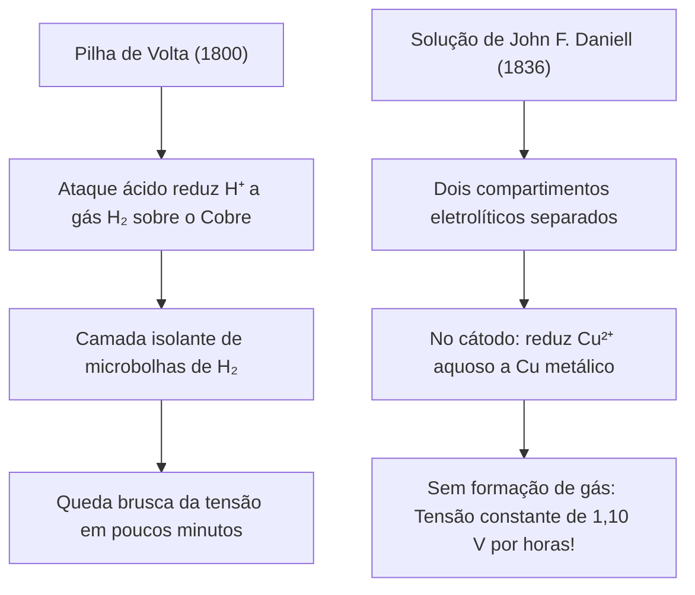
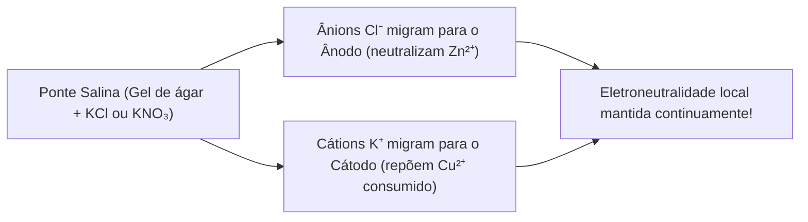

# ⚡ Apostila Completa & Intuitiva: A Pilha de Daniell
> **Disciplinas Integradas:** Eletroquímica (Físico-Química) & Teoria de Circuitos (Engenharia Elétrica) — USP  
> **Tema:** Origem Histórica, Termodinâmica Eletroquímica, Dedução Rastreável de Nernst, Modelo Elétrico de Thévenin e Resistência Interna  
> **Público-alvo:** Estudantes que buscam compreensão física profunda e rigor matemático com rastreabilidade total de todas as passagens.

---

## 📑 Sumário

1. [Contexto Histórico: O Problema da Pilha de Volta e a Invenção de Daniell](#1-contexto-histórico-o-problema-da-pilha-de-volta-e-a-invenção-de-daniell)
2. [Arquitetura Física e Componentes da Pilha de Daniell](#2-arquitetura-física-e-componentes-da-pilha-de-daniell)
3. [A Química da Pilha: Semi-Reações e Termodinâmica Redox](#3-a-química-da-pilha-semi-reações-e-termodinâmica-redox)
4. [O Papel Vital da Ponte Salina (Equilíbrio Eletrostático)](#4-o-papel-vital-da-ponte-salina-equilíbrio-eletrostático)
5. [Dedução Rastreável da Equação de Nernst](#5-dedução-rastreável-da-equação-de-nernst)
6. [A Visão da Engenharia Elétrica: Circuito Equivalente de Thévenin](#6-a-visão-da-engenharia-elétrica-circuito-equivalente-de-thévenin)
7. [Sobretensão, Polarização e Origens da Resistência Interna](#7-sobretensão-polarização-e-origens-da-resistência-interna)
8. [Dedução da Máxima Transferência de Potência](#8-dedução-da-máxima-transferência-de-potência)
9. [Capacidade Energética e Leis de Faraday](#9-capacidade-energética-e-leis-de-faraday)
10. [Quadro Resumo & Formulário Rápido](#10-quadro-resumo--formulário-rápido)
11. [Exemplos Canônicos Resolvidos Passo a Passo](#11-exemplos-canônicos-resolvidos-passo-a-passo)

---

## 1. Contexto Histórico: O Problema da Pilha de Volta e a Invenção de Daniell

Em 1800, Alessandro Volta criou a primeira fonte contínua de eletricidade (**Pilha Voltaica**: discos de Zinco e Cobre separados por tecido embebido em solução salina ou ácida).

A pilha de Volta sofria de um defeito fatal: a **polarização por hidrogênio**.



Em 1836, **John Frederic Daniell** resolveu o problema:
* Separou os eletrodos em dois compartimentos com eletrólitos distintos interligados pela **ponte salina**.
* O eletrodo de Cobre ficou imerso em solução de íons $\text{Cu}^{2+}$ ($\text{CuSO}_4$).
* Em vez de reduzir $\text{H}^+$, o eletrodo reduz $\text{Cu}^{2+}$ a cobre metálico sólido ($\text{Cu}_{(s)}$), eliminando bolhas de gás e fornecendo uma **tensão contínua e estável de $1{,}10\text{ V}$**, viabilizando a telegrafia elétrica.

---

## 2. Arquitetura Física e Componentes da Pilha de Daniell

```text
       Ânodo (-)                                          Cátodo (+)
   [Placa de Zinco]                                   [Placa de Cobre]
          |                                                  |
          v                                                  v
   +--------------+      ====================      +------------------+
   |              |======|   PONTE SALINA   |======|                  |
   | ZnSO₄ (aq)   |      |  (K⁺ e Cl⁻/NO₃⁻) |      | CuSO₄ (aq)       |
   |              |      ====================      |                  |
   +--------------+                                +------------------+
          |                                                  |
          +------------------- [ Carga R_L ] ----------------+
                                  e⁻ --->
```

### Notação Padrão IUPAC da Célula

$$
\text{Zn}_{(s)} \,|\, \text{Zn}^{2+}_{(aq)}\,(c_1) \,||\, \text{Cu}^{2+}_{(aq)}\,(c_2) \,|\, \text{Cu}_{(s)}
$$

* $|$: Interface de separação de fases (sólido/líquido).
* $||$: Junção líquida / ponte salina.

---

## 3. A Química da Pilha: Semi-Reações e Termodinâmica Redox

Os potenciais padrão de redução ($E^\circ_{\text{red}}$) a $25^\circ\text{C}$ determinam a espontaneidade:

### 3.1 Semi-Reação no Ânodo (Pólo Negativo — Oxidação)
O Zinco tem menor potencial de redução e oxida espontaneamente:

$$
\text{Zn}_{(s)} \longrightarrow \text{Zn}^{2+}_{(aq)} + 2\,e^- \quad (E^\circ_{\text{red}} = -0{,}763\text{ V})
$$

* A placa de zinco sofre corrosão/perda de massa ($\Delta m < 0$).
* A solução anódica enriquece em $[\text{Zn}^{2+}]$.

---

### 3.2 Semi-Reação no Cátodo (Pólo Positivo — Redução)
Os íons $\text{Cu}^{2+}$ em solução recebem elétrons e se depositam na placa:

$$
\text{Cu}^{2+}_{(aq)} + 2\,e^- \longrightarrow \text{Cu}_{(s)} \quad (E^\circ_{\text{red}} = +0{,}340\text{ V})
$$

* A placa de cobre sofre deposição/ganho de massa ($\Delta m > 0$).
* A cor azul da solução clareia pela depleção de $[\text{Cu}^{2+}]$.

---

### 3.3 Reação Global e Força Eletromotriz Padrão ($E^\circ_{\text{celula}}$)

$$
\text{Zn}_{(s)} + \text{Cu}^{2+}_{(aq)} \longrightarrow \text{Zn}^{2+}_{(aq)} + \text{Cu}_{(s)}
$$

$$
E^\circ_{\text{celula}} = E^\circ_{\text{catodo}} - E^\circ_{\text{anodo}} = (+0{,}340\text{ V}) - (-0{,}763\text{ V}) = \mathbf{+1{,}103\text{ V}}
$$

### 3.4 Energia Livre de Gibbs Padrão ($\Delta G^\circ$)
O trabalho elétrico máximo reversível relaciona-se com $\Delta G^\circ$:

$$
\Delta G^\circ = -n \cdot F \cdot E^\circ_{\text{celula}}
$$

Com $n = 2$ mols de elétrons e $F = 96485\text{ C}\cdot\text{mol}^{-1}$:

$$
\Delta G^\circ = -2 \cdot 96485 \cdot 1{,}103 \approx \mathbf{-212{,}8\text{ kJ}\cdot\text{mol}^{-1}}
$$

---

## 4. O Papel Vital da Ponte Salina (Equilíbrio Eletrostático)

Sem a ponte salina, a pilha para em menos de um milissegundo.

A oxidação de $\text{Zn}$ acumula cátions $\text{Zn}^{2+}$ no ânodo, enquanto a redução de $\text{Cu}^{2+}$ deixa excesso de ânions $\text{SO}_4^{2-}$ no cátodo. Esse desbalanço gera um campo elétrico de oposição que bloqueia a corrente.



---

## 5. Dedução Rastreável da Equação de Nernst

A Equação de Nernst quantifica o potencial elétrico fora das condições padrão.

### Passo 1: Variação da Energia Livre de Gibbs
Da termodinâmica de soluções para uma reação química com quociente de reação $Q$:

$$
\Delta G = \Delta G^\circ + R \cdot T \cdot \ln(Q)
$$

Onde as espécies sólidas puras têm atividade unitária ($a_{\text{Zn}} = a_{\text{Cu}} = 1$):

$$
Q = \frac{a_{\text{Zn}^{2+}}}{a_{\text{Cu}^{2+}}} \approx \frac{[\text{Zn}^{2+}]}{[\text{Cu}^{2+}]}
$$

---

### Passo 2: A Substituição Termodinâmica-Elétrica
> ⚡ **A Manobra:** O trabalho elétrico reversível máximo realizado por mol de reação é igual à variação de energia livre do sistema:

$$
\Delta G = -n \cdot F \cdot E_{\text{celula}} \quad \text{e} \quad \Delta G^\circ = -n \cdot F \cdot E^\circ_{\text{celula}}
$$

Substituindo essas relações na equação de Gibbs:

$$
-n \cdot F \cdot E_{\text{celula}} = -n \cdot F \cdot E^\circ_{\text{celula}} + R \cdot T \cdot \ln(Q)
$$

---

### Passo 3: Isolamento do Potencial $E_{\text{celula}}$
Dividindo ambos os membros por $-n \cdot F$:

$$
E_{\text{celula}} = E^\circ_{\text{celula}} - \frac{R \cdot T}{n \cdot F} \cdot \ln(Q)
$$

---

### Passo 4: Conversão para Base Decimal a $25^\circ\text{C}$
Aplicando a mudança de base $\ln(x) = \ln(10) \cdot \log_{10}(x) \approx 2{,}30259 \cdot \log_{10}(x)$ com $T = 298{,}15\text{ K}$:

$$
\frac{R \cdot T \cdot \ln(10)}{F} = \frac{8{,}3145 \times 298{,}15 \times 2{,}30259}{96485} \approx \mathbf{0{,}05916\text{ V}}
$$

Para a pilha de Daniell ($n = 2$ elétrons):

$$
E_{\text{celula}} = 1{,}103 - \frac{0{,}05916}{2} \cdot \log_{10}\left(\frac{[\text{Zn}^{2+}]}{[\text{Cu}^{2+}]}\right) = 1{,}103 - 0{,}02958 \cdot \log_{10}\left(\frac{[\text{Zn}^{2+}]}{[\text{Cu}^{2+}]}\right)
$$

---

## 6. A Visão da Engenharia Elétrica: Circuito Equivalente de Thévenin

Uma pilha real não é uma fonte ideal de tensão. O **Teorema de Thévenin** modela a pilha como uma fonte ideal de FEM em série com uma **Resistência Interna ($R_{\text{int}}$)**:

```text
      +---[ E_celula (FEM) ]---+---/\/\/\/\/\---+--- (Terminal +)
      |         (1,10 V)       |     R_int      |
      |                        |   (Resistência |
      |                        |     Interna)   |
     ---                      ---               |
                                              [ Carga R_L ]
                                                |
      +-----------------------------------------+--- (Terminal -)
```

### 6.1 Análise de Malha sob Carga Resistiva ($R_L$)
Aplicando a Lei das Malhas de Kirchhoff (KVL):

$$
E_{\text{celula}} - I_{\text{carga}} \cdot R_{\text{int}} - I_{\text{carga}} \cdot R_L = 0 \implies I_{\text{carga}} = \frac{E_{\text{celula}}}{R_{\text{int}} + R_L}
$$

A **Tensão Terminal útil ($V_{\text{terminal}}$)** entregue à carga é:

$$
V_{\text{terminal}} = I_{\text{carga}} \cdot R_L = E_{\text{celula}} \cdot \left( \frac{R_L}{R_{\text{int}} + R_L} \right) = E_{\text{celula}} - I_{\text{carga}} \cdot R_{\text{int}}
$$

Em circuito aberto ($R_L \to \infty$): $I_{\text{carga}} = 0 \implies V_{\text{terminal}} = E_{\text{celula}} = 1{,}10\text{ V}$. Em curto-circuito ($R_L = 0$): $I_{\text{sc}} = \frac{E_{\text{celula}}}{R_{\text{int}}}$.

---

## 7. Sobretensão, Polarização e Origens da Resistência Interna

A resistência interna total ($R_{\text{int}}$) decompõe-se em três contribuições físicas:

$$
R_{\text{int}} = R_{\Omega} + R_{\text{ct}} + R_{\text{dif}}
$$

* **Resistência Ôhmica ($R_{\Omega}$):** Resistividade dos eletrólitos aquosos e do gel da ponte salina ($R = \rho \cdot L / A$).
* **Resistência de Transferência de Carga ($R_{\text{ct}}$):** Barreira cinética para o elétron atravessar a interface metal/solução.
* **Resistência de Difusão ($R_{\text{dif}}$ / Impedância de Warburg):** Gradiente de concentração provocado pelo consumo rápido de $\text{Cu}^{2+}$ na superfície da placa sob corrente elevada.

---

### 7.1 O Mol de Avanço ($\xi$) e o Trabalho Elétrico Diferencial
Para quantificar rigorosamente o progresso da reação, utiliza-se a coordenada de **grau de avanço** ($\xi$, em $\text{mol}$):

$$
dq = n \cdot F \cdot d\xi \implies I = \frac{dq}{dt} = n \cdot F \cdot \frac{d\xi}{dt}
$$

A taxa de reação $d\xi/dt$ em $\text{mol}\cdot\text{s}^{-1}$ é diretamente proporcional à corrente elétrica $I$.

O trabalho reversível máximo por mol de avanço ($I \to 0$) é:

$$
\left(\frac{dw_{\text{el,rev}}}{d\xi}\right) = -n \cdot F \cdot E_{\text{rev}} = \Delta_r G
$$

---

### 7.2 A Não-Reversibilidade Termodinâmica em Alta Corrente ($I \gg 0$)
Quando a pilha é descarregada rapidamente a uma corrente elevada ($I > 0$):

A reação ocorre a uma **taxa finita ($d\xi/dt > 0$)**, afastando o sistema do equilíbrio quase-estático. A tensão terminal útil disponível cai devido às sobretensões e perdas ôhmicas ($V_{\text{terminal}} = E_{\text{rev}} - \eta_{\text{total}} - I R_{\Omega}$).

O trabalho elétrico real obtido por mol de avanço é estritamente inferior à variação de energia livre:

$$
\left(\frac{dw_{\text{el,real}}}{d\xi}\right) = -n \cdot F \cdot V_{\text{terminal}} < -\Delta_r G
$$

Pelo **Teorema de Gouy-Stodola**, a diferença de energia é degradada irreversivelmente como calor dissipado ($q_{\text{dissipado}}$), gerando entropia no universo:

$$
\left(\frac{dw_{\text{perdido}}}{d\xi}\right) = n \cdot F \cdot (E_{\text{rev}} - V_{\text{terminal}}) = T \cdot \left(\frac{d_i S}{d\xi}\right) > 0
$$

---

## 8. Dedução da Máxima Transferência de Potência

Para encontrar a resistência de carga $R_L$ que extrai a potência útil máxima da pilha:

### Passo 1: Função da Potência na Carga

$$
P_L(R_L) = I_{\text{carga}}^2 \cdot R_L = \left( \frac{E_{\text{celula}}}{R_{\text{int}} + R_L} \right)^2 \cdot R_L = E_{\text{celula}}^2 \cdot \frac{R_L}{(R_{\text{int}} + R_L)^2}
$$

---

### Passo 2: Maximização via Derivada
> ⚡ **A Manobra:** Aplicando a Regra do Quociente $(u/v)' = (u'v - uv')/v^2$ com $u = R_L$ e $v = (R_{\text{int}} + R_L)^2$:

$$
\frac{dP_L}{dR_L} = E_{\text{celula}}^2 \cdot \frac{1 \cdot (R_{\text{int}} + R_L)^2 - R_L \cdot 2(R_{\text{int}} + R_L)}{(R_{\text{int}} + R_L)^4}
$$

Fatorando $(R_{\text{int}} + R_L)$ no numerador:

$$
\frac{dP_L}{dR_L} = E_{\text{celula}}^2 \cdot \frac{(R_{\text{int}} + R_L) - 2 R_L}{(R_{\text{int}} + R_L)^3} = E_{\text{celula}}^2 \cdot \frac{R_{\text{int}} - R_L}{(R_{\text{int}} + R_L)^3}
$$

Igualando a derivada a zero ($\frac{dP_L}{dR_L} = 0$):

$$
R_{\text{int}} - R_L = 0 \implies \mathbf{R_L = R_{\text{int}}}
$$

No ponto de casamento de impedâncias, a tensão terminal cai para a metade da FEM ($V_{\text{terminal}} = E_{\text{celula}}/2 \approx 0{,}55\text{ V}$), e a potência máxima extraível é:

$$
P_{\max} = \frac{E_{\text{celula}}^2 \cdot R_{\text{int}}}{(2 R_{\text{int}})^2} = \mathbf{\frac{E_{\text{celula}}^2}{4 \cdot R_{\text{int}}}}
$$

---

## 9. Capacidade Energética e Leis de Faraday

Pela **1ª Lei de Faraday da Eletrólise**, a carga total ($Q_{\text{total}}$) gerada pelo consumo de uma massa $m_{\text{Zn}}$ de zinco é:

$$
Q_{\text{total}} = I \cdot \Delta t = \left( \frac{m_{\text{Zn}}}{M_{\text{Zn}}} \right) \cdot n \cdot F
$$

Com $M_{\text{Zn}} = 65{,}38\text{ g}\cdot\text{mol}^{-1}$, $n = 2\text{ mols } e^-/\text{mol Zn}$ e $F = 96485\text{ C}\cdot\text{mol}^{-1} = 26{,}801\text{ A}\cdot\text{h}\cdot\text{mol}^{-1}$:

$$
\text{Capacidade Especifica do Zinco} = \frac{2 \times 26{,}801\text{ A}\cdot\text{h}}{65{,}38\text{ g}} \approx \mathbf{0{,}820\text{ A}\cdot\text{h}\cdot\text{g}^{-1}} \quad (820\text{ mAh por grama})
$$

---

## 10. Quadro Resumo & Formulário Rápido

| Parâmetro | Ânodo (Pólo Negativo) | Cátodo (Pólo Positivo) |
| :--- | :--- | :--- |
| **Material do Eletrodo** | Placa de Zinco ($\text{Zn}_{(s)}$) | Placa de Cobre ($\text{Cu}_{(s)}$) |
| **Eletrólito do Compartimento** | $\text{ZnSO}_4\text{ (aq)}$ | $\text{CuSO}_4\text{ (aq)}$ |
| **Semi-Reação** | $\text{Zn} \to \text{Zn}^{2+} + 2e^-$ | $\text{Cu}^{2+} + 2e^- \to \text{Cu}$ |
| **Variação de Massa** | Corrosão ($\Delta m < 0$) | Deposição ($\Delta m > 0$) |
| **Migração na Ponte Salina** | Recebe ânions ($\text{Cl}^-$) | Recebe cátions ($\text{K}^+$) |
| **Fluxo de Elétrons** | Saem pelo circuito externo | Entram pelo circuito externo |

---

## 11. Exemplos Canônicos Resolvidos Passo a Passo

### Exemplo 1: Cálculo de FEM por Nernst Fora do Padrão
**Enunciado:** Uma pilha de Daniell opera a $25^\circ\text{C}$ com $[\text{Zn}^{2+}] = 2{,}00\text{ M}$ e $[\text{Cu}^{2+}] = 0{,}020\text{ M}$. Determine a FEM ($E_{\text{celula}}$).

#### Passo 1: Quociente de Reação ($Q$)
$$
Q = \frac{[\text{Zn}^{2+}]}{[\text{Cu}^{2+}]} = \frac{2{,}00}{0{,}020} = 100 = 10^2
$$

#### Passo 2: Aplicação da Equação de Nernst
$$
E_{\text{celula}} = 1{,}103 - \frac{0{,}05916}{2} \cdot \log_{10}(10^2) = 1{,}103 - 0{,}02958 \cdot (2) = 1{,}103 - 0{,}05916 = \mathbf{1{,}044\text{ V}}
$$

---

### Exemplo 2: Circuito Completo sob Carga e Queda Interna
**Enunciado:** A pilha do Exemplo 1 ($E = 1{,}044\text{ V}$) possui resistência interna $R_{\text{int}} = 10{,}0\ \Omega$ e alimenta um resistor de carga $R_L = 40{,}0\ \Omega$. Determine $I_{\text{carga}}$, $V_{\text{terminal}}$ e a potência útil $P_L$.

#### Passo 1: Corrente na Malha ($I_{\text{carga}}$)
$$
I_{\text{carga}} = \frac{E_{\text{celula}}}{R_{\text{int}} + R_L} = \frac{1{,}044\text{ V}}{10{,}0\ \Omega + 40{,}0\ \Omega} = \frac{1{,}044}{50{,}0} = \mathbf{0{,}02088\text{ A}} \quad (20{,}88\text{ mA})
$$

#### Passo 2: Tensão Terminal Útil ($V_{\text{terminal}}$)
$$
V_{\text{terminal}} = I_{\text{carga}} \cdot R_L = 0{,}02088\text{ A} \times 40{,}0\ \Omega = \mathbf{0{,}8352\text{ V}}
$$

#### Passo 3: Potência Útil Dissipada na Carga ($P_L$)
$$
P_L = V_{\text{terminal}} \cdot I_{\text{carga}} = 0{,}8352\text{ V} \times 0{,}02088\text{ A} \approx \mathbf{0{,}01744\text{ W}} \quad (17{,}44\text{ mW})
$$
