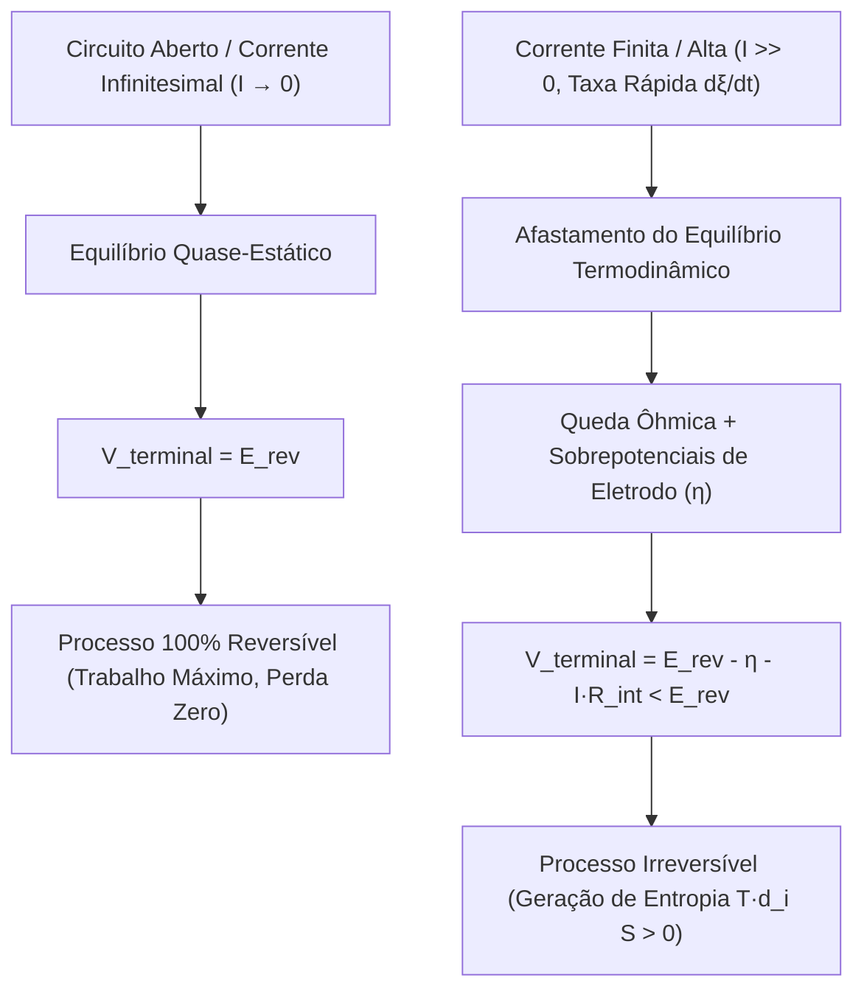

# 📘 O Conceito de Mol de Avanço (Grau de Avanço) na Termodinâmica e Eletroquímica

> **Disciplinas Integradas:** Físico-Química (Termodinâmica Química) & Eletroquímica — USP  
> **Tema:** Grau de Avanço ($\xi$), Potenciais Químicos, Trabalho Elétrico por Mol de Avanço ($dw_{\text{el}}/d\xi$), Afastamento do Equilíbrio e Irreversibilidade sob Corrente Finita  
> **Público-alvo:** Estudantes que buscam compreensão rigorosa da conexão entre estequiometria, energia livre de Gibbs, fluxo de elétrons e perdas irreversíveis em pilhas reais.

---

## 📑 Sumário

1. [O Que é o Mol de Avanço (Grau de Avanço ξ)](#1-o-que-é-o-mol-de-avanço-grau-de-avanço-ξ)
2. [Propriedades Termodinâmicas Diferenciais da Reação](#2-propriedades-termodinâmicas-diferenciais-da-reação)
3. [Conexão Eletroquímica: Carga, Corrente e Velocidade de Reação](#3-conexão-eletroquímica-carga-corrente-e-velocidade-de-reação)
4. [Trabalho Elétrico Reversível por Mol de Avanço (dw_el,rev/dξ)](#4-trabalho-elétrico-reversível-por-mol-de-avanço-dw_elrevdξ)
5. [Afastamento do Equilíbrio: Processos a Taxa Finita e Irreversibilidade](#5-afastamento-do-equilíbrio-processos-a-taxa-finita-e-irreversibilidade)
6. [O Teorema de Gouy-Stodola: Trabalho Perdido e Dissipação Entrópica](#6-o-teorema-de-gouy-stodola-trabalho-perdido-e-dissipação-entrópica)
7. [Tabela Completa de Termos, Grandezas e Unidades no SI](#7-tabela-completa-de-termos-grandezas-e-unidades-no-si)
8. [Exemplo Numérico Canônico Resolvidos Passo a Passo](#8-exemplo-numérico-canônico-resolvido-passo-a-passo)

---

## 1. O Que é o Mol de Avanço (Grau de Avanço $\xi$)?

Introduzido pelo físico-químico belga **Théophile De Donder** em 1922, o **grau de avanço** (símbolo $\xi$, letra grega *csi*) é a coordenada termodinâmica unificada que mede o progresso de uma reação química de forma independente de qual espécie (reagente ou produto) está sendo monitorada.

### 1.1 Definição Diferencial Fundamental
Para qualquer reação química genérica expressa pela estequiometria $\sum_i \nu_i \text{A}_i = 0$ (onde $\nu_i < 0$ para reagentes e $\nu_i > 0$ para produtos):

$$
dn_i = \nu_i \cdot d\xi \iff d\xi = \frac{dn_i}{\nu_i}
$$

* $n_i$: Quantidade de matéria (mols) da espécie $i$.
* $\nu_i$: Coeficiente estequiométrico adimensional da espécie $i$ (com sinal).
* $\xi$: Grau de avanço da reação, com dimensão física de **quantidade de matéria** ($\text{mol}$).

### 1.2 Forma Integrada
Integrando desde o instante inicial ($t=0$, onde $\xi = 0$ e $n_i = n_{i,0}$):

$$
\xi = \frac{n_i - n_{i,0}}{\nu_i} \iff n_i(\xi) = n_{i,0} + \nu_i \cdot \xi
$$

> [!NOTE]
> **Significado de $1\text{ mol}$ de avanço ($\Delta \xi = 1\text{ mol}$):**
> Significa que a reação ocorreu exatamente nas proporções numéricas indicadas pelos seus coeficientes estequiométricos.
> * Na pilha de Daniell ($\text{Zn} + \text{Cu}^{2+} \to \text{Zn}^{2+} + \text{Cu}$): $\Delta \xi = 1\text{ mol}$ consome $1\text{ mol de Zn}$, $1\text{ mol de Cu}^{2+}$, produz $1\text{ mol de Zn}^{2+}$, $1\text{ mol de Cu}$ e transfere $2\text{ mols de eletrons}$.

---

## 2. Propriedades Termodinâmicas Diferenciais da Reação

A energia livre de Gibbs total do sistema reacional varia à medida que a reação avança a temperatura e pressão constantes:

$$
dG = -S\,dT + V\,dP + \sum_i \mu_i\,dn_i
$$

A $T, P$ constantes ($dT = 0, dP = 0$), substituindo a relação fundamental de avanço $dn_i = \nu_i\,d\xi$:

$$
dG = \sum_i \mu_i (\nu_i\,d\xi) = \left( \sum_i \nu_i \mu_i \right) d\xi
$$

### 2.1 Energia Livre de Gibbs de Reação ($\Delta_r G$)
Define-se a **energia livre de Gibbs por mol de avanço**:

$$
\Delta_r G \equiv \left(\frac{\partial G}{\partial \xi}\right)_{T,P} = \sum_i \nu_i \mu_i
$$

Substituindo o potencial químico de cada espécie $\mu_i = \mu_i^\circ + R \cdot T \cdot \ln(a_i)$:

$$
\Delta_r G = \sum_i \nu_i \mu_i^\circ + R \cdot T \sum_i \nu_i \ln(a_i) = \Delta_r G^\circ + R \cdot T \cdot \ln\left( \prod_i a_i^{\nu_i} \right)
$$

$$
\Delta_r G = \Delta_r G^\circ + R \cdot T \cdot \ln(Q)
$$

* Se $\Delta_r G < 0$: A reação avança espontaneamente no sentido direto ($d\xi > 0$).
* Se $\Delta_r G = 0$: O sistema atingiu o **equilíbrio termodinâmico** ($Q = K_{\text{eq}}$).
* Se $\Delta_r G > 0$: A reação é não espontânea no sentido direto.

---

## 3. Conexão Eletroquímica: Carga, Corrente e Velocidade de Reação

Em uma célula eletroquímica onde cada unidade de reação estequiométrica transfere $n$ elétrons:

### 3.1 Carga Elétrica Infinitesimal Transferida ($dq$)
$$
dq = n \cdot F \cdot d\xi
$$

* $n$: Número estequiométrico de elétrons transferidos por fórmula unitária (adimensional).
* $F = 96485\text{ C}\cdot\text{mol}^{-1}$: Constante de Faraday (carga elétrica por mol de elétrons).
* $d\xi$: Variação infinitesimal do grau de avanço ($\text{mol}$).

### 3.2 Corrente Elétrica e Velocidade de Reação ($v_{\text{rx}}$)
A corrente elétrica $I$ que atravessa o circuito externo é o fluxo temporal de carga:

$$
I = \frac{dq}{dt} = n \cdot F \cdot \frac{d\xi}{dt} = n \cdot F \cdot v_{\text{rx}}
$$

Onde $v_{\text{rx}} = \frac{d\xi}{dt}$ é a **taxa de avanço (velocidade da reação química)** em $\text{mol}\cdot\text{s}^{-1}$.

> [!IMPORTANT]
> **Acoplamento Fundamental:** A corrente elétrica em Ampères é diretamente proporcional à velocidade da reação em mols por segundo: $v_{\text{rx}} = \frac{I}{n \cdot F}$.

---

## 4. Trabalho Elétrico Reversível por Mol de Avanço ($dw_{\text{el,rev}}/d\xi$)

Pela primeira e segunda leis da termodinâmica, em um processo eletroquímico a $T, P$ constantes, o trabalho de não-expansão (elétrico) reversível é dado por:

$$
dw_{\text{el,rev}} = -E_{\text{rev}} \cdot dq
$$

O sinal negativo decorre da convenção termodinâmica: trabalho realizado *pelo sistema sobre a vizinhança* reduz a energia do sistema.

Substituindo $dq = n \cdot F \cdot d\xi$:

$$
dw_{\text{el,rev}} = -n \cdot F \cdot E_{\text{rev}} \cdot d\xi
$$

### 4.1 Trabalho Elétrico por Mol de Avanço
Dividindo por $d\xi$:

$$
\left(\frac{dw_{\text{el,rev}}}{d\xi}\right) = -n \cdot F \cdot E_{\text{rev}} = \Delta_r G
$$

> **Conclusão Teórica:** Em regime estritamente reversível, cada mol de reação que avança ($\Delta \xi = 1\text{ mol}$) converte integralmente a variação de energia livre de Gibbs $\Delta_r G$ em trabalho elétrico útil reversível máximo.

---

## 5. Afastamento do Equilíbrio: Processos a Taxa Finita e Irreversibilidade

### 5.1 O Limite Reversível ($I \to 0$)
Para que um processo seja termodinamicamente **reversível**, ele deve ocorrer por uma sucessão de estados infinitesimamente próximos do equilíbrio:
* A velocidade da reação deve tender a zero ($v_{\text{rx}} = \frac{d\xi}{dt} \to 0$).
* A corrente elétrica deve tender a zero ($I \to 0$).
* Esse estado só é alcançado medindo a FEM com um **potenciômetro de oposição balanceado (método de Poggendorff)** ou voltímetro de altíssima impedância de entrada ($R_{\text{in}} > 10^{12}\ \Omega$).

---

### 5.2 A Pilha sob Corrente Real / Alta ($I > 0$)
Quando fechamos o circuito sobre uma carga resistiva $R_L$ e drenamos uma corrente finita $I$, a reação avança a uma taxa finita $d\xi/dt = I/(nF) > 0$. Os gradientes locais de potencial e concentração deixam de ser nulos, surgindo sobrepotenciais irreversíveis de oposição:

$$
V_{\text{terminal}}(I) = E_{\text{rev}} - \eta_{\text{anodo}}(I) - |\eta_{\text{catodo}}(I)| - I \cdot R_{\Omega}
$$

* $\eta_{\text{anodo}}(I)$: Sobretensão de ativação e transferência de massa no ânodo ($\text{Zn}$).
* $\eta_{\text{catodo}}(I)$: Sobretensão de ativação e transferência de massa no cátodo ($\text{Cu}$).
* $I \cdot R_{\Omega}$: Queda de potencial ôhmica nos eletrólitos e na ponte salina.

---

## 6. O Teorema de Gouy-Stodola: Trabalho Perdido e Dissipação Entrópica

O trabalho elétrico real obtido por mol de avanço sob corrente finita é:

$$
\left(\frac{dw_{\text{el,real}}}{d\xi}\right) = -n \cdot F \cdot V_{\text{terminal}}
$$

Como $V_{\text{terminal}} < E_{\text{rev}}$, temos que $|w_{\text{el,real}}| < |w_{\text{el,rev}}|$.

### 6.1 Trabalho Perdido por Irreversibilidade
A diferença entre o trabalho termodinâmico máximo e o trabalho elétrico real aproveitado é o **trabalho perdido** ($w_{\text{perdido}}$):

$$
\left(\frac{dw_{\text{perdido}}}{d\xi}\right) = \left|\frac{dw_{\text{el,rev}}}{d\xi}\right| - \left|\frac{dw_{\text{el,real}}}{d\xi}\right| = n \cdot F \cdot (E_{\text{rev}} - V_{\text{terminal}})
$$

Substituindo $E_{\text{rev}} - V_{\text{terminal}} = \eta_{\text{total}} + I \cdot R_{\Omega}$:

$$
\left(\frac{dw_{\text{perdido}}}{d\xi}\right) = n \cdot F \cdot (\eta_{\text{total}} + I \cdot R_{\Omega}) > 0
$$

### 6.2 Conexão com a Geração de Entropia ($\Delta S_{\text{universo}}$)
Pelo **Teorema de Gouy-Stodola** da termodinâmica de não-equilíbrio:

$$
\left(\frac{dw_{\text{perdido}}}{d\xi}\right) = T \cdot \left(\frac{d_i S}{d\xi}\right) = T \cdot \Delta S_{\text{universo, molar}} > 0
$$

* $d_i S$: Entropia gerada internamente por irreversibilidade (sempre positiva pela 2ª Lei).
* Toda a energia livre que não foi extraída como trabalho elétrico é **degradada irreversivelmente na forma de calor dissipado ($q_{\text{dissipado}}$)** para o meio ambiente.

---

## 7. Tabela Completa de Termos, Grandezas e Unidades no SI

| Símbolo | Nome do Termo | Papel Físico / Descrição | Grandeza Física | Unidade no SI | Unidades Usuais |
| :--- | :--- | :--- | :--- | :--- | :--- |
| **$\xi$** | Grau / Mol de Avanço | Coordenada estequiométrica do progresso da reação | Quantidade de matéria | $\text{mol}$ | $\text{mol}$ ou $\text{mmol}$ |
| **$d\xi/dt$** | Taxa de Avanço (Velocidade) | Velocidade molar de transformação química | Fluxo molar | $\text{mol}\cdot\text{s}^{-1}$ | $\text{mol/s}$ |
| **$\Delta_r G$** | Energia Livre de Reação | Derivada molar parcial $(\partial G/\partial \xi)_{T,P}$ | Energia molar | $\text{J}\cdot\text{mol}^{-1}$ | $\text{kJ}\cdot\text{mol}^{-1}$ |
| **$n$** | Número de Elétrons | Mols de $e^-$ transferidos por mol de reação | Adimensional | $1$ | Inteiro ($2$ para Daniell) |
| **$F$** | Constante de Faraday | Carga elétrica de um mol de elétrons | Carga por mol | $\text{C}\cdot\text{mol}^{-1}$ | $96485\text{ C/mol}$ |
| **$E_{\text{rev}}$** | Potencial Reversível (FEM) | Força eletromotriz em circuito aberto ($I \to 0$) | Potencial elétrico | $\text{V}$ ($\text{J/C}$) | $\text{V}$ ou $\text{mV}$ |
| **$V_{\text{terminal}}$** | Tensão sob Carga | Tensão real disponível nos terminais ($I > 0$) | Potencial elétrico | $\text{V}$ ($\text{J/C}$) | $\text{V}$ |
| **$dw_{\text{el}}/d\xi$** | Trabalho Elétrico por Avanço | Trabalho elétrico realizado por mol de reação | Energia molar | $\text{J}\cdot\text{mol}^{-1}$ | $\text{kJ}\cdot\text{mol}^{-1}$ |
| **$dw_{\text{perdido}}/d\xi$** | Trabalho Perdido por Avanço | Energia degradada em calor por irreversibilidade | Energia molar | $\text{J}\cdot\text{mol}^{-1}$ | $\text{kJ}\cdot\text{mol}^{-1}$ |
| **$d_i S/d\xi$** | Geração de Entropia por Avanço | Taxa de produção entrópica por avanço | Entropia molar | $\text{J}\cdot\text{K}^{-1}\cdot\text{mol}^{-1}$ | $\text{J}\cdot\text{K}^{-1}\cdot\text{mol}^{-1}$ |

---

## 8. Exemplo Numérico Canônico Resolvido Passo a Passo

### Enunciado
Uma pilha de Daniell opera a $298{,}15\text{ K}$ com FEM reversível $E_{\text{rev}} = 1{,}100\text{ V}$. 
Ao ser conectada a um circuito com demanda de corrente elevada, a tensão terminal cai para $V_{\text{terminal}} = 0{,}850\text{ V}$.

Para um avanço de $\Delta \xi = 0{,}050\text{ mol}$ de reação:
1. Calcule o trabalho elétrico reversível máximo ($w_{\text{el,rev}}$);
2. Calcule o trabalho elétrico real entregue à carga ($w_{\text{el,real}}$);
3. Determine o trabalho perdido ($w_{\text{perdido}}$) e a entropia total gerada no universo ($\Delta S_{\text{universo}}$).

---

### Resolução:

#### Passo 1: Trabalho Elétrico Reversível Máximo ($w_{\text{el,rev}}$)
$$
w_{\text{el,rev}} = -n \cdot F \cdot E_{\text{rev}} \cdot \Delta \xi
$$

$$
w_{\text{el,rev}} = -(2) \times (96485\text{ C/mol}) \times (1{,}100\text{ J/C}) \times (0{,}050\text{ mol})
$$

$$
w_{\text{el,rev}} = -212267 \times 0{,}050 = \mathbf{-10613{,}35\text{ J}} \quad (-10{,}613\text{ kJ})
$$

---

#### Passo 2: Trabalho Elétrico Real Entregue ($w_{\text{el,real}}$)
$$
w_{\text{el,real}} = -n \cdot F \cdot V_{\text{terminal}} \cdot \Delta \xi
$$

$$
w_{\text{el,real}} = -(2) \times (96485\text{ C/mol}) \times (0{,}850\text{ J/C}) \times (0{,}050\text{ mol})
$$

$$
w_{\text{el,real}} = -164024{,}5 \times 0{,}050 = \mathbf{-8201{,}23\text{ J}} \quad (-8{,}201\text{ kJ})
$$

---

#### Passo 3: Trabalho Perdido e Entropia Gerada
O trabalho perdido dissipado irreversivelmente como calor é:

$$
w_{\text{perdido}} = |w_{\text{el,rev}}| - |w_{\text{el,real}}| = 10613{,}35\text{ J} - 8201{,}23\text{ J} = \mathbf{2412{,}12\text{ J}} \quad (2{,}412\text{ kJ})
$$

Pelo Teorema de Gouy-Stodola ($w_{\text{perdido}} = T \cdot \Delta S_{\text{universo}}$):

$$
\Delta S_{\text{universo}} = \frac{w_{\text{perdido}}}{T} = \frac{2412{,}12\text{ J}}{298{,}15\text{ K}} \approx \mathbf{+8{,}09\text{ J}\cdot\text{K}^{-1}}
$$

> **Conclusão Físico-Química:** Devido à alta taxa de descarga (processo rápido e irreversível fora do equilíbrio), **$22{,}7\%$** da energia livre da reação foi perdida na forma de calor de sobrepotencial e efeito Joule, gerando $+8{,}09\text{ J/K}$ de entropia no universo.
