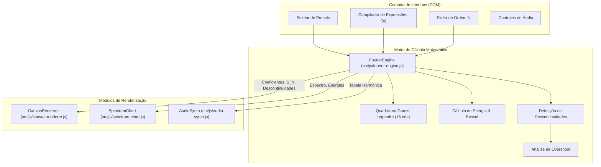

# 💡 Explicação Teórica & Arquitetura: Visão Geral do Fourier Studio

> **Quadrante Diátaxis:** Explanation (Orientado ao Entendimento e Teoria)  
> **Tema:** Arquitetura do Software, Fluxo de Dados e Pipeline Gráfico

---

## 1. Diagrama Geral de Arquitetura

O Fourier Studio foi concebido com separação estrita de responsabilidades entre computação matemática, pipeline de renderização visual e interface com o usuário:

---

## 2. Pipeline de Renderização em Camadas (`CanvasRenderer`)

O renderizador do canvas principal opera em 9 passos ordenados para garantir alta performance e nitidez em telas HiDPI:

1. **Grade & Eixos Adaptativos:** Eixos cartesianos com marcações inteligentes em frações e múltiplos de $\pi$.
2. **Área de Erro Residual ($L^2$):** Preenchimento translúcido com cache de amostras para renderização em tempo constante.
3. **Decomposição Par e Ímpar:** Curvas opcionais $f_{\text{par}}(x)$ e $f_{\text{impar}}(x)$.
4. **Harmônico Isolado:** Destaque em amarelo com hover na tabela ou espectro.
5. **Função Original:** Linha sólida no intervalo fundamental $[-L, L]$ e tracejada nas extensões periódicas.
6. **Série de Fourier $S_N(x)$:** Traçado com efeito neon glow verde.
7. **Destaques de Dirichlet:** Marcadores ocos nos limites laterais e sólidos no ponto médio do salto.
8. **Epiciclos Fasoriais (3Blue1Brown):** Cadeia de vetores complexos rotativos com fase corrigida.
9. **Inspeção Interativa (Hover):** Tooltip flutuante com valores numéricos pontuais e erro instantâneo.
